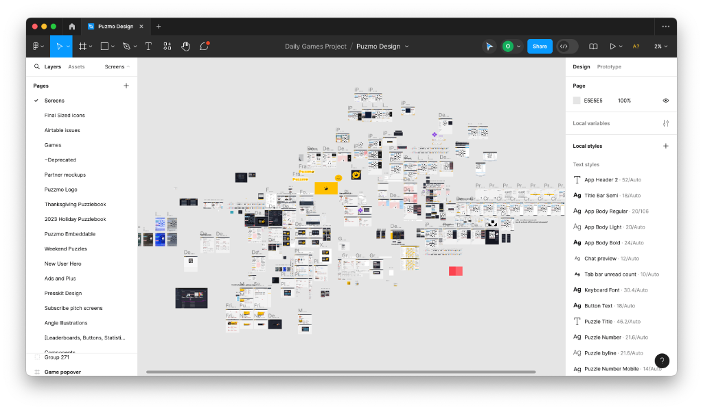
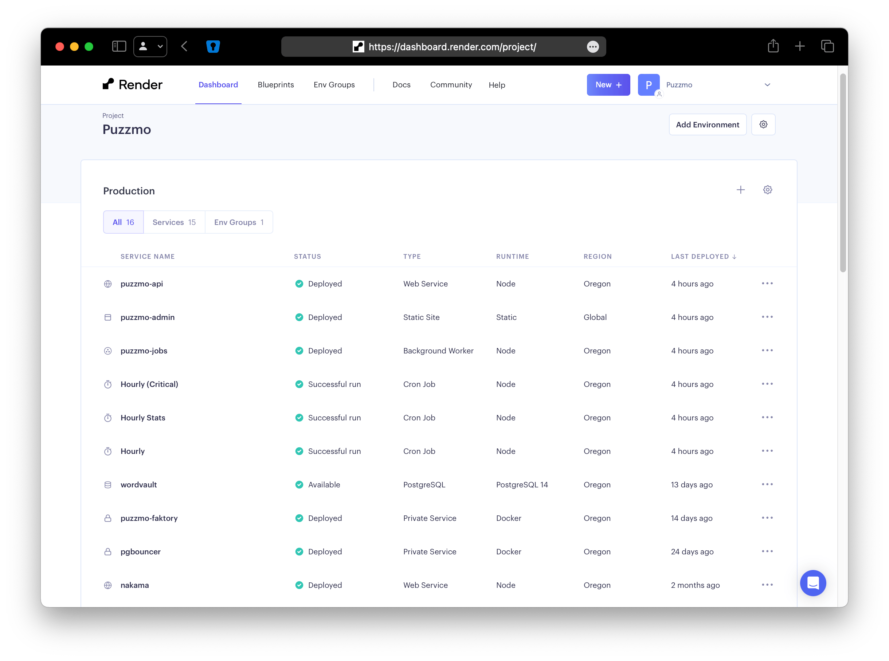
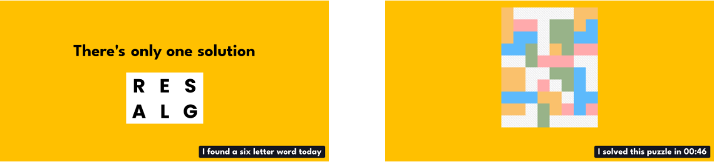
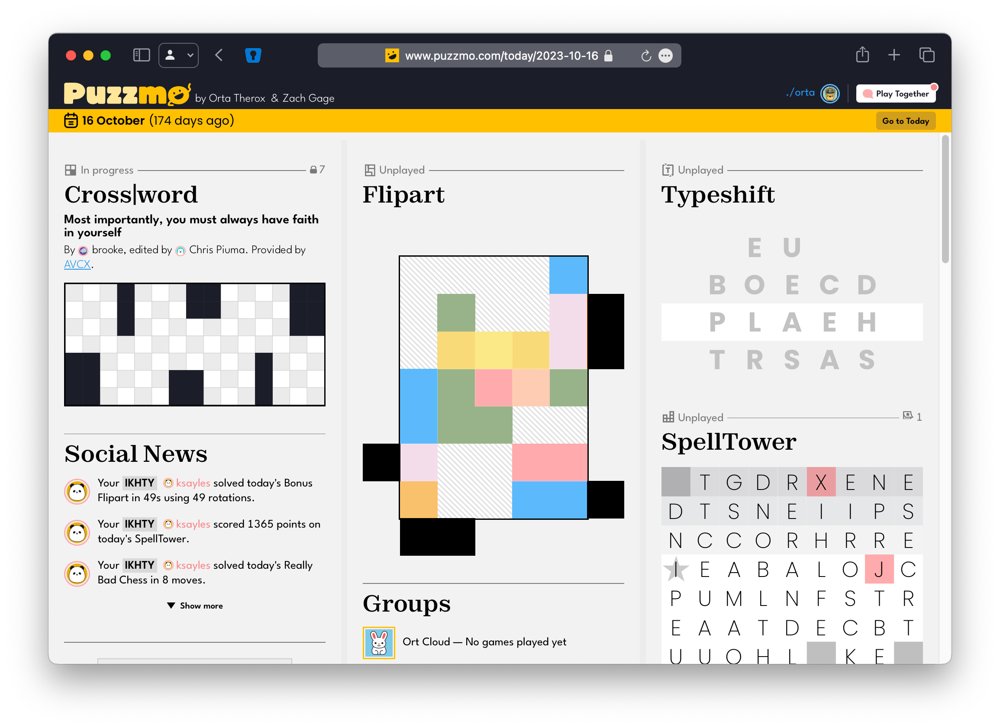
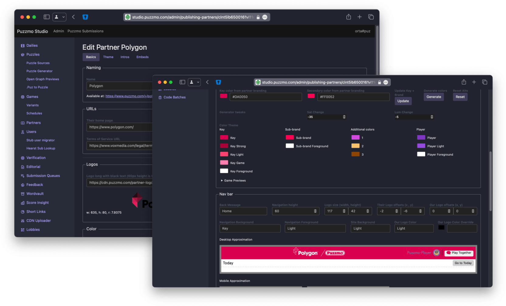
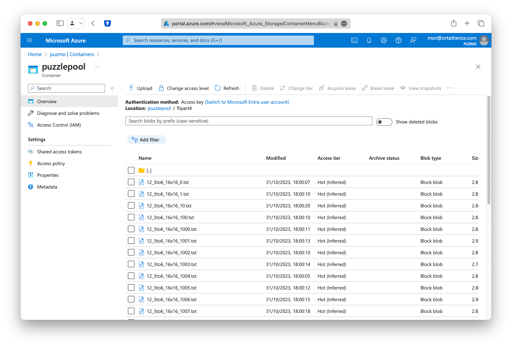
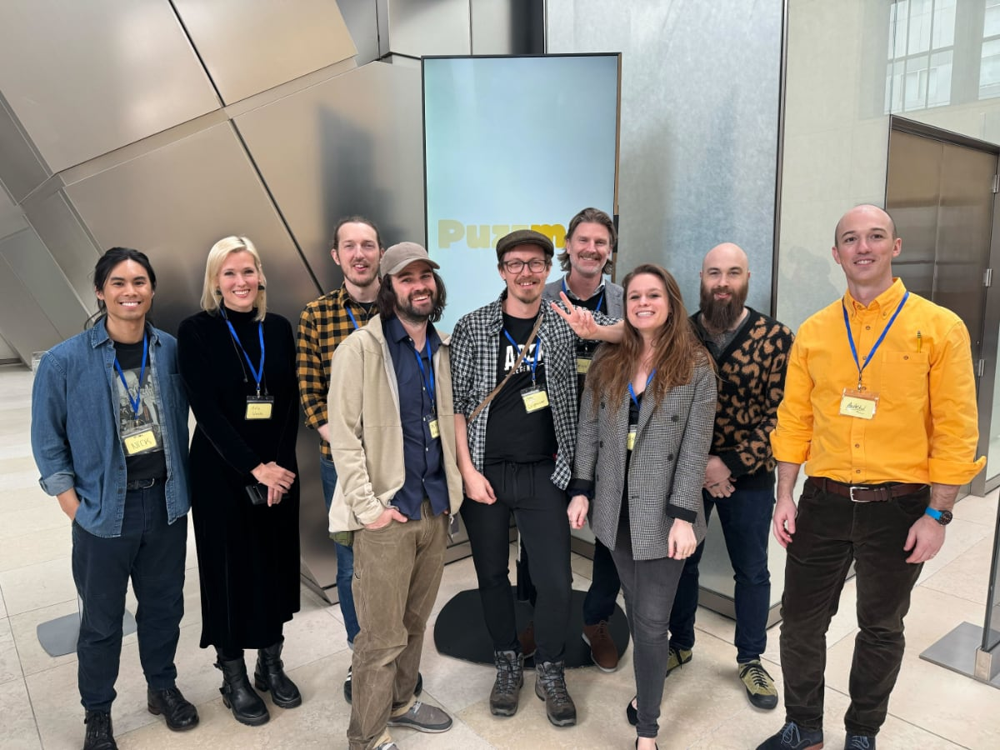

+++
title = 'Puzzmo v1 tech deep-dive'
date = 2024-04-13T12:56:32Z
authors = ["orta"]
tags = ["tech", "launch"]
theme = "outlook-hayesy-beta"
draft = true
+++

This blog post is trying to do a lot, I want to look back at the initial version of Puzzmo we shipped back in November and talk through what we built. It's a very long read, and sometimes doesn't flow too naturally - but it's comprehensive and a very useful reference for noting a little slice of time when Puzzmo's users were in the hundreds. 

I'm mainly going to be concentrating on "Puzzmo" the system, e.g. the bits which power features like the website, leaderboards, scoring systems, groups, servers and that sort of thing. Internally, we generally call these projects the "App" _(the public facing website for puzzmo.com)_ or the "API" _(the servers powering the website)_. In doing so, I will be omitting "games" topics like _"We changed Wordbind to use two words"_, _"Changes we made to games to make them fit Puzzmo"_. The hows and whys for those topics are not really my story to tell, and I have enough on my plate trying to keep on top of the technical architecture for Puzzmo.

## What did it take to ship Puzzmo?

We started off with a small jpg [and a general plan](https://www.youtube.com/watch?v=68TGvXlSSVY), and turned it into that Figma above over the course of two years. We were in a bit of a strange position with Puzzmo being a mix of "games" and "app" culturally, as well as being a tech startup I guess. This meant we could kind of pick and choose ideas from all of those cultures.

Somewhere after the six months, we had a [really](./puzzmo-today-sept-2022.png) [solid]((./puzzmo-games-sept-2022.png)) ["vertical slice"](https://www.whatgamesare.com/vertical-slice.html) of what Puzzmo would be. We had folks playing daily, and you could see the skeleton of what we were trying pretty quickly.

Over the next ~18 months, we plodded on. While I don't think we did a good job of being a ["minimum viable product"](https://en.wikipedia.org/wiki/Minimum_viable_product#/media/File:From_minimum_viable_product_to_more_complex_product.png), we had a pretty strong vision of what we wanted to build and where the edges of that problem space lay`.

### How did we launch?

To kick off Puzzmo, we wanted to build something which would be interesting to a general audience, and have a bit of FOMO mixed in. We came up with a plan which hit a few goals:

- Be [worth reporting about](https://www.techradar.com/gaming/zach-gage-is-letting-500-people-into-his-new-puzzle-app-each-day-but-theres-a-catch) for games journalists
- Gate folks getting in, as we did not know the ordinal of our audience
- Let people bring their friends along
- Have a pretty small time window for being open, and a random timing aspect to work on all timezones
- Explore mixing digital and physical aspects of games
.
To make that happen, we created a completely separate website from puzzmo.com

## launch.puzzmo.com

The launch site. Keeping it on a separate domain removed complexity in the app and allowed us to try a different technique of writing websites (next.js) than our strategy for the app.

The idea for the site was based on our first guess at what a launch could be: make a site which felt like a wordle-like (e.g. just played one game which refreshed daily) and then have that alternate between all of Puzzmo's games over time as a surprise. What we ended up with was a system which explained our plans a bit, and required being one of the first 500 people to completing a Puzzmo puzzle in a day: 

For folks in the US, we would then [send them a postcard](./puzzmo-invite-letters.jpeg) which included an invite code for puzzmo.com. Because mail takes time, this meant for the first week or so, puzzmo.com (and our discord) was full of europeans who didn't get physical mail, which made for some interesting discussions on the Crossword's Americanness. 

During the launch period we offered lifetime accounts for Puzzmo, the launch site ran for about a month as the gateway to joining Puzzmo.

#### Iframe Embeds

As you can see above, we relied on playing Puzzmo games as a part of the launch strategy. This meant we needed to allow our games to run outside of puzzmo.com!

For games which don't require a virtual keyboard on mobile, we felt we could do a good job of making "puzzle previews" which can be embedded [inside articles](https://www.theverge.com/23929222/puzzmo-newspaper-games-crossword-zach-gage), the launch site or on blog posts like this eventually, for example here it is in The Verge:

The iframe embeds are a separate games runtime from our main application, it has less overhead and less features overall - but it's not supposed to be able to do so much anyway as they act more like a preview. This gave us a way to "show, not tell" when talking about Puzzmo to the press.

## puzzmo.com 

So, what was behind the curtain?

### App

At ~25 screens, roughly 70k lines of code and a whole world of spit-shine. The majority of the app which powered puzzmo.com was written by two folks (_Saman & Me_). The app itself is largely a conventional Relay application built in React, but it also talks, via a websocket, to our multiplayer/social side making state management non-trivial.

We do quite a lot of work in the application in terms of having layouts which differ on mobile vs desktop, which causes some interesting tension inside the codebase. This approach is complex, but reviews of Puzzmo have often called it "native-like" which is high praise for a project based on web-tech. It's likely that the choice of using React Native Web via Expo at the start made this report a lot more likely to happen. 

Betting of React Native Web gave us an obvious way to have native app when we get start thinking about putting Puzzmo on app stores. 

This decision is something we've started to roll back on though, as the number of legally necessary third party systems and policy systems start to make maintaining one codebase across many platforms (each web browser, iOS and Android.) far less compelling. Part of the problem is that the complexity in managing all these constraints really requires at least one engineer's full time focus on each platform, and I'm not sure we're going to be there any time soon.

We host the app on Vercel, where it is bundled as a Single Page App. Similar to techniques seen in Create React App, or Vite projects today. 

### API

The API for this app is a pretty traditional RedwoodJS app, with a reasonable amount of built-in features replaced or dropped. The API is roughly 85k lines of code mostly written by one person (_your truly_), and provides a GraphQL interface to the app and an admin dashboard.

A Redwood app provides both APIs and a web interface, we use the web parts of RedwoodJS for an admin dashboard we call "Studio". Studio powers all of the admin tools for managing dailies, puzzles, iframe embeds and offers a "GitHub for Crosswords" which is used to handle editing, reviewing and fact checking every crossword which is put on the daily. This clocks in at roughly 100k lines of code, though a lot of it comes from our templating systems. We use react-bootstrap for the majority of the user interface, which is truly a "no-frills get stuff done" framework for writing reasonable code fast.

My opinions have a roughly 50% overlap with Redwood's.That number used to be higher, as they look to be prioritising the parts we have little interest in over parts of Redwood we agree about. In a way that means we need to start being careful about the future of our API's foundations.

We host the API on Render, which occasionally has gone down on us, but not enough to be a concern. Render has a great set of tools for building server-driven apps - we use a lot of their features and I've been really happy with that choice on the long-term.

### Open Graph Thumbnail PNGs

As we were a year and a half into Puzzmo, Wordle came out and introduced to a mass audience the idea of a text representation of a game. This approach did that game wonders! We had a few ideas similar, but had also been exploring the connection between a URL and the image preview that lots of sites/apps show. We wondered that maybe URLs could act as a conduit for doing image shares. 

 When creating Puzzmo, we wanted to always have support for live thumbnails inside the site, and this code was re-used to generate custom image thumbnails for each puzzle being played on the server. At 2k lines of code, it's not a very big system because a lot of the hard work on making the thumbnails lives in the games repo. The thumbnail generator runs on Deno Deploy, which we've found to be pretty cool.

We ended up making a few different versions of these thumbnails and settled on a pattern of trying to make a puzzle _in that image_ which was a non-spoiler for the puzzle you click through on. Quite a conceptual (and technical!) challenge for some of the games.

## Systems

Within Puzzmo itself, we had quite a lot systems to build in order to provide a broad set of meta-game features seen in modern video games.

### Game Runtime

Heyyy, I thought we were defining this post as not being about games?! Well, I think the technical architecture of how we run games at least worth a mention. First up, we should answer to _"how do we run a game?"_

To run a Puzzmo game, we have a embedded game runtime which communicates to an external system via JSON messages. For the app, we boot the game runtime inside an `<iframe>` and use `postMessage` to send info back and forth. I have working prototypes for the same thing via webviews on iOS. The runtime is reasonably light, and mostly exists to provide an easy library for interacting with a running game.

Games themselves are JavaScript bundles generated by rollup, and we build a copy of every game for every commit to our CDN. A game declares to Puzzmo (via the database entry for a game) what commit SHA it is at, and what the global function for starting the game is called. This means that the API can tell the embed runtime how to make the right `<script>` tag, and then what function to use to boot up.

This system intentionally disconnects deploys of the API/App from the games deployments, and so games can deploy when it makes sense for them, and rollbacks are trivial as it's just a SHA switch in the database in our studio.

Second up, _"how do game thumbnails work?"_ - it's kinda the same thing as above, every game is responsible for creating it's own JavaScript bundle for creating an SVG version of the puzzle. It means all games have to have at least two renderers which take the same puzzle and gameplay state (e.g. progress, or completion info.)

A thumbnail renderer tends to be significantly simpler code-wise, but tends to share a lot of state management code. Thumbnails are also just global functions in the JavaScript context which return an SVG string, so they work anywhere.

#### Dailies

The root page on puzzmo.com we call the "Today" page and a today is responsible for showing you things like "your group scores for today", news, group/friend invites etc. Here's the today page for the day Puzzmo went live with the launch site:

The Today page is powered by a daily system that operates via the timezone of our servers (which pretends to live in Chicago (which brings all sorts of daylight saving issues!)) but largely revolves around a single function in our codebase which turns a date / timestamp into a format like `2023-10-16` (which would be day 0.) 

We build dailies 3 weeks in advance for games we can code generate, and curated games try to schedule a month or two in advance. We offer prior dailies for folks who pay, which act as an archive of games to play.

#### Social

We felt like the ability to talk and interact with friends were pretty important in this space. So, Puzzmo has a social graph, where you can find friends and optionally give friends a "tag". This gives us a way to have a two-tied relationship lookups for news, recommendations and ordering when presenting friends as a list. The technical foundations are based on an external open source project called Nakama, which provides a lot of our social primitives.

We're very careful around letting folks interact, currently we have three tiers of users: admins and crossword contributors, whose profiles are considered public (and get bios, links etc) and users who are largely private to the internet.

There's a pretty nuanced invite system for friends, games, groups and gifting paid subscriptions which lives in the social systems. 

#### Groups

Groups act as our competitive angle, anyone who is a subscriber can create a group and anyone with an account can join. Group members collectively pool their scores together, combining the highest score from each game into a single score for the group each day.

Groups are a bit of a strange technical space for us, because some parts of what people see lives in Nakama and others in the API.

Groups also act as our system for letting people get Discord and Slack webhooks with updates from the dailies.

#### Leaderboards

Our leaderboards system operates mainly inside postgres at request-time, taking a lot of inspiration [from this blog post](https://blog.programster.org/postgresql-leaderboard-query-example). We have a few types of leaderboards at launch!

- Daily leaderboards, which are mostly about combining points from puzzles
- Puzzle leaderboards, which are "how fast did you complete the Cross|word"
- Group leaderboards, combined points, which is show against other groups.

We added the ability to pin leaderboards you care about on your Today page. Leaderboards can be filtered to just be your friends, or to be folks who have signed up via the same partner as you (for example like I am signed up to Polygon in a lot of these screenshots).

#### Partner Subsites

We shipped Puzzmo with a whitelabel-like system that allows for nuanced theming support for folks who we want to work with. This means custom design work, custom themes, unique leaderboards - and the potential for unique games, puzzles or editorials to run. We built a lot of small configurable tweaks in the Studio to get everything copacetic across teams where the only contact can be sales folks on each side:

These run on puzzmo.com by using a custom path routing system, which we try to replicate in other systems: roughly `/+/[partner-slug]` is marked as a reserved prefix in our namespace which can safely be removed from any URL. The partner slug is then passed though most of our App and API communications so what we present is customized to the partner. 

#### Partner App Embeds

In addition to white-labeling as a subsite, which works on websites - we have a version of Puzzmo which is built to run inside a tab on a native application. This is a smaller, full re-implementation of the Today page. Unlike the Today Page however, an App Embed has two extra constraints:

- Only allowing anonymous users, because having a second un-linked user system would be unintuitive
- Being very cautious around app-store rules with respect to Puzzmo's Plus subscription. As app store owners want their cut of digital services, and Puzzmo should not accidentally trigger the app it is embedded in to get booted off the store.

#### Stats Pipelines

When you complete a puzzle, the game emits "pipeline data" and has some "metrics". Metrics are values which stick around, and pipeline data is used only for the processing pipeline after a game is completed in a job process.

The stats pipeline uses both to create a user's aggregate data (e.g. a user's words found across all games, or moves made in chess) and also creates puzzle aggregate data (how many words found _in this puzzle_.) Both of these are the fuel for systems like News or a user's profile stats shown on hovering.

#### Cron Jobs

We have a pretty naive cron system where a function is called once an hour, three times at the same time. One marked as "critical", where the stuff that has to happen happens (and any task failure is a direct to slack report), another which is less critical, and a third which only does metric processing once an hour to generate histograms for puzzles.

#### Payments and Subscriptions

Like many smaller tech companies, we use Stripe to handle our payment infrastructure. A lot of the "work" is making the right config options for redirecting a user to stripe, and then responding to the right webhooks to handle access rights, gifts and the different types of discounts we do.

#### Puzzle Pool

Aside from the Crossword, all our games are generated by computers, which at least makes scheduling much easier. We have a shared set of folders in the CDN which are basically piles of text files that the API can grab from to get a puzzle. We then extract from the pool either via cron jobs system every morning (we generate dailies 3 weeks in advance) or when someone wants to re-generate a puzzle, or we've changed the format.

Having the pool as a giant set of text files (e.g. like S3) gives us the ability to do a lot of scripting around puzzles as a giant pile before moving them up into the CDN to eventually get pulled out by the daily system.

#### News

We split news into two sections "Social News" (e.g. what happened today within your friend group) and "Yesterday's News" (e.g. what are the highlights from yesterday.) 

These systems are relatively straight forward systems which pull out aggregate stats for puzzles and related users. These are then passed to different games within the API to see if they have ideas about things worth classing as news. You can see how that system works in a [prior blog post](https://blog.puzzmo.com/posts/2024/03/28/an-ode-to-game-plugins/).

### Submission Review

The "GitHub for Crosswords" mentioned earlier, is called the Submission Review area - and you can think of it as a collection of tools for working on the curated puzzles. At first, I built it to be generic to any of our puzzles - but this far into the game it's solely for Crossword.

_( This is the Crossword my wife (Danger), [Brooke Husic](https://www.brookehusic.com) and I made BTW - you can [play it here](https://www.puzzmo.com/play/crossword?puzzleSlug=vgn1l2ttp).)_

Submissions go through a ~12 step process, admittedly for a lot of our submissions, they start about a third of the way. We are often adding the hints, pipes to indicate word separators, metadata to describe related clues and some additional information for generating image thumbnails for completed puzzle shares. These are usually done in the Hint Editor section:

Then there are review phases with the original authors, fact checkers and test solvers. These folks all use a commenting system which is effectively the same as GitHub's, with only 2 key differences.

- Some comments are private to the public
- As I only have one file format to work with, we can attached to [AST](https://www.youtube.com/watch?v=X8k_4tZ16qU&t=301s) nodes instead of lines, which is cool - but rarely useful as lines don't change much during editing. It's a nice factoid though.

Submissions are then scheduled separately from puzzles to give Brooke the ability to figure out her plans without impacting the dailies, and is synced when a puzzle has fully gone through the submission process.

We shipped a very solid, very feature-full xd format parser with interactive devtools support using similar patterns from TypeScript's compiler. I helped bump [the xd spec two versions](https://github.com/century-arcade/xd/blob/master/doc/xd-format.md) over the years as we extended the file format to support some of the features above in a generalizable way. Strictly speaking, the [JavaScript xd library](https://github.com/puzzmo-com/xd-crossword-tools?tab=readme-ov-file#xd-crossword-tools) is the only new open source I've done since leaving TypeScript.

### Notifications

Hah, I forgot I built this till doing the write-up. Puzzmo supports web notifications, so you can get a daily reminder! This is one of those gnarly projects that you need to make extremely opt-in because so many marketers abused the feature in browsers. The path to someone using these is so obscure but there's been about a ratio of 1 in 50 people using it, which is more people than I expected.  I felt like we needed notifications (or native ones) eventually, and was really up for the challenge as a break from the day-to-day Puzzmo work.

Here's what the notifications section looks like when you've added some browsers to receive webhooks:

Sometimes you just gotta enjoy doing a little side-project.

---

So, that's where we were with the "v1" of Puzzmo, we had a tight vision which took a few years to get right, then we joined up with Hearst to figure out how to scale and make it a "real business" since then the team has shifted quite a lot!

## Team

I started going full-time on Puzzmo in Feb 2022, with Zach committing full-time after the release of [Knotwords](http://www.playknotwords.com/presskit/) in April 2022. Then Saman joined in May 2022! For launch, everyone involved managed to fit into this photo:

And today we have more, both in the photo and missing from the photo! It's been a wild run.