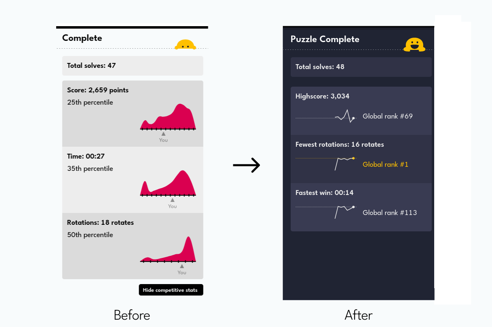
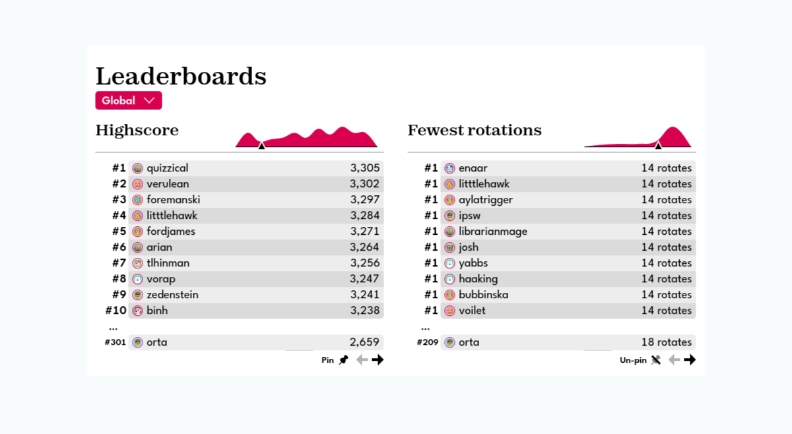

+++
title = 'The new completion section'
date = 2024-04-18T10:48:48+01:00
authors = ['orta']
tags = ["changelog"]
theme = "puzzmo-light"
+++

Hi folks, welcome to our new blog if you're a first time reader! ( The rest of our posts are tech stuff, which my wife described as _"full of jargon"_. So, it'd be very reasonable to skip. ) 

We've been trying to figure out a way to give updates on major changes to Puzzmo and thought a changelog section on the blog would do a pretty good job at that.

So, what just changed?

**We're introducing a re-think of the information you see after completing a game today.** 

What are the key changes:

- We're prioritising your play history as a way to show progress. 
- Globally competitive information is deemphasised.

Since launch we've been re-examining ways in which we encourage competition on Puzzmo, and have a better sense of what we're doing which can make folks feel bad about a puzzle which they thought they did well in. 

Some games just seem to have folks competing at a different level, which is cool, but kinda de-motivating to see straight after you completed something tricky. Now, you're mostly competing with past you, and we have kept a way to let you know about interesting highlights. You would be astute to note that the screenshots above somewhat contradict this, because they still include _"Global rank xth"_ - this is now a choice! If you set your leaderboards to be friends only, the messages will respect that choice!

We're trying to run Puzzmo on a reasonable budget, and so we aren't storing all of the history for folks who are not logged in! They will see a small prompt to sign up. 

If, _like me_, you enjoy the histograms - worry not, they are still around. They've moved down to the leaderboards. This has the advantage of letting us show histograms in new places.

We've been running this system behind the scenes for a while now, so it's likely that if you are a regular player you have a history already set up to see on the next time you complete a puzzle!