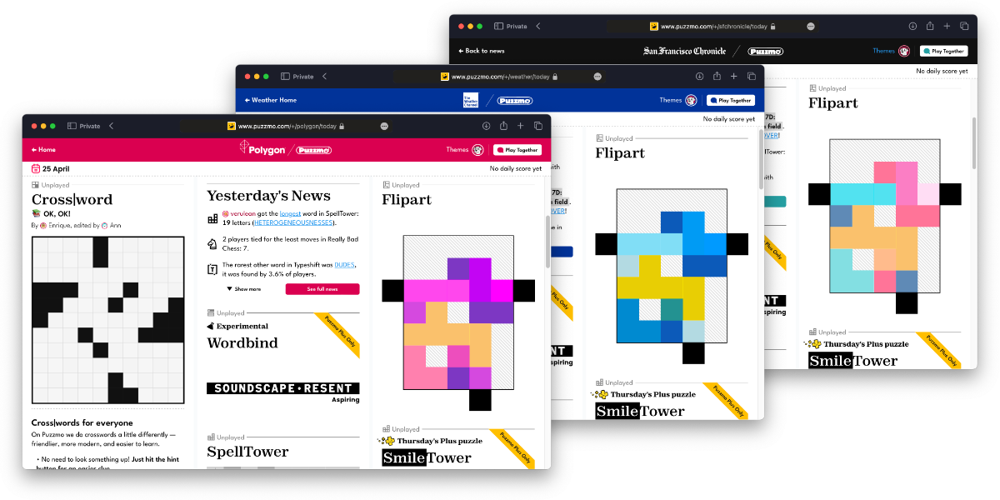

+++
title = 'The new theme editor'
date = 2024-04-25T15:03:59+01:00
authors = ['orta']
tags = ["changelog"]
theme = "puzzmo-light"
+++

Puzzmo has a pretty comprehensive theming system, we've used it to ship 8 different themes before we launched!


Then we built a system which lets our partners have a custom theme based on their own site's color themes:



Now we're bringing the ability to customize your theme to all Puzzmo Plus users! Here's one I whipped up just now, using the excellent video game [Hollow Knight](https://www.hollowknight.com)'s [Greenpath area](https://www.ign.com/wikis/hollow-knight/Into_Greenpath) as inspiration:


I really like how Slack handles theming, which uses a sharable bit of text to pass the theme around, so we replicated it. Here is the theme for the above screenshot:

```
Greenpath/1/#704c73/#ffffff/#563359/#8c668f/#c0a3c2/#348782/#000000/#ed4d1c/#ff8764/#000000/#b4813c/#3cb445/#3c6eb4/#000000/#FF3C3C/#1d3c41/#82b8af/#2d7351/#236f78/#3d3846/#1B1B28/#FFFFFF/#000000/#2a725c/#1B1D29/#349272/#31856b/#629994/#eac44f/#000000/#4c836e/#437260/#3572a5/#92b9b4
```

Let's learn how to use the new theming system.

### How to set a custom theme

The theme settings live in your "Account Settings" screen, you can access via [this link](https://www.puzzmo.com/me) - or by tapping on your avatar in the top-right corner and choosing "Account Settings" in the drop-down.

If you are a Puzzmo Plus subscriber, you will see a new section "Use custom theme" which toggles between our default themes and the new custom theme support:


Toggling "Custom" on will bring up a new section, which you can paste in the new sharable theme:


Hitting "Update" should change your theme to the new one:


:tada:

### Making your own theme

On desktop, hitting the "Theme Editor" button will bring up a sidebar to Puzzmo. The sidebar can persist on all of the different pages, so you can look at all the weird edge-cases our theming system handles.


If you have questions - there's a little guide at the bottom of the theme editor highlighting how certain games and pages are themed, if you have more questions than that. We're around in discord!

Then, when completed you can take the "Share Text" and give that around to other folks to share your theme, we've opened up a channel in [the Puzzmo Discord](https://discord.gg/7ZSwDSUZbd) specifically for sharing themes! 