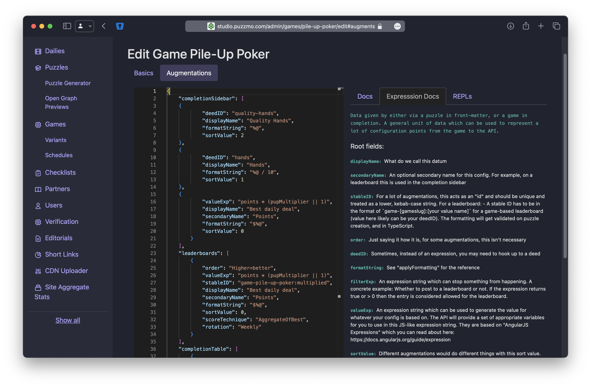

+++
title = 'Augmenting Puzzmo'
date = 2024-04-28T18:25:53+01:00
authors = ["orta"]
tags = ["tech", "leaderboards"]
theme = "outlook-hayesy-beta"
+++

After we launched Puzzmo, we sort of hit this moment of _"well... what now?"_. Zach & I had such a complete vision of what we wanted to build for v1 from the get-go, and we all had taken some extra time for polish pass, so to a __reasonable__ extent, we had a solid version one.

We'd never _really_ talked about version two, and on top of that, our team had just tripled in the last month. So - _what now?_

If you'll permit me to simplify, after weeks of discussion, we concluded that the path to a Puzzmo version two is _"Weird Puzzmo"_. Our main competitors are less nimble (they tend to have significantly larger support backlogs) and often aim to project a very serious tone. If we ship fast, experiment often and present ourselves as a more playful approach to daily puzzles - then we'd ideally be competing on our strengths.

OK. So... How do we do that?

This blog post tries to cover the technical under-the-hood changes which I felt were necessary to get us to a point where weird Puzzmo was even possible.

For a lot of our users, the sense that something interesting was happening to Puzzmo started on April 1 2024. For alpha users, they'd be used to the idea that we take April Fools seriously, 2023's had Really Bad Chess simply play as the default chess board arrangement. For 2024, it was the first day we shipped something weird across all games.

[What did that look like](https://www.puzzmo.com/today/2024-04-01):

- `Cross|word` - A crossword that was **basically** only possible by using hints
- `TypeShift` - "Trioshift", a version of a Typeshift where there were only three letters, making is vertically massive but horizontally short
- `Flipart` - "☐☐☐☐art", a version where all the pieces are invisible
- `Really Bad Chess` - "Really Checkers Chess", a board where chess pieces were framed like checkers pieces
- `Cube Clear` - "ABCube Clear", instead of the usual scrabble-ish prioritised letters, it's A-Z.
- `Wordbind` - We presented the puzzle as though it were a placeholder which had been left in

From our side, we introduced a new systemic approach to categorizing the sources of our puzzles. Previously, we had a single dimension of "difficulty" now we have different sets of puzzle variants (e.g. Trioshift) and those variants need to be treated differently systemically!

## Shifting control

If you want a comprehensive understanding of what the original version of our per-game extension system looked like, you can read (with code) ["How the Puzzmo API handles integrations on a per-game basis"](https://blog.puzzmo.com/posts/2024/03/28/an-ode-to-game-plugins/), the TDLR: each game has a server-level plugin which is encapsulated in a single file.

This plugin system is great because I can easily test it, see changes in pull requests and debug it trivially by reading the code. The downside, is that all of this work happens in the API, which is a system the games team basically never contribute to. This becomes particularly evident looking at plugins for the games I would play daily being fully featured in news and stats vs the ones I play mainly to test during development.

This system worked great during the creation of our initial set of games because there were only a few of us and we all contributed everywhere, but now it concentrates control in the wrong place. So, we needed _a technical solution which can open the way for a cultural change_ to give the games team more control over app-wide systems inside Puzzmo.

## Augmentations & Deeds & Expressions

The [answer I came up with](https://gist.github.com/orta/8d975a33a9be14ca0fba52c6aecfd454) is to build out three concurrent systems:

- Deeds: A key-value store for game progress/completion data
- Augmentations: A way to describe system hooks in outside of the API (e.g. in games, puzzles, admin tools)
- Expressions & Scopes: A way to write simple logic for augmentations in strings

### Deeds

When I initially designed Puzzmo's data-models, I knew completing a puzzle across all games would create `points`, `time`, `hints` but also accommodated for each game having different values which are unique to that game. So, we had 0 to 4 integers 'metrics' and a 'metrics string' array which correspond to different per-game stats generated while playing the puzzle. These variables get used for leaderboards, news, the completion table and other app-wide concerns. 


```
/// Metrics for games

// Spelltower
// Metric 1: longest word length
// Metric 2: highest scoring word
// Metric 3: Full or partial complete (as 1 or 0)
// Metric 4: Number of words played
// Metric Strings:
//  0: Longest word
//  1: Highest scoring word

// Crossword
// None!

// RBC
// Metric 1: captured count
// Metric 2: Lost count
// Metric 3: Turns taken
// Metric Strings:
//  0: Current FEN
//  1: Current FEN -1 move

// Typeshift
// Metric 1: found words count
// Metric 2: 1 if a game where only core words were found, 2 if only other words were found, 3 if all core words were found and some other words were found, 0 if both

// Flip Art
// Metric 1: number of flips
// Metric 2: number of excess flips

// Wordbind
// Metric 1: number of words found
// Metric 2: Time to energetic
// Metric 3: List completion bonus +/- (par)
// Metric 4: Toughest word
// Metric Strings:
//  0: Toughest word text

// CubeClear
// Metric 1: Words found
// Metric 2: Solve score (extra tiles x 10 + words)
// Metric 3: Extra tiles

// PileUpPoker
// No metrics yet
```


This isn't enough to do our entire data-pipelining though, so there is also an _additional_ set of variables which come along which we call `pipelineData`. Pipeline data is information the game engine generates which is only valid for the game completion pipeline and is not stored, here's an example of the one for Spelltower:

```ts
export type SpelltowerStats = {
  pipelineStats: [
    wordsFound: number,
    fullClear: number,
    partialClear: number,
    highestScoringWord: string,
    highestScoringWordScore: number,
    longestWord: string,
    longestScoringWordLength: number,
    wpm: number,
    averageWordLength: number,

    amountOfWordsGreaterThan8Chars: (number | undefined)[]
  ]
  /// ...
}
```

So, in summary we had information about a completed puzzle in:

- Time, points, hints, cheats, pauses lived on the gameplay
- Metrics 1 to 4, and metrics string
- Pipeline data

In order to provide higher-level tooling, I needed to flatten these storage spaces into a single way to access variables. 

Today, we have a generalized "Deed" system where completing a puzzle has the game emitting an array of `key: value`. Here's one for a game of Spelltower I have just completed:

```json
[
  { "id": "time", "value": 360.431, "persist": true },
  { "id": "hints", "value": 0, "persist": true },
  { "id": "points", "value": 779, "persist": true },
  { "id": "longest-word", "value": 7, "textRepresentation": "WILDEST", "persist": true },
  { "id": "best-word", "value": 602, "textRepresentation": "WILDEST", "persist": true },
  { "id": "completion-type", "value": 0, "persist": true },
  { "id": "bonus-tiles-used", "value": 1 },
  { "id": "line-clear-tiles-used", "value": 0 },
  { "id": "words-longer-than-4", "value": 1 },
  { "id": "time-before-first-word", "value": 103 },
  { "id": "words-found", "value": 8 },
  { "id": "wpm", "value": 1.33 },
  { "id": "avg-word-length", "value": 3.75 },
  { "id": "long-word-counts",  "value": [ 0, 0, 0, 0, 0, 0 ]}
]
```



```ts
type PipelineDeed = {
  /** The key value, this wants to be terse, kebab-case */
  id: string
  /** Any value the deed represents. A value of null or undefined is ignored by the API.  */
  value: any
  /** For deeds like 'best-word' on spelltower */
  textRepresentation?: string | null
}

type PersistedDeed = {
  /** The key value, this wants to be terse, kebab-case */
  id: DeedKeys
  /** The number the deed represents. A value of null or undefined is ignored by the API. */
  value: number
  /** For deeds like 'best-word' on spelltower */
  textRepresentation?: string | null
  /** Should this get stored on the user for history etc? */
  persist?: true
}

/** This is a controlled vocabulary, thus the bit of friction required to append to it. Keys should be generalizable across many games. */
export type DeedKeys =
  | "points"
  | "time"
  | "hints"
  | "words-found"
  | "moves"
  | "excess-moves"
  | "custom-time"
  | "completion-type"
  | "par"
  | "best-word"
  | "longest-word"
  | "time-to-best-word"
  | "avg-word-length"
  | "wpm"
  | "long-word-counts"
  | "captures"
  | "losses"
  | "hands"
  | "quality-hands"
  | "best-hands"
  | "mode"
  | "plonks"
```


There's basically hints of all prior systems in this single array:

- A deed can be persisted or transitory
- A deed value can be any type, unless it is persisted (where it has to be a number)
- A deed can have text attached to it
- We have a controlled set of ids for persisted deeds (to try contain complexity)

Then by having it all flattened opens the door for making them available to augmentations and expression strings!

### Augmentations

The core idea is we have existing systems in place (leaderboard, news, groups etc) and "augmentations" provides hooks into those systems and extends those systems without having to write code. Generally speaking, there are two places where this happens:

- A puzzle being added to the daily
- When someone completes a puzzle

#### Puzzle Creation

Let's start with the puzzle being created. We extended the puzzle file format to support JSON front-matter. This is a technique used in blogging engines a lot (this post for example has front-matter describing its metadata like my authorship) and it means that we can continue to ensure that the API/App systems continue to not understand/read the puzzle file's content. That's a games concern. 

Here's an example of a puzzle which ran today:

```
---
{
  "_v": 1,
  "variant": {
    "slug": "lock",
    "subvariantSlug": "center-shift"
  }
}
---
1
7x6
6
18
0, 0, 3, 4, 2, 2, 0
WEZCIRS
*AIDHL*
*IDLLE*
**NGRD*
**EVET*
***A***
WAILERS
WIDGETS
WADDLES
WEEVILS
WIZARDS
WINCHES
WADDIES
[ Snip... ]
```

You can see the version number, and then we have the `variant` and `subVariant` information, these act like templates for the augmentations JSON. 



The `"lock"` variant does not have any augmentations, it looks like:

```json
{}
```

That's because for this case, everything is happening in `"center-shift"` which looks like:

```json
{
  "_v": 1,
  "displayName": "|Center|shift",
  "shortDescription": "Typeshift, but you can only move the center columns!",
  "augmentations": {
    "leaderboards": [
      {
        "order": "Higher=better",
        "valueExp": "tilesInFoundWords - tilesInPuzzle",
        "stableID": "game-typeshift:center:Repeated-letters",
        "displayName": "Repeated letter uses",
        "formatString": "%@",
        "sortValue": -100
      }
    ]
  }
}
```

This means when the puzzle is created, we combine all possible augmentations (which in this case is just a leaderboard from the subVariant) and then use that for handling the additional processing.



You can learn a bit more how we used the puzzle and variant infrastructure (we call them Remixes when user-facing) [from Jack on his blog](https://www.jackschlesinger.com/post/remix-postmortem). From this post's perspective, the interesting aspect is the switch to allow an individual puzzle file to quite drastically influence how it is shown on the today page and then influence the completion process:



The front-matter schema:

```jsonc
/** The schema supported by the API for the JSON front-matter in a puzzle */
type PuzzleFrontMatter = {
  /** The current API contract */
  _v: 1

  /** If we want to prefix this game with an emoji */
  emoji?: string

  /** A way to replace the puzzle's game name within the Puzzmo UI */
  displayName?: string

  /** A one-liner which goes above the thumbnail on the today page */
  shortDescription?: string

  /** Setup for variants */
  variant?: {
    /** A unique string which can be used to check against existing declared variants */
    slug: string

    /** A way to pull out from a templated front-matter on an existing variant */
    subvariantSlug?: string
  }

  /** Site wide hooks  */
  augmentations?: Augmentations
}
```

Which is a lot of today page info, and then an "augmentations" object which is what we'll get into next



#### Puzzle Completion

We do a lot of post-processing when someone has completed a puzzle; think leaderboards, user stats, puzzle stats, group updates, events and site stats. These are the type of systems which we want the games team to be able to influence without making API code changes!

Similar to how we implemented augmentations into an existing workflow for puzzle creation, the completion infrastructure is also built atop the existing flows for building games inside Puzzmo. In this case, I extended the admin tools for our games to include augmentations:





```ts
type Augmentations = {
  /** Dynamic leaderboards for this game */
  leaderboards?: LeaderboardExpressionSetup[]

  /** Game specific stats datums to augment the existing aggregate data for a puzzle generated by the API */
  puzzleAggregateStats?: ExpressionSetup[]

  /** Game specific user aggregate stats, these get tied to the game/variant and are
   * separate from the existing stats which are generated in code via the API */
  userAggregateStats?: Pick<ExpressionSetup, "deedID" | "stableID" | "filterExp" | "valueExp">[]

  /** A way to add additional persisted deeds based on the data from the game.
   *  Consider it a way to take a non-persisted deed, and persist it. For example,
   *  if you wanted to take a temporary deed from a game and show it on a completion table.
   *  The "deedID" is used as storage key, value lookup is done via 'valueExp'. */
  persistedDeeds?: ExpressionSetup[]

  /** Additional info to show on the today page completion table, it is ignored when coming from a game */
  completionTable?: Array<{ title: string; persistedDeedID: string; formatString: string }>

  /** Additional info to show on the today page completion table, it is ignored when coming from a game. Used for deeds which do not have a leaderboard attached. */
  completionSidebar?: ExpressionSetup[]
}

```