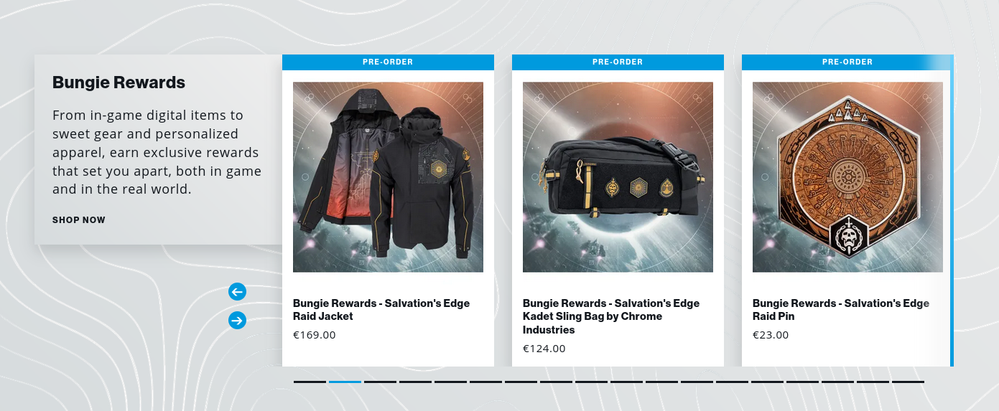
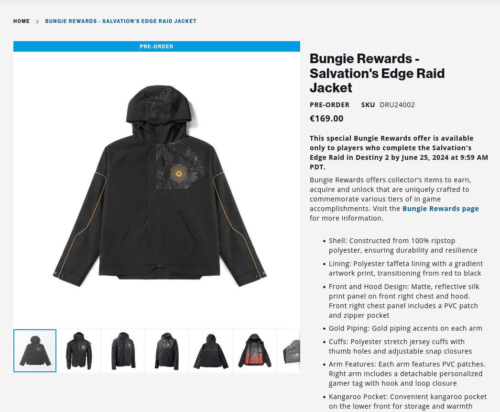
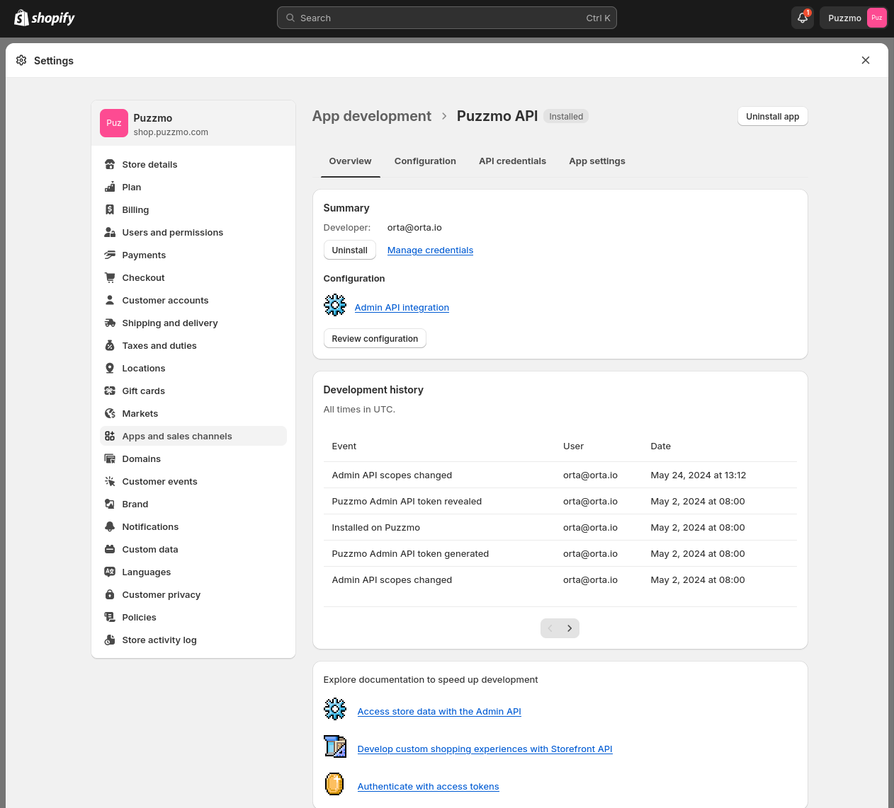

+++
title = "Making a shopify shop with per-user discounts"
date = 2024-06-17T12:34:31+01:00
authors = ["orta"]
tags = ["tech", "api", "shopify", "graphql"]
theme = "outlook-hayesy-beta"
+++

With the launch of [Pile-Up Poker](https://www.gamedeveloper.com/design/how-pile-up-poker-survived-cancellation-to-become-a-puzzmo-hit) we knew that we wanted to sell a [pack of cards](https://shop.puzzmo.com/products/puzzmo-lisa-hanawalt-playing-cards). Systemically thinking, this meant a few requirements for what it would mean to buy a physical item from us:

- We want admins to handle inventory
- We want to work with third party fulfillment tools
- We want people who sign up during the launch period to get the cards for free
- We want folks who had already signed up, to get it for a reasonable price
- Folks who don't want a Puzzmo subscription could have a route to getting the cards

There was a strong recommendation from the business side to use Shopify, and we didn't have any argument against it on the technical side! After trying out a quick prototype, I recommended we implement a system similar to how [Bungie handled their store](https://eu.bungiestore.com/) for the video game Destiny 2.

The Bungie store has this concept where they create physical gear specific to raids which are extremely difficult end-game content (e.g. stuff after you have "completed" the game, and then really decided to commit to sticking around) that requires you to have completed the raid in-game _before_ you can buy them:



For example, this raid jacket which is for a new upcoming raid:



There is a ~3 week time period where you have to complete the raid under unique constraints and if you pull it off _you have the opportunity_ to buy this ~$170 USD coat.

Ask me how I know?


What Bungie did for my jacket was [charge $7777 USD](https://gamerant.com/destiny-2-deep-stone-crypt-raid-jacket/), unless you had a discount from a prior raid. 

### How to replicate what Bungie did

We do it in three different steps:

1. Your app needs to track discounts for users
2. You need to be able to send someone to a checkout with the discount code
3. Shopify needs to tell you that a discount was used so you can mark it as applied

### 1. In your app

This is what our database schema looks like for the product discounts:

```
model ProductDiscount {
  id   String @id @unique
  slug String @unique

  createdAt DateTime @default(now())
  updatedAt DateTime @default(now()) @updatedAt

  // E.g. what has been given
  productType ProductDiscountType
  // How many times has it been used
  usedCount   Int?

  // Who does it relate to
  accountID String
  account   Account @relation(fields: [accountID], references: [id])
}

enum ProductDiscountType {
  PUPCards90

  PUPCardsEventually
  PUPCards100
}
```

And we have a 1-to-many relationship between accounts and product discounts. The "Eventually" is because we have a trial system in place, so we can provide a UI which lets someone know they will get the discount when the trial is over.

Next up, you want to send someone to Shopify.

### 2. Sending them to the Shop

OK, this is where you need to learn all of the shopify concepts now. First up, you need to have a Shopify store set up, with an existing (expensive) product.

You're going to want to add the app ["Headless"](https://shopify.dev/docs/storefronts/headless/building-with-the-storefront-api/getting-started) to your store-front. Next, you will create your own Shopify app. These will provide you with the two access tokens you need:

Go to [shopify.dev](https://shopify.dev) and create a new app. I gave our app these permissions: `write_cart_transforms, read_cart_transforms, read_all_cart_transforms, write_product_listings, read_product_listings, write_products, read_products, write_product_feeds, read_product_feeds, write_orders, read_orders, write_discounts, read_discounts` (basically read/write access to order/cart/discounts.)

This app needs to be added to your shop!



With both of those apps ready, I added these environment variables in our API's `.env` as:

```sh
# Comes from our "Puzzmo API" shopify app
SHOPIFY_ADMIN_API_TOKEN="shpat_170[... the rest]"

# Comes from the "Headless" app
SHOPIFY_PUBLIC_STOREFRONT_ACCESS_TOKEN="1e77[.. the rest]"
```

Our end goal is to generate a redirect URL which has both the product, and the discount applied - so someone can just go and put in their shipping/card details to purchase the item.

To get there we need to generate (or find) the discount code and create a checkout session for someone. We're going to use these 3 mutations in the 2 Shopify GraphQL APIs.

- Admin: [`discountNodes`](https://shopify.dev/docs/api/admin-graphql/2024-04/queries/discountNodes) (to look up a code)
- Admin: [`discountCodeBasicCreate`](https://shopify.dev/docs/api/admin-graphql/2024-04/mutations/discountCodeBasicCreate) (to create discount if not found)

- Storefront: [`cartCreate`](https://shopify.dev/docs/api/storefront/2024-04/mutations/cartCreate) (for the user redirect)

### Making the mutations

Discounts aren't searchable via the actual discount 'code' - that would make this a whole lot easier. So, here's how I got the look-up working: You need a consistent title for the discount which is unique per user.

We have a function which looks like this:

```ts
import { createAdminApiClient } from "@shopify/admin-api-client"

export const getOrCreateDiscountCodeForUser = async (user: { username: string; usernameID: string }, item: ProductDiscount) => {
  const token = process.env.SHOPIFY_ADMIN_API_TOKEN
  if (!token) throw new Error("Missing SHOPIFY_ADMIN_API_TOKEN")

  if (item.productType !== "PUPCards100" && item.productType !== "PUPCards90") throw new Error("Unknown item")

  const isFree = item.productType.endsWith("100")
  const prefix = isFree ? "free" : ""

  const client = createAdminApiClient({
    storeDomain: `${shopifyStoreID}.myshopify.com`,
    apiVersion: "2024-04",
    accessToken: token,
  })

  const title = `${user.username}#${user.usernameID}'s ${prefix} Pile-Up Poker Cards`

  const { data, errors } = await client.request(
    `query discountAutomaticBasicGet($title: String!)  {
        discountNodes(query: $title, first:10) {
            nodes {
                id
                discount {
                  ${fragment}
                }
            }
        }
    }`,
    { variables: { title } }
  )

  // [SNIP Error checking etc]

  // [SNIP looking up and comparing the titles, and returning if found]

  if (notFound) {
    const { data, errors } = await client.request(
      `mutation basicCodeDiscount($basicCodeDiscount: DiscountCodeBasicInput!) {
                discountCodeBasicCreate(basicCodeDiscount: $basicCodeDiscount) {
                    codeDiscountNode {
                        codeDiscount {
                            ${fragment}
                        }
                    }
                    userErrors {
                        field
                        code
                        message
                    }
                }
            }`,
      {
        variables: {
          basicCodeDiscount: {
            title,
            code: item.slug,
            startsAt: new Date().toISOString(),
            endsAt: null,
            customerSelection: {
              all: true,
            },
            customerGets: {
              value: {
                percentage: isFree ? 1 : 0.9,
              },
              items: {
                products: {
                  productsToAdd: [cardsProductID],
                },
              },
            },
            usageLimit: 1,
          },
        },
      }
    )

    // [SNIP Error checking etc]
    return data.discountCodeBasicCreate.codeDiscountNode.codeDiscount.codes.nodes[0].code
  }
}
```

That function with error handling etc will turn into a pretty serious function, let me warn you now. However, that's the skeleton of the idea: look it up, and create a discount if you can't find it.

I use the slug of the product discount as the code, these are small 7-10 char strings. This makes the third step (marking them as used) easy.

OK, we have a discount made on Shopify and a code for the customer now, let's make a checkout session:

```ts
export const getShopifyCheckoutURLForItem = async (
  item: ProductDiscount,
  user: { username: string; usernameID: string; id: string },
  account: { id: string },
  buyerIdentity: any | undefined
) => {
  const token = process.env.SHOPIFY_PUBLIC_STOREFRONT_ACCESS_TOKEN
  if (!token) throw new Error("Missing SHOPIFY_PUBLIC_STOREFRONT_ACCESS_TOKEN")

  if (item.productType !== "PUPCards100" && item.productType !== "PUPCards90") throw new Error("Unknown item")
  const code = await getOrCreateDiscountCodeForUser(user, item)

  // Make graphQL call to get the checkout URL
  // https://shopify.dev/docs/api/storefront/2024-04/mutations/cartCreate
  const response = await fetch(`https://${shopifyStoreID}.myshopify.com/api/2024-04/graphql.json`, {
    method: "POST",
    headers: {
      "Content-Type": "application/json",
      "X-Shopify-Storefront-Access-Token": token,
    },
    body: JSON.stringify({
      query: `
      mutation Create ($input: CartInput!) {
        cartCreate(input: $input) {
          cart {
            id
            checkoutUrl
          }

          userErrors {
            field
            code
            message
          }
        }
      }
      `,
      variables: {
        input: {
          lines: [
            {
              merchandiseId: cardsPublicProductVariantID,
              quantity: 1,
            },
          ],
          buyerIdentity,
          discountCodes: code ? [code] : [],

          attributes: [
            { key: "itemID", value: item.id },
            { key: "accountID", value: account.id },
            { key: "userID", value: user.id },
          ],
        },
      },
    }),
  })

  // [SNIP Error Checking etc]
  const json = await response.json()
  return json.data?.cartCreate?.cart?.checkoutUrl
}
```

Which will generate a URL we can send a user to!

Lets remove a bit of friction too, if we already have some billing information about someone (because they are signed up to Puzzmo) then we can pre-fill the address with their details from stripe:

```ts
// Creates a CartBuyerIdentityInput for an existing user
// https://shopify.dev/docs/api/storefront/2024-04/input-objects/MailingAddressInput
export const getShopifyBuyerIdentityFromStripe = async (stripeID: string | undefined, email: string | undefined) => {
  if (!stripeID) return null
  const stripe = createStripe()
  const customer = await stripe.customers.retrieve(stripeID)
  if (customer.deleted) return null
  if (!customer) return null

  return {
    email,
    deliveryAddressPreferences: customer.address
      ? [
          {
            deliveryAddress: {
              country: customer.address?.country,
              phone: customer.phone || undefined,
              address1: customer.address?.line1,
              address2: customer.address?.line2,
              city: customer.address?.city,
              province: customer.address?.state,
              zip: customer.address?.postal_code,
              // postalCode: customer.address?.postal_code,
              firstName: customer.name?.split(" ")[0],
              lastName: customer.name?.split(" ")[1],
            },
          },
        ]
      : undefined,
  }
}
```

There we go! You can see the discounts being created in your shopify shop, and validate the process by running through it yourself.

Now we just need to make sure that your database is kept up-to-date!

### 3. Updates from the Shop

We're going to want to get a webhook that the user has completed a purchase, so we can mark the code as used on our side. 

Next you need to be able to receive webhooks, there isn't a user interface for this, so you need to use the GraphQL Admin API for it:

```ts
import { createAdminApiClient } from "@shopify/admin-api-client"
import chalk from "chalk"

const shopifyStoreID = "..."

export async function addShopifyWebhook({ args }) {
  const url = args._[1]
  if (!url) throw new Error("No URL param provided")
  const token = process.env.SHOPIFY_ADMIN_API_TOKEN
  if (!token) throw new Error("Missing SHOPIFY_ADMIN_API_TOKEN")

  const client = createAdminApiClient({
    storeDomain: `${shopifyStoreID}.myshopify.com`,
    apiVersion: "2024-04",
    accessToken: token,
  })

  // https://shopify.dev/docs/api/admin-graphql/2024-04/mutations/webhooksubscriptioncreate
  const exists = await client.request(
    `mutation WebhookCreate($url: URL!)  {
      webhookSubscriptionCreate (
        topic: ORDERS_CREATE
        webhookSubscription: { format: JSON, callbackUrl: $url }
      ) {
        userErrors {
          field
          message
        }
        webhookSubscription {
          id
        }
      }
    }`,
    {
      variables: { url },
    }
  )

  if (exists.data?.webhookSubscriptionCreate?.userErrors.length > 0) {
    console.log(exists.data?.webhookSubscriptionCreate.userErrors)
  }
  if (exists.errors) {
    console.log(exists.errors)
  }
  if (exists.data?.webhookSubscriptionCreate?.webhookSubscription?.id) {
    console.log("Webhook created: " + chalk.bold(url + "/shopifyWebhook"))
  }
}
```

`ORDERS_CREATE` means you will get webhooks with completed purchases. Handling the webhook is straight-forward web infra:

```ts
export const handler = async (event: RequestEvent) => {
  if (!event.body) return { statusCode: 200, body: "No body" }

  const body = JSON.parse(event.body) as ShopifyWebhook

  const discountCode = body.discount_codes[0]
  if (!discountCode) {
    console.error("No discount code found in webhook")
    return { statusCode: 200, body: "No discount code found in webhook" }
  }

  const discount = await db.productDiscount.findFirst({
    where: { slug: discountCode.code },
  })

  if (!discount) {
    console.error("No discount found for code", discountCode.code)
    return { statusCode: 200, body: "No discount found for code" }
  }

  if (discount.usedCount) {
    console.error(`Discount ${discount.slug} already used`)
    return { statusCode: 200, body: "Discount already used" }
  }

  await db.productDiscount.update({
    where: { id: discount.id },
    data: { usedCount: 1 },
  })

  // Delete the discount from shopify
  await deleteDiscountCode(discountCode.code)

  return { statusCode: 200, body: "Success" }
}
```

You can go figure out how to do `deleteDiscountCode` but that should be everything for replicating the Bungie-like shop system using Shopify.