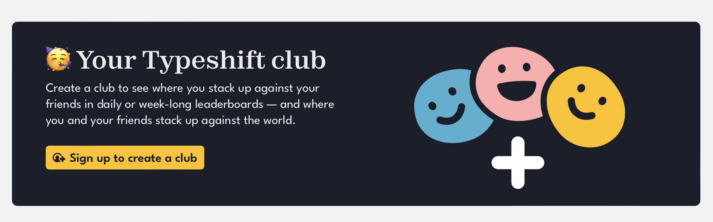
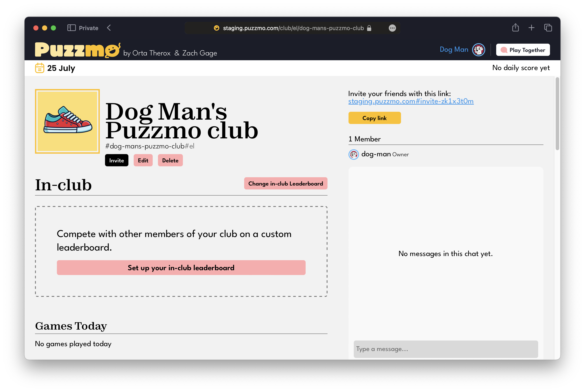
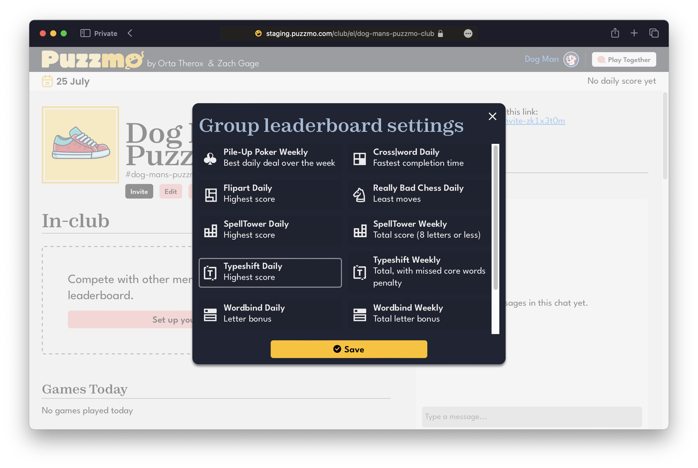
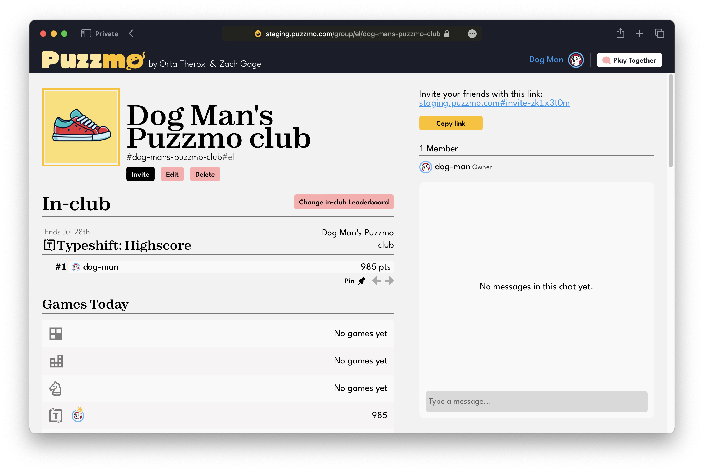
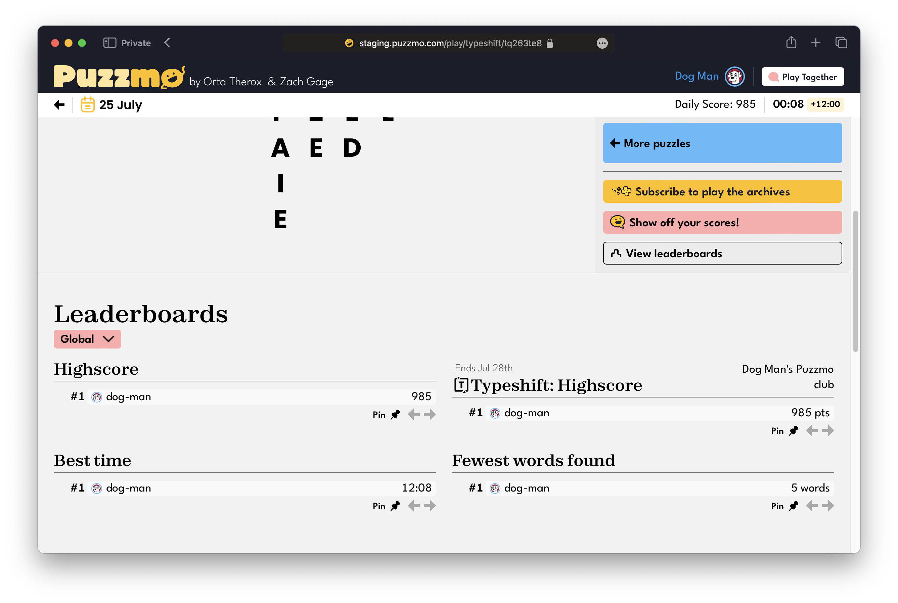
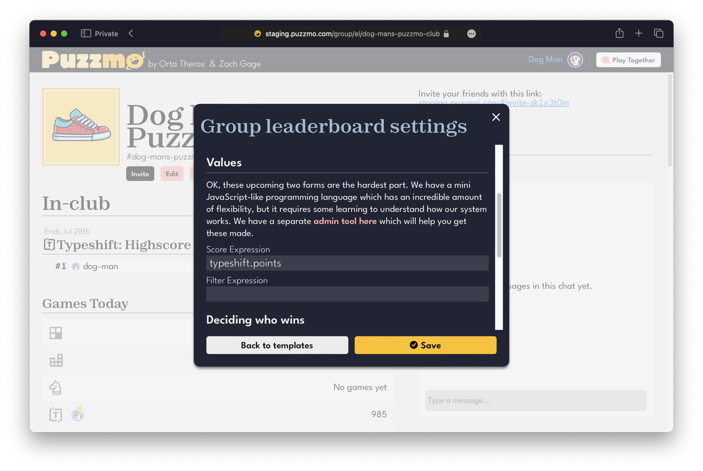
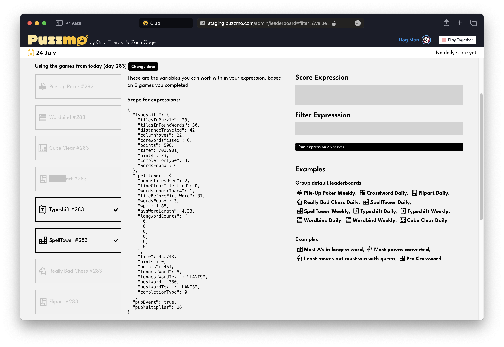

+++
title = 'From Groups to Clubs'
date = 2024-07-24T10:23:52+01:00
authors = ['orta']
tags = ["changelog"]
theme = "puzzmo-light"
+++

With the $50 billion dollar mark passed on the Pile-Up Poker launch fund we're releasing a re-think of how ~~Groups~~ Clubs work in Puzzmo.

**TLDR:** Groups are now called clubs, you do not need to have Puzzmo Plus to create your first club and **clubs can have leaderboards**.

Starting today, you'll see a way to quickly create a club with a leaderboard based on the game that you just completed!

Creating a club through this will take you through to your blank club, ready to customize or invite your friends.

Some key things to note:

- There is an easy invite URL to share with club members. This link will handle guiding someone through creating a Puzzmo account if they need it.

- Inter-club competitive aspects of Puzzmo, based on the top daily score in games from your club members, are still around below.

- There is a big "Set up your leaderboard" button to get started with the new club leaderboards, which we'll dig into now.

### Club Leaderboards

To get you started quickly we offer a series of interesting leaderboards for clubs which cover all the games on Puzzmo:

Completing a game will give you a first place! Hah, easy.

Your club leaderboards will show up with the rest of the leaderboards after completing a puzzle:

When any member of your club completes your club's game, their scores will post to the leaderboard, meaning you can _compare scores with non-Puzzmo Plus folks for the first time_.

### Custom Club Leaderboards

**For me,** this is where clubs get interesting. The templates which we provide cover a broad range of new leaderboards, most of which differ from the leaderboards to for Puzzmo Plus members after playing a game. We call the choices templates because we also are providing full access to the machinary that powers all of the leaderboards across Puzzmo to clubs.

As with the [theme editing support](https://blog.puzzmo.com/posts/2024/04/25/theme-editor/), we do not anticipate this be a feature most people engage with. However, for those who are interested in being creative around the meta-games you play - _I think we're offering some of the most in-depth leaderboard tools to non-programmers_ in the industry.

In _very_ quick: Puzzmo's custom leaderboards lets you write a line of JavaScript-like code which to describe the score for a leaderboard, it can work with information from all games someone played that day.

These two underwhelming _"expression"_ text boxes have been powering all of Puzzmo's leaderboards for the last few months!

We've been using our own tools for working on Puzzmo.com's leaderboards, so to tie with this release we've polished [the page we use](https://www.puzzmo.com/admin/leaderboard/) for the public:

This page is a live environment where you can safely explore your ideas about what a leaderboard could be, for example:

- A leaderboard which counts how many pawns are converted in Really Bad Chess
- A leaderboard which you can only use if you use more than 3 hints in a Cross|word
- A leaderboard which combines the words found in Spelltower and Wordbind
- A leaderboard which counts Flipart time, but only if you get no excess rotates
- A leaderboard which uses the words per minute on Spelltower and Cubeclear, but only if you have an average word length greater than 5
- A leaderboard which takes the most points for a word in SpellTower, but only if it contains two `A`s
- A leaderboard for Cross|word which requires having 'Brooke's expert settings' enabled
- A leaderboard in Spelltower's scores, where you are not able to use bonus tiles

It's hard to write about how many bits of data you can work with because they are constantly evolving on our side, it's a lot, and you can combine them into all sorts of leaderboards. The best way to dig in is to play a few games on the Puzzmo daily, then visit [the admin page](https://www.puzzmo.com/admin/leaderboard/).

I'm hoping folks will creative uses of this leaderboard infrastructure, and am excited to be surprised! We'll be setting up a space in our discord for answering questions and sharing leaderboard ideas, similar to how the theme editing has been going.

Thanks for reading, and happy clubbing!