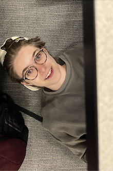
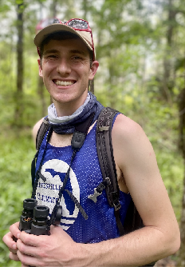

+++
title = 'What is it like to construct Puzzmo Cross|words?'
date = 2024-08-01T05:00:00-04:00
authors = ["madison"]
tags = ["crossword"]
theme = "bright-white"
comments = false
+++

Hi all! [Madison](https://www.puzzmo.com/user/puz/mgreens) (Puzzmo’s Cross|word intern) here!

For the past eight weeks, I have been working closely with Brooke on various Cross|word tasks. I have had the opportunity to observe and take part in all the work that goes into publishing Puzzmo Cross|words, and even try my hand at constructing! You can read more about my reflections on [reviewing submissions](https://link.mailer.puzzmo.com/view/652eb296b069b512940514d1lb7eq.dw4/d9fa12e7), [editing](https://link.mailer.puzzmo.com/view/652eb296b069b512940514d1levfb.hr0/0f032ecf), [co-constructing my first puzzle](https://link.mailer.puzzmo.com/view/6606d36670a6f5f63c022f93lggf6.mz5/addffddb), [writing hints](https://link.mailer.puzzmo.com/view/652eb296b069b512940514d1ldbgg.gz8/a7ce782c), and [test solving and fact checking](https://link.mailer.puzzmo.com/view/6606d36670a6f5f63c022f93li4y2.oil/b70da9cc) in more detail in my past newsletters.

While working for Puzzmo, it has become clear to me that its approach to crosswords, and games in general, is special. I asked Zach Gage, the Creative Director and one of the co-founders of Puzzmo, about this approach.

One of Puzzmo’s main priorities is for “anybody at any skill level to be able to play and win any game they choose to play,” Zach said over Slack DM. In carrying out this goal, “one of the most important jobs Puzzmo has is telling players that they are smart and they are able to play puzzle games and that these games are for them.”

In addition to the hint system — which gives solvers a second, easier clue should they need it — Puzzmo Cross|words are made approachable in their consciousness of new solvers. In other words, to solve a Puzzmo Cross|word, one should not have to rely on knowledge that only comes with experience of solving crosswords. Rather, anyone at any level should be able to enjoy and solve a Cross|word. One of the most notable things for me is that, simultaneously, Puzzmo is able to preserve the voice of the constructor.

Puzzmo Cross|words have a unique ability to center the constructor's personality. After experiencing and observing the Cross|word publishing process, I was inspired to reach out to constructors. I wanted to understand how Puzzmo’s standards for puzzles coincided with constructors’ experiences. I emailed several constructors, including some from [Open Submission Week](https://blog.puzzmo.com/posts/2024/02/05/open-submissions), to learn more about their takeaways from constructing for Puzzmo. 

I was curious about constructors’ processes in making Puzzmo Cross|words. What inspires them to take a word or phrase and put it in a grid? Many constructors gave similar answers: they draw inspiration from their daily lives. The following responses are mostly taken from interviews conducted over email.

**[Kelsey Dixon](https://www.puzzmo.com/user/xwc/kelsey):** 
> it sounds cliche, but i draw inspiration from the world around me— most of my 'seed' entries or clue ideas are things that come to me as i go about my day-to-day life! someone will send me a silly article, or i'll hear a song, or talk to my friends and the gears start turning. i'm a pop culture junkie and i think that's really apparent in my work. i usually start with that one entry i'm really intentionally putting in a grid, and then try to find a bunch of other answers that resonate with me and feel fun and engaging but don't necessarily draw attention from the star of the show.

**[Kenneth Cortes](https://www.puzzmo.com/user/xwc/kenny):**
> My favorite puzzle ideas come from phrases I encounter in my day to day life. I learn a lot of funny words and colloquialisms from my physics students (shout out to CANDY SALAD) that inspire me to make new puzzles and develop themes. I think there is a strong connection between words you authentically discover in real life and entries that are entertaining in a crossword puzzle.

**[Enrique Henestroza Anguiano](https://www.puzzmo.com/user/xwc/enrique):**
> I usually find a little piece of inspiration from my life, or from some wordplay that comes up in conversations I'm having with the people around me, and then turn that into a crossword theme.

Several constructors highlighted how Puzzmo’s unique approach to grid design and size gave way to greater experimentation when constructing. Many crossword venues restrict constructors to rotational symmetry, which Puzzmo does not require. Rather than requiring a specific grid shape, Puzzmo Cross|word submissions are instead constrained by the number of white squares in the puzzle, which roughly amounts in size to the range of 9x9 to 11x11 grids. This requirement results in puzzles that adhere to a “midi” size without restricting constructors in grid design. Puzzmo’s flexibility on grid size and shape led several constructors to develop a different process than they would for other venues.

**Enrique Henestroza Anguiano:**
> Puzzmo allows for light/small themes with two examples, which makes the range of possible themes much wider than with a traditional 15x15 crossword, which is awesome and allows for more of those seeds of ideas to turn into puzzles. My process after coming up with a theme is to find a grid shape that allows me to pack in as many interesting yet accessible answers as possible. Then I just have fun with the clues, knowing that I'm in good hands with the editing to ensure that the puzzle is gentle in difficulty while still having my personality come through. 

**[Chandi Deitmer](https://www.puzzmo.com/user/xwc/chandi):**
> Sometimes I start a puzzle with seed entries, as I think most people do, and as is definitely the case for other outlets. But for Puzzmo, I love sometimes choosing an unconventionally shaped/sized grid and toying with the black square patterns I find pretty. From there, it's about making sure that it also yields fun entries 😅 and tweaking things so that both words and square patterns are ideally pleasing! 

**[Alex Eaton-Salners](https://www.puzzmo.com/user/xwc/alex):**
> When constructing for Puzzmo, I sometimes start with a theme but more often I start with an idea for a fun grid shape.  From there, I build out a tentative grid design and choose appropriate theme entries.  This is often an iterative process since changing the grid shape changes what theme answers the puzzle can accommodate.  Next comes filling the grid with fun words and, eventually, writing the clues. 

**[Adam Aaronson](https://www.puzzmo.com/user/xwc/adam):**
> I feel a unique sense of freedom constructing puzzles for Puzzmo! Like I told Brooke at one point, it’s like “a Puzzmo puzzle can be whatever you want, as long as it’s good”—of course, there are rules and guidelines for the puzzles, but in general, the restrictions for grid shape, symmetry, fresh words to include, and cluing angles to write are so much looser than other outlets, which is truly freeing and always gets me in the groove when I’m constructing.

**[Kate Hawkins](https://www.puzzmo.com/user/xwc/kate):**
> I love writing themeless mid-sized crosswords: Puzzmo gives me a chance to write them for an audience! The smaller format also gives me a chance to build puzzles around fun mini-theme finds that may only have a few components. 

Rachel Fabi has a Cross|word coming out at the end of August that utilized Puzzmo’s freedom in grid design. I edited this puzzle with Brooke and was struck by its creativity and cleverness. I asked Rachel about submitting it to Puzzmo.

**[Rachel Fabi](https://www.puzzmo.com/user/xwc/fabioethics):**
> the reason I made this puzzle for Puzzmo in particular is that I knew I could get away with breaking some rules (grid shape, unchecked squares) for the good of the theme. I love that Puzzmo grants constructors the freedom to experiment and push (imaginary) boundaries. 

Puzzmo’s approach to grid design exemplifies its goals in bringing a human touch to games. Brooke told me about her motivation for this gridding approach. “There are lots of constraints applied to newspaper puzzles exactly because they appear in print. Grids should be a certain consistent size and shape, and the overall character count on clues is limited to the space the newspaper has set aside for its crossword puzzle,” Brooke said. “It’s always been interesting to me that venues that do not have physical restrictions on their crosswords continue to enforce print-motivated constraints. I love when constructors send me puzzles that feature nonstandard shapes and black square patterns, and whose clues don’t adapt the kind of terse newspaper voice developed to save print space.”

This quality of Puzzmo Cross|words is also represented in the effort to preserve the voice and personality of the constructor. The [Puzzmo Manifesto](https://www.puzzmo.com/manifesto) emphasizes that “games are made by people, designed by people, and written by people,” a quality that, I believe, shines through in Puzzmo Cross|words. Whereas other venues may edit down clues to be concise and brief to adhere to an in-house style, Puzzmo leans into longer and more voicey clues, giving constructors space to bring a personal flare to their work. The ability to include voicey clues and answers was highlighted by many of the constructors I interviewed:

**Chandi Deitmer:**
> Cluing for Puzzmo almost feels like writing a diary entry. Why yes, I WILL include that reference to that Nickelodeon show I loved when I was 8, simply because it brings me joy! 

**[Rob Dubbin](https://www.puzzmo.com/user/xwc/ardubs):**
> Puzzmo values the specific things constructors have to say and the personal ways they want to say them, and to me that's what makes them feel like they were really written by people and not just turned out by a process. 

**Kenneth Cortes:**
> An entry that might be too "obscure" for another crossword venue can be celebrated as the centerpiece of a Puzzmo crossword puzzle. This results in puzzles that feel truly personal to the constructor's life experience and is the main reason I love playing/constructing Puzzmo crosswords! 

**Kate Hawkins:**
> Cluing for other puzzle venues can feel like an exercise in tailoring my personal voice to a specific publication's tone. When I write clues for Puzzmo puzzles, I skip this filtering step and get to put myself into what I send to the editors. An upcoming puzzle of mine has the clue "___ ooooh is bananas... B-A-N-A-N-A-S!" ("Hollaback Girl" radio edit lyrics)". It makes me laugh. I hope it makes at least a few other people laugh too. I love that Puzzmo puzzles I write feel like I wrote them. 

**Rachel Fabi:**
> I try to make sure my puzzles include entries and cluing angles that relate to the things I love and care about as much as possible. 

**[Kate Atkinson](https://www.puzzmo.com/user/xwc/swimtime):**
> Cross|words are a chorus made up of unique voices. There's an editorial interest in things that would likely be dismissed or censored in other venues. As an older Millennial, I have had to ponder hard a few current references in clues, and that is great. Younger constructors are naming the cultural phenomena that are shaping their lives, but I never feel excluded or that I can't piece it together. One of the clues in my Cross|word was about Angela Davis's prison abolitionist writing. That clue could only get published by a venue that thinks that knowing about the topic is worth the solvers' while. 

**[Rose Sloan](https://www.puzzmo.com/user/xwc/acommonrose):**
> I love how much Puzzmo cares about constructors’ voices. If you go through my puzzles, you can get a sense of who I am and what I care about—whether it’s what music I’ve been listening to, what movies and video games I love, or just me mentioning some food I like when I write yet another clue for `EAT`. I can generally trust Puzzmo editors to keep these clues that show my personality (though they might make the wording a lot smoother!), and that’s something I really appreciate about Puzzmo, both as a constructor and a solver.

Even throughout the editing process, the constructor’s voice is not eliminated. If Brooke and I ever came across a voicey clue while editing that required a revision — due to grammatical inconsistencies, unnecessary wordiness, or difficulty, etc. — we worked to ensure that our revision did not overshadow the original voice within which the clue was written. 

In my upcoming Cross|word, I have an answer in the grid that I wanted to clue as a song title. My original clue was a fill-in-the-blank with a lyric from the song, but test solvers pointed out this was too difficult if they didn’t know the song. Brooke helped me make the clue more inferable by dropping the lyric approach and instead providing a definitional angle for the title, while still referencing the album it’s on. This revision let me keep the reference while also prioritizing solvers! 

All constructors are also sent a proof of their puzzle before they run, allowing them to review any changes that have been made. The Puzzmo editing process was another feature that constructor’s emphasized:

**Kelsey Dixon:**
> i enjoy the puzzmo process, and the transparency of being able to see the alternate clue options etc. before a puzzle runs… i feel that at puzzmo the constructor has a little more control/ownership over the final product than one might have elsewhere. 

**Enrique Henestroza Anguiano:**
> The chance to review clue edits and have a UI to foster conversations about them is totally unique and amazing. 

**Alex Eaton-Salners:**
> Other venues typically have long turnaround times and provide minimal feedback.  With Puzzmo, communication is fast, and the editors are knowledgeable and helpful.  It's great to work with such a dedicated bunch of crossword enthusiasts! 

**Kate Atkinson:**
> The editorial support from Brooke made this an experience I want to repeat. Knowing I was new, Brooke provided a lot of encouragement, ideas, and explanation of how to tailor my Cross|word to Puzzmo's audience. 

The support constructors receive at Puzzmo extends beyond the editorial phase. Many constructors wrote to me about the importance of the Puzzmo community. Puzzmo maintains an active [Discord](https://discord.gg/puzzmo) with daily puzzle discussion. Dedicated moderators work to cultivate kind and respectful conversations. 

When I first started interning at Puzzmo, Brooke underscored the importance of this community — so rarely in online spaces is the discussion largely civil and polite. Throughout my time at Puzzmo, the messages I’ve been receiving in the Discord have been overwhelmingly positive and welcoming. As I wrote about in my final newsletter, reading the Discord on the day my Cross|word collaboration with Brooke came out was incredibly heartwarming and encouraging. My experience with the Puzzmo community was shared by several constructors. 

**Rob Dubbin:**
> The day my debut was published was a really good time in the Puzzmo discord. It's such a great community of engaged and thoughtful solvers and it really was a blast to experience people being entertained by my silliness and clownery! 

**Adam Aaronson:**
> What I love about Puzzmo is that I can see tons of feedback from the passionate solvers in the Puzzmo discord when my puzzles get released (yes, I read every message, I might be slightly Discord-obsessed), which lets me tangibly see the impact that my puzzles have on their solvers, which I think is really neat and rewarding. 

**Kelsey Dixon:**
> it's really the most rewarding and exciting part of publishing puzzles on puzzmo— i love having that oh! moment and going to the discord channel to see what people are saying. i appreciate how engaged and passionate the solvers are, regardless of where they're at in their solving 'skill' level or how new they are to crosswords. they're always incredibly nice and, even when they have not necessarily enjoyed my puzzle or it wasn't quite for them, i think they offer up good feedback and insight that i like to take forward with me to work on my next one. 

**Rose Sloan:**
> I love reading the Puzzmo Discord whenever I have a puzzle published! A lot of published crosswords (even ones in newspapers that presumably have a lot of solvers) don’t get much online discussion, so getting to see people I don’t know react to something I made is always nice.

**Enrique Henestroza Anguiano:**
> I've loved the feedback I get [on the Puzzmo Discord], which is always respectful, and I like that people post a lot of thoughts and reactions that are less critiques (was the theme set "good", was the fill "good") and more like e.g. an answer made someone think of a funny story or outside reference. 

Finally, I asked constructors about their biggest takeaways they’ve learned from working with Puzzmo. For some constructors, the international solving base resulted in them being more conscious of U.S.-specific references.

**Kelsey Dixon:**
> i've become extremely aware of some of the american-isms i took for granted! 

**Enrique Henestroza Anguiano:**
> One thing I keep in mind for Puzzmo that's different than for other venues is to avoid too many U.S.-centric references, since the audience includes a sizable non-U.S. contingent. 

**Rose Sloan:**
> I try to avoid American sports team/college abbreviations that probably won’t be known to an international audience.

Other constructors noted the importance of creating puzzles that are approachable for new solvers. One thing Brooke is very mindful of is the crossing of trivia-based and/or difficult answers. This consciousness was also highlighted by some of the constructors I interviewed. 

**Kelsey Dixon:**
> i think i have also become more thoughtful about what the solving experience is like for people who are truly brand new to crosswords. it's hard, sometimes, to remember what it was like for me and so being able to see so much constructive feedback and live reports of how people approach the puzzle and how it went for them is invaluable information you do not often get (especially for smaller puzzles) 

**Adam Aaronson:**
> When I make crosswords, the solver is at the top of my mind at all times, whether that’s ensuring each crossing of words is fair and gettable, or writing clues that are approachable and accessible for solvers of all backgrounds. 

**Rose Sloan:**
> There’s a lot of entries that have become standard in crosswords but aren’t particularly common elsewhere, and I think they can be really off-putting to newer solvers. (I don’t think I should have to remember the dog in the Thin Man movies, for example.) 

**Kate Hawkins:**
> While constructing in general -- but especially when writing for Puzzmo's audience -- I aim to create accessible puzzles. That doesn't mean there's no room for proper nouns or tricky clues. It means that I pay close attention to what the less inferable, less definition-based stuff crosses and abuts. 

**Rob Dubbin:**
> No crossing trivia answers!!!!! 

For the Cross|word, a key way that Puzzmo makes solvers feel smart is through the hint system. “It's very easy for somebody to try a crossword on a site other than Puzzmo, come across a clue that they don't have the answer for, and then they feel like they have to Google it, and then feel like maybe they've just cheated, and never want to play a crossword again,” Zach said. “And so, the design of crosswords for Puzzmo was all about making sure that people never felt like they had to search for something. And then, in that moment where players are asking us for help, delivering them the kind of help that genuinely improves their skill.”

As I touched on above, the hint system is a unique aspect of Puzzmo Cross|words that ensures their approachability for all solvers. Matthew Stock, a frequent writer of Cross|word hints (and Cross|words!), wrote to me about his hint-writing process. He explained that much of his process was impacted by the Puzzmo mission of making solvers feel capable and smart.

**[Matthew Stock](https://www.puzzmo.com/user/xwc/matthew):**
> I generally err on the side of overexplaining rather than underexplaining. This feels more in line with the ethos of hints as Brooke first presented them to me, which was that we never wanted anyone to still be stuck even after using a hint. 

Even though hints are meant to provide solvers with an easier and more straightforward clue, Matthew emphasized that there is still ample room for creativity and fun wordplay. 

**Matthew Stock:**
> I always love writing a hint that gets a “whoa” comment from Brooke during the review process — these usually have an especially long full anagram or a particularly unique string of hidden letters in a phrase. My favorite hint that I’ve written doesn’t quite fall into either of those categories, but I love the hint [Sticky tree stuff aptly hidden in the phrase “Ponderosa pine”] for SAP. I love that a) “sticky tree stuff” can get a lot of people to SAP without the rest of the hint, b) that “Ponderosa pine” is a fun, evocative phrase, and c) that it perfectly captures the notion of SAP being inside it from both wordplay and actual life perspectives. I always look forward to the chance to use it :) 

According to Matthew, one of the most important aspects of the hints is its influence on solver experience. 

**Matthew Stock:**
> I think hints give cross|word solvers an added layer of autonomy to decide how they want to enjoy their game time. This is a hallmark of all the Puzzmo games (like, you can choose to go for speed or fewest pieces lost in Really Bad Chess, or choose to get only core words — or no core words!—  in Typeshift), and it’s fun to see that in the Cross|word too. 

I had the opportunity to sit in on a meeting about the [reworking of the Cross|word hint system](https://blog.puzzmo.com/posts/2024/07/22/hints-v2/). I observed as Brooke and Zach went back and forth on various options, debating what hint system would be the most beneficial and fair for solvers. “I always want to avoid a paradigm that’s sort of good for mostly everybody,” Brooke told me. “When Zach and I were discussing various possibilities, we tried to keep in mind what would be philosophically and practically best for using hints as a way to help Puzzmo players become better crossword solvers. When a certain aspect of the hint system was positive in one context and negative in another, we needed to decide what context to prioritize, rather than attempt to co-optimize. We have the opportunity to do something really special here and trying to satisfy every possible consideration — instead of choosing a context to focus on — dilutes that.”

The previous hint system added thirty seconds to a solver’s time for every hint they used. However, this approach was recently phased out. “We didn't really like the way that we were applying a time penalty to the hints. And Brooke and I talked about it a lot and decided that a better approach would be to include a sort of natural time penalty instead of an artificial time penalty,” Zach said. “We had this problem in crosswords where we didn't want hints to be totally free but we also wanted to make sure that we weren't stigmatizing the use of hints because players already stigmatize the use of hints internally.” The new hint system operates on a cool-down system that gives solvers a natural time penalty. The implementation of this system was driven by the need to remove the punitive aspect of the previous system. 

Sitting in on this meeting was one of the highlights of my internship. I loved witnessing how Puzzmo evolves in order to best improve a solver’s experience. Zach stressed the importance of centering the solver at Puzzmo. “Always making sure — and not just the Puzzmo crossword — every game on Puzzmo — always making sure that when you come to us for help, when you have that moment of needing help, that we're going to help you play better, feel better, have more fun, and be smarter.”

Puzzmo’s ability to publish Cross|words that reflect those who make them while also remaining an engaging, inviting, and enjoyable activity for solvers is truly special. Balancing the experiences of the constructor and the solver is no easy feat. But from what I’ve seen and heard, Puzzmo does both. 

As I wrap up my internship, I plan on bringing Puzzmo’s philosophy with me. Too often have I felt discouraged and incapable when solving crosswords. But Puzzmo taught me that through creating crosswords that encourage play, experimentation, and growth, challenge this feeling. I want my crosswords to reflect the person I am while also making people feel smart. Puzzmo has taught me that both can be done together. While working on my upcoming puzzle (check it out on Monday!), I loved embellishing it with my personality. I can’t wait for people to try it!

---

## Constructor bios

**Name:** [Adam Aaronson](https://www.puzzmo.com/user/xwc/adam) (he/him)

**Crossword involvement:** constructor for various newspapers and indie outlets, puzzles at https://aaronson.org/crosswords 

**Other stuff he does:** develop software, play trombone and electric bass, eat really good sandwiches, write Wikipedia pages

**Favorite answer he’s put in a Puzzmo Cross|word:** `LET HIM COOK` (July 24, 2024)

---

**Name:** [Alex Eaton-Salners](https://www.puzzmo.com/user/xwc/alex) (he/him)

**Crossword involvement:** Freelance constructor

**Other stuff he does:** Boardgames, curling, escape rooms

**Favorite answer he's put in a Puzzmo Cross|word:** `FORCE OF NATURE` ([April 22, 2024](https://www.puzzmo.com/link/crossword/earth-day-crossword))

---

**Name:** [Brooke Husic](https://www.puzzmo.com/user/puz/brooke) (she/her)

**Crossword involvement:** Showrunner for Puzzmo's crossword; [Crossword Con](https://www.crosswordcon.com/) director; editor for [Lollapuzzoola](https://bemoresmarter.com/2024/04/03/lollapuzzoola-2024-save-the-date/), [These Puzzles Fund Abortion](https://www.abortionpuzzles.com/), and others; co-maintainer of [Spread the Word(list)](https://www.spreadthewordlist.com/); co-teacher of a [crossword course](https://www.atlasobscura.com/experiences/crossword-course) thru Atlas Obscura; free time (lol) constructor (fave venues to write for: [my blog](https://xwordsbyaladee.blogspot.com/), [The New Yorker](https://www.newyorker.com/contributors/brooke-husic), [Apple News+](https://www.cnet.com/tech/services-and-software/how-you-can-play-crossword-puzzles-on-your-iphone-with-ios-17/))

**Other stuff she does:** Running (far), yoga (hot), reading (fiction)

**Favorite answer she's put in a Puzzmo Cross|word:** `EEVEELUTION` (June 19, 2024)

---

**Name:** [Chandi Deitmer](https://www.puzzmo.com/user/xwc/chandi) (she/her)

**Crossword involvement:** Full-time crossword/word stuff writer/editor at Elevate Labs, also freelance other places (puzzmo, atlantic, slate, apple, fun places I like with nice people!)

**Other stuff she does:** Cat snuggles, walking around the world squarely by myself (no one is invited, I assume you will annoy me), eating food that tastes good \*usually served with rice\*

**Favorite answer she's put in a Puzzmo Cross|word:** `TRY TO KEEP UP` - ended up happily and randomly scheduled on my birthday (December 8, 2023)

---

**Name:** [Enrique Henestroza Anguiano](https://www.puzzmo.com/user/xwc/enrique) (he/him)

**Crossword involvement:** Part-time professional constructor

**Other stuff he does/loves:** Tennis, musical theater, board games, literary fiction

**Favorite answer he's put in a Puzzmo Cross|word:** `BOOKTOK` (April 25, 2024)

---

**Name:** [Kate Atkinson](https://www.puzzmo.com/user/xwc/swimtime) (she/her)

**Crossword involvement:** New constructor, lifelong regular and cryptic crossword solver

**Other things she does:** Swim, work in harm reduction, watch BBC cozy mysteries

**Favourite answer she's put in her Puzzmo Cross|word:** Hard to choose, but I will say my themers, `HONEY BADGER` and `SUGAR GLIDER`! ([July 1, 2024](https://www.puzzmo.com/link/crossword/2024/07/01))

---

**Name:** [Kate Hawkins](https://www.puzzmo.com/user/xwc/kate) (she/her)

**Crossword involvement:** Constructor with puzzles all over the place (NYT, Puzzmo, Autostraddle...)

**Other stuff she does:** walking around cities, raising two cute small kids, making beverages, gleaning fruit and veggies

**Favorite answer she's put in a Puzzmo Cross|word:** `COYOTE DOGGIRL` (an answer I've had on my "to put in a puzzle" list since before I started constructing for real) and `RIGAMAROLE` (just a good word) (June 4, 2024 & January 29, 2024) 

---

**Name:** [Kelsey Dixon](https://www.puzzmo.com/user/xwc/kelsey) (she/her)

**Crossword involvement:** full-time editor ([the modern](https://www.puzzlesociety.com/member/crossword-puzzles/modern-crossword), [apple news+](https://submissions.puzzlesociety.com/)), free-time constructor (anywhere that will have me, and [my blog](https://crosstina-aquafina.blogspot.com/))

**Other stuff she does:** graphic design, eating tomatoes, watching love island, evangelizing sun protection

**Favorite answer she's put in a Puzzmo Cross|word:** `EAT HOT CHIP AND LIE` (January 28, 2024)

---

**Name:** [Kenneth Cortes](https://www.puzzmo.com/user/xwc/kenny) (they/them)

**Crossword involvement:** For-fun crossword constructor since 2022

**Other stuff they do:** Full-time physics teacher, fighting game player, guitarist

**Favorite answer they've put in a Puzzmo Cross|word:** Coming soon to a Puzzmo puzzle near you! (Though I also love the clue pairing for `BERETS` in my last puzzle) (June 13, 2024)

---

**Name:** [Madison Greenstein](https://www.puzzmo.com/user/puz/mgreens) (they/them)

**Crossword involvement:** Puzzmo Crossword Intern!

**Other stuff they do:** College, watch Survivor, write/perform in a sketch comedy group, pet every dog they pass on the street

**Favorite answer they’ve put in a Puzzmo Cross|word**: `QUICK CHANGE` ([July 8, 2024](https://puzzmo.com/link/crossword/2024/07/08))

---

**Name:** [Matthew Stock](https://www.puzzmo.com/user/xwc/mstock) (he/him)

**Crossword involvement:** Busy freelancer! I write most of Puzzmo’s hints, I make half of the levels for [The Puzzle Society](https://www.puzzlesociety.com/)’s daily word game, Squared Away, and I almost always have several full-sized crosswords in the works across different publications. I love collaborating with other constructors, too, so I’m often working on grids or theme ideas with a few folks at a time via text or email.

**Other stuff he does:** I’m currently a full-time master’s student in school-based mental health counseling. Outside of that, I spend a lot of time birding, cooking, playing ultimate frisbee, and playing board games.

**Favorite answer he’s put in a Puzzmo Cross|word:** `GOOSE FRONTING` (December 15, 2023)

---

**Name:** [Rachel Fabi](https://www.puzzmo.com/user/xwc/fabioethics) (she/her)

**Crossword involvement:** Creator/Co-Editor of [These Puzzles Fund Abortion](https://www.abortionpuzzles.com/), Editor of [Autostraddle crosswords](https://www.autostraddle.com/category/games/queer-crosswords-and-puzzles/), sporadic constructor

**Other stuff she does:** Biking, Baking, Bioethics (and, of course, D&D)

**Favorite answer she's put in a Puzzmo crossword:** I mean, it's gotta be [redacted until late August!]. I've only had the one Puzzmo puzzle :)

---

**Name:** [Rob Dubbin](https://www.puzzmo.com/user/xwc/ardubs) (he/they)

**Crossword involvement:** Fan turned constructor

**Other stuff they do:** Game design, late-night TV, generative poetics, tabletop storytelling, art/code technomancy, animal friendship

**Favorite answer they've put in a Puzzmo crossword:** Hmmm is it cheating... or intriguing?! ... to say it's [REDACTED] from my next Puzzmo puzzle?

---

**Name:** [Rose Sloan](https://www.puzzmo.com/user/xwc/acommonrose) (she/they)

**Crossword involvement:** Constructor and Puzzmo editor

**Other stuff they do:** Knitting, Dungeons and Dragons, making computers better at talking

**Favorite answer she's put in a Puzzmo Cross|word:** `GOODBYE EARL` (January 5, 2024)
