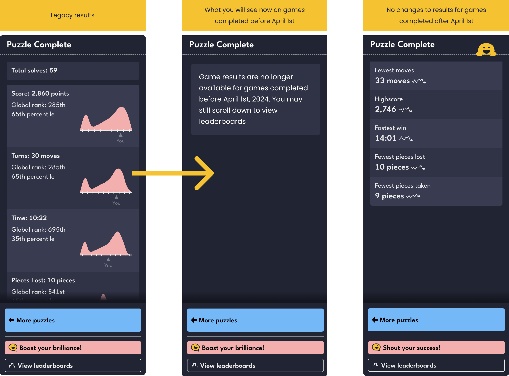

+++
title = 'Goodbye to legacy game results'
date = 2024-08-09T14:51:52-07:00
draft = true
authors = ["saman"]
tags = ["games", "changelog", "sunset"]

+++

Today we are sunsetting the competitive stats displays on games completed before April 1st, 2024.

Leaderboard results, which you can find in a section below the game, will continue to be available for all past games.