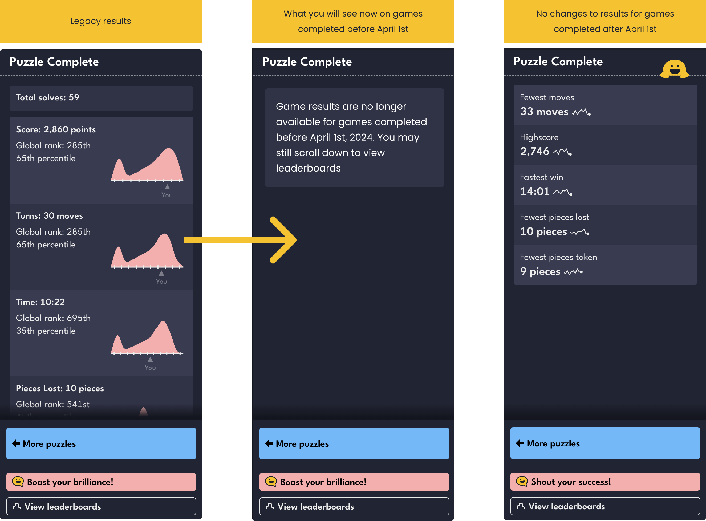

+++
title = 'Changes to how we handle older games'
date = 2024-08-23T00:01:00-07:00
draft = true
authors = ["saman", "orta"]
tags = ["games", "changelog", "sunset"]
+++

Hey folks, this week we've had a think about how we can ensure some of the long-term systems running in Puzzmo keep running smoothly. We concluded that there are two things we should probably do to keep site speed up, and keep costs down.

1. **We are removing the stats displays on games completed before April 1st, 2024.**

    

    The version of Puzzmo which launched, and the Puzzmo we all use today may visually look very similar, but under-the-hood things are quite different. There's a _long_ technical [write-up here](https://blog.puzzmo.com/posts/2024/07/16/augmentations/) but TLDR: we have new tools which powers things like custom club leaderboards, _[un-announced features in Pile-Up Poker]_ and Puzzle Remixes.

    We've been keeping the older systems around to make sure the migration back in April was seamless, but have been finding these older system have been slowing down work on the 2 new games we have in active development. So, we're starting to remove these pieces.

    You will only notice the difference when you look at games completed prior to April 1st, 2024, it will not affect your statistics/streaks etc.

2. **We are starting to archive old leaderboards for games running on older days**

    Like any computer, our API has something like [a hard drive](https://www.postgresql.org). Right now, tracking leaderboards account for roughly 50% of it's disk drive space. If you enjoy stats, we've created 43k leaderboards since launch, and 10mm entries to them.  The scale of leaderboards has always come at a bit of a surprise to us, but it does seem reasonable when thinking it through: each day there are many puzzles, each puzzle there are many games played, for each Puzzmo Plus player there are many leaderboards to rank on.

    We have recently [opened the floodgates here too with club leaderboards](https://blog.puzzmo.com/posts/2024/07/24/groups-to-clubs/) and Pile-Up Poker currently has public leaderboards, allowing any player to participate. We felt this was possible if we made a trade-off with some older leaderboards: if it's been longer than 30 days since the leaderboard was closed, then we archive the leaderboard.

    **Archiving a leaderboard means only the top 100 entries will be preserved.** It feels very unlikely that someone is going to go to a game they completed a month ago, to brag about a leaderboard entry that requires 5 clicks to get through on the board. This is a little bit complicated with leaderboards where the number of people in first place is massive (like Flipart's least rotations) these I expect we will just mark all of them for deletion.

This sort of work is normal on long-term software projects, but often not communicated, and we'd trying to get into a good rhythm of writing up what we've been doing, so thanks for reading. Happy to answer questions in the discord.