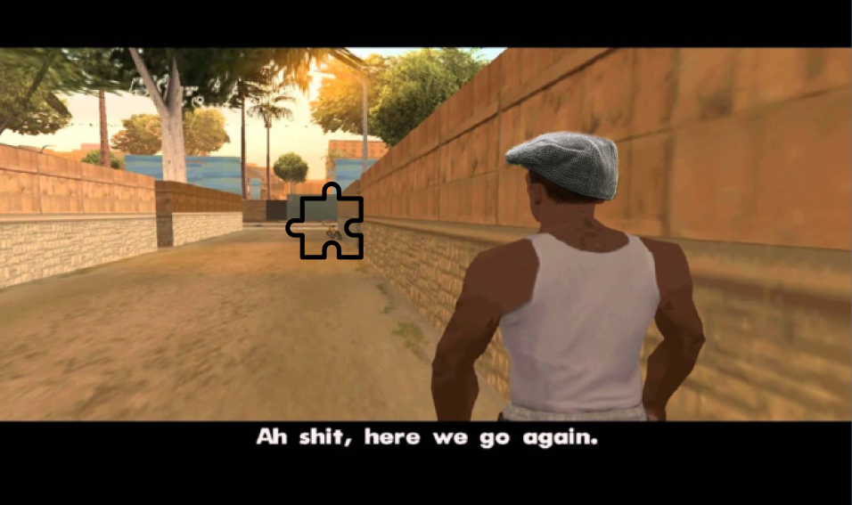

+++
title = 'Making the launch: How we handled releasing Pile-Up Poker'
date = 2024-08-26T10:56:14+01:00
comments = false
tags = ["tech", "api", "plugins", "events"]
theme = "outlook-hayesy-beta"
series = ["Integrating games to the server"]
+++

### Aspects of the launch

When we were spec'ing out the map for what the Pile-Up Poker launch would look like, it was pretty overwhelming:

- A new, fully polished, game
- A "pro" version of the game
- A "series" infrastructure for games to account for many plays of one game per day
- A "go to next game" recommendation system
- A system for each player having a unique puzzle
- An early-access system for press
- A new system for marking games the next day as being "Fantasyland"
- Custom event hooks into the completion screen
- Custom event "secret leaderboards"
- Custom event leaderboards ("most contributions to pot" for example)
- A "pool" of winnings
- A set of unlockables based on the pool of winnings
- The winnings being based on multipliers (which we can control and use to tweak timings)
- A new tutorial system for games
- A new side-quest system
- Revised [club infrastructure](https://blog.puzzmo.com/posts/2024/07/24/groups-to-clubs/)
- Free 2 week trials
- The Shopify integration for product discounts covered [in this post](https://blog.puzzmo.com/posts/2024/06/17/shopify-integration/)
- A game early-unlock system based on a notable
- Avatar sets unlocked based on notables

Here we are, roughly two months after launch (June 10th) and only a few things from our original list were cut, and a few were added (club leaderboards, side quests, tutorials.) So, given my opinion of "It's not shipped until it's doc'd" let's try and cover these from a systems/API perspective to understand how it got shipped.

### Pile-Up Poker

The game itself was built by [Saman Bemel-Benrud](https://github.com/samanpwbb) and [Jason Ho](https://github.com/cod1r), like all of the Puzzmo games, it is a React application. You can learn about [the design process here](https://www.gamedeveloper.com/design/here-s-how-zach-gage-prototyped-puzzmo-sensation-pile-up-poker).

The game's logic runs inside Redux, and as it was our first card game - we've started a small card game library which uses nested redux stores to separate general "card stuff" from "this specific game" stuff. Pile-Up was the first game we released using [framer-motion](https://www.framer.com/motion/) for animations.

I probably only touched the Pile-Up codebase a few times, so I'll leave more details if/when the games folk decide to do their own write-ups.

### Series

We knew that one hand of Pile-Up was too little, and after a bit of experimenting, came to the conclusion that 3 was about right and more than 5 felt like a chore. We spent some time considering what we'd need to build to handle multiple hands, the easiest was to simply have the game track your hands and restart when you have finished a hand.

Having the game handle it felt unsatisfying, because it made the completion of a hand feel underwhelming. Two major issues, we had all these existing design patterns for completing a puzzle, and none of them would trigger in this mode and getting back to an individual hand was not puzzle in our existing puzzle infrastructure.

The solution for this problem came by introducing a "puzzle series", wherein the a daily puzzle has an awareness that it lives within a navigable set of puzzles, each of which is individually completable (and eligible for the usual game completion processing.)

This series system gave us the ability to provide new gates for "you need to be a user" or "you need to be a subscriber", in a way which felt quite natural.

### Viewer Metadata

I added a new abstraction to how puzzles and users interacted to handle:

- A system for each player having a unique puzzle
- A new system for marking games the next day as being "Fantasyland"

The general data-model for playing a puzzle on Puzzmo is that you have:

```text
[User] starts [Gameplay] of [Puzzle] of type [Game]
```

So:

- `User`: A pretty traditional user model
- `Gameplay`: Someone's play through of a puzzle e.g. their state of completion, progress info, [deeds](https://blog.puzzmo.com/posts/2024/07/16/augmentations/#deeds) etc 
- `Puzzle`: An instance of a game with a specific string, attribution, custom name etc
- `Game`: "Pile-Up Poker"'s game describes things like the layout, its readiness/polish, where to find the game's JavaScript etc

This mental model worked well until Pile-Up! Today it's more like:

```text
       ╒ starts [Gameplay]      ╕
[User] ╡                        ├ of [Puzzle] of type [Game]
       ╘ with [Viewer Metadata] ╛
```

With the somewhat ambiguously named "Viewer Metadata" representing a relationship between the user and a particular puzzle. This is a new API available via [the games plugin](https://blog.puzzmo.com/posts/2024/03/28/an-ode-to-game-plugins/). For Pile-Up, this contained the per-user custom puzzle string and the feasibility of accessing Fantasyland within the current game.



```ts
const puzzleViewerMetadata = async (puzzle, userStateID) => {
    const isLaunchPuzzle = puzzle.puzzle === ""
    const isPro = puzzle.game?.slug === "pile-up-poker-pro"

    const uniquePuzzleSeed = await makeNumberSha(puzzle.id + userStateID)
    const gridSize = puzzle.game?.slug === "pile-up-poker-pro" ? 5 : 4
    const puzzleStr = `2
${uniquePuzzleSeed}
${gridSize}`

    const defaultExport = isLaunchPuzzle ? { puzzleStr } : null

    // No daily? No fantasy land
    if (!("featuredInDaily" in puzzle && puzzle.featuredInDaily?.length)) return { ...defaultExport, canFantasyLand: "not-daily" }

    // In an archive game? No fantasy land
    const today = puzzle.featuredInDaily.find((d: any) => dailyIsToday(d.daily))
    if (!today) return { ...defaultExport, canFantasyLand: "not-today" }

    const userState = await _getUserState(userStateID)

    const seriesReferences = puzzle.seriesReferences || (await db.puzzleSeriesPuzzle.findMany({ where: { puzzleID: puzzle.id } }))
    const isPositionOne = !!seriesReferences.filter((s) => s.position === 1).length || false

    // Grab the userstate note about when we should do fantasyland
    const index: keyof UserState = isPro ? "pupProFantasyLandSeriesIndex" : "pupFantasyLandSeriesIndex"
    const seriesIndex = userState[index]

    const dailyNumbers = puzzle.featuredInDaily.map((d: any) => d.daily.seriesNumber).filter(Boolean) as number[]
    if (seriesIndex) {
      //  Does it match a daily for this puzzle? if so - you are _in_ fantasy land already
      // Note that we flip the current series index when you complete the fantasyland game, so after playing it,
      // you will be able to unlock it again in later games in the series
      const dailyWithFantasyland = dailyNumbers.includes(seriesIndex)
      if (dailyWithFantasyland && isPositionOne) {
        return { ...defaultExport, canFantasyLand: "already-unlocked", fantasyLand: true }
      }

      //  if so - you are _in_ fantasy land already, but it is tomorrow
      const isTomorrow = dailyNumbers.includes(seriesIndex - 1)
      if (isTomorrow) return { ...defaultExport, canFantasyLand: "already-unlocked" }
    }

    /// You have access to fantasyland
    return { ...defaultExport, canFantasyLand: "possible" }
}
```



If you think critically about this implementation, a more fitting name would be "owner metadata" as all of the responses here are about the relationship between the gameplay owner and puzzle. This tension became less important once I started migrating systemic hacks we had in this space too. For example. there is a "review mode" to the Crossword which lets folks leave direct feedback on individual clues. This was brought into the viewer metadata system, and the next game we have coming up uses this feature heavily.

### Event Plugins

Just a few months after finally settling on a post-plugin system (called [Augmentations](https://blog.puzzmo.com/posts/2024/07/16/augmentations/)), I got dragged back into a needing to build a [cross-aspect](https://en.wikipedia.org/wiki/Aspect-oriented_programming) system which has a significant number of interaction points across Puzzmo

Here's those cases:

- A new system for marking games the next day as being "Fantasyland"
- A set of unlockables based on the pool of winnings
- A "pool" of winnings
- Press should be able to get in early
- Custom event hooks into the completion screen
- Custom event "secret leaderboards"
- Custom event leaderboards ("most contributions to pot" for example)
- The winnings being based on multipliers (which we can control and use to tweak timings)


To pull this off, we needed to have very broad hooks for the event:

- A gameplay is completed
- Add to the list of leaderboards for a puzzle
- Update groups contributions
- Add to the daily leaderboards
- Add to the augmentations scope
- Extend the cron jobs

So, as Carl from the opening to Grand Theft Auto: San Andreas says:



I must admit though, I did explore a hook system ([propeller](https://github.com/WeCanDoBetter/propeller) felt the most interesting) before eventually settling, once again, on the plugin model.

Our event plugin start as any JavaScrpt plugin system, you make a function which returns your plugin:

```ts
export const getEventPlugin = async (_roles: string | string[]) => {
  const statsNow = await getCachedPUPCommunityScore()
  if (statsNow && statsNow.value < 1_000_000_000_000n) {
    return pupEvent
  }

  return _defaultPlugin
}
```

As we needed to work on the launch event before the event launched, the system was original gated by user role - then eventually was converted to turn itself off based on the community score hitting 1 trillion.

The plugin conforms to an interface, this grew organically, but eventually settled on this shape:

```ts
export type EventPlugin = {
  name: string
  
  /** Adds info at the start of the completion screen (for PUP: the ticker) */
  addCalloutsToSidebar: (puzzle: RichGamePlayedForEvent, opts: { ownerIsUser: boolean }) => Promise<CompletionCallouts[]>

  /** Adds user + gameplay specific sidebar items to the completion  */
  extendSidebarItemArray: (
    items: DeedHistoryMiniSummary[],
    gameplay: RichGamePlayedForEvent,
    opts: { ownerIsUser: boolean; currentUserNakamaID: string }
  ) => Promise<DeedHistoryMiniSummary[]>

  /** Custom leaderboard stable IDs for putting on the today page */
  todayPageLeaderboardStableIDs: string[]

  /** Extra puzzle leaderboard stable IDs */
  puzzleLeaderboardStableIDs: (puzzle: Puzzle) => string[]

  /** Leaderboards which we should create/submit to for a particular user */
  extraLeaderboardsForUser: (
    user: { nakamaID: string } | null,
    position: { type: "daily"; daily: Daily } | { type: "puzzle"; gameSlug: string; puzzleID: string }
  ) => Promise<Leaderboard[]>

  /** Extend the augmentation scope for adding to the users' aggregate user stats */
  extendAggregateUserEvalScope: (scope: any) => void

  /** Extend the augmentation scope across an entire day of games, affects group leaderboards too */
  extendDailyEvalScope: (scope: any, daily: Daily) => void

  /** Extend the augmentation scope when running on a single gameplay  */
  extendGameEvalScope: (scope: any, gamePlayed: GamePlayed, daily: Daily | undefined) => void

  /** Hook into the completion of a gameplay, before it goes into the full processing pipeline */
  gameplayCompletePrePipeline: (
    gameplay: RichGamePlay,
    deedValues: DeedValue[],
    config: { userStateID: string; todayDaily: Daily; isOnToday: boolean; gameSlug: string }
  ) => Promise<void>

  /** Hooks into the gameplay completion for groups pipeline */
  gameplayCompletePipelineUpdateGroups: (groups: Group[], gameplay: RichGamePlay, user: User) => Promise<void>

  /** Allows extending /code codes */
  codeWasAccepted: (batch: CodeBatch) => Promise<void>

  /** Hooks into the cron system */
  hourlyWork: (hour: number, daily: Daily, yesterDaily: Daily) => Promise<void>
}
```

This meant adding code like:

```ts
const eventPlugin = await getEventPlugin(user.roles)
await eventPlugin.gameplayCompletePipelineUpdateGroups(groupsImIn, gameplay!, user)
```

In the right places. The operations become a no-op once the event plugin stops running. This meant that disabling the system has been _relatively_ stress free, because it all hinges on the logic inside `getEventPlugin`.

As I can't open-source Puzzmo, here's the code for the entire event plugin:



```ts
import { Group } from "@heroiclabs/nakama-js"
import { UserAggregateStats } from "@prisma/client"
import { UserStatsJSON } from "@puzzmo-com/shared/statsAPI"
import { UserAwardsBitmapKeys } from "@puzzmo-com/shared/statsAPIRuntime"
import { addDays, getDay, startOfWeek } from "date-fns"
import { PUPEntry } from "types/shared-return-types"
import { DeedHistoryMiniSummary, PUPLeaderboard } from "types/shared-schema-types"

import { GroupLeaderboardMetadataShape } from "src/lib/groups/groups"

import { bitmapCheckTrueValue, bitmapSetTrueValue } from "../bitmapFns"
import { getTotalPointsFromChecklistProgresses } from "../checklist/checklist"
import { isDevAPI, isStagingAPI } from "../constants"
import {
  _dailyDayIndexMonFirst,
  _dateKeyToDate,
  _dateToDateKey,
  dateStringForWeekPeriod,
  weekReferenceForDateKey,
} from "../dailies/dailies"
import { db, dbReplica } from "../db"
import { getLeaderboardRecords } from "../leaderboards/leaderboards"
import { nakamaAPICallViaRPC } from "../nakama.arbitrary"
import { groupsImInForUser } from "../nakama.helpers"
import { numberFormatter } from "../numberFormatter"
import { sailthruAddEmailToList } from "../sailthru"
import { getFromCacheOrSet } from "../sharedCache"
import { _sendGamesSlackMSG, _sendGenericSlackMSG, sendSlackForJokerUnlocked } from "../slack"
import { archiveLeaderboard } from "../tasks/leadearboards/archiveLeaderboard"
import { manipulateUserNotableStats } from "../users/notables"

import { EventPlugin } from "./eventPlugin"

const multipliers: { [key: string]: number } = {
  "2024-06-03": 1,
  "2024-06-04": 1.5,
  "2024-06-05": 2,
  "2024-06-06": 2.5,
  "2024-06-07": 3,
  "2024-06-08": 4,
  "2024-06-09": 6,
  // 1
  "2024-06-10": 2,
  "2024-06-11": 3,
  "2024-06-12": 4,
  "2024-06-13": 5,
  "2024-06-14": 6,
  "2024-06-15": 8,
  "2024-06-16": 12,
  // 2
  "2024-06-17": 4,
  "2024-06-18": 6,
  "2024-06-19": 8,
  "2024-06-20": 10,
  "2024-06-21": 12,
  "2024-06-22": 16,
  "2024-06-23": 24,
  // 3
  "2024-06-24": 4,
  "2024-06-25": 6,
  "2024-06-26": 8,
  "2024-06-27": 10,
  "2024-06-28": 12,
  "2024-06-29": 16,
  "2024-06-30": 24,
  // 4
  "2024-07-01": 4,
  "2024-07-02": 6,
  "2024-07-03": 8,
  "2024-07-04": 10,
  "2024-07-05": 12,
  "2024-07-06": 16,
  "2024-07-07": 24,
  // 5
  "2024-07-08": 4,
  "2024-07-09": 6,
  "2024-07-10": 8,
  "2024-07-11": 10,
  "2024-07-12": 12,
  "2024-07-13": 16,
  "2024-07-14": 24,
  // 6
  "2024-07-15": 4,
  "2024-07-16": 6,
  "2024-07-17": 8,
  "2024-07-18": 10,
  "2024-07-19": 12,
  "2024-07-20": 16,
  "2024-07-21": 24,
  // 7
  "2024-07-22": 8,
  "2024-07-23": 12,
  "2024-07-24": 16,
  "2024-07-25": 20,
  "2024-07-26": 24,
  "2024-07-27": 32,
  "2024-07-28": 48,
  // 8
  "2024-07-29": 32,
  "2024-07-30": 48,
  "2024-07-31": 64,
  "2024-08-01": 80,
  "2024-08-02": 96,
  "2024-08-03": 128,
  "2024-08-04": 192,
  // 9
  "2024-08-05": 64,
  "2024-08-06": 96,
  "2024-08-07": 128,
  "2024-08-08": 160,
  "2024-08-09": 192,
  "2024-08-10": 256,
  "2024-08-11": 384,
  // 10
  "2024-08-12": 128,
  "2024-08-13": 192,
  "2024-08-14": 256,
  "2024-08-15": 320,
  "2024-08-16": 384,
  "2024-08-17": 512,
  "2024-08-18": 768,
  // 11
  "2024-08-19": 256,
  "2024-08-20": 384,
  "2024-08-21": 512,
  "2024-08-22": 640,
  "2024-08-23": 768,
  "2024-08-24": 1024,
  "2024-08-25": 1536,
  // 12
  "2024-08-26": 512,
  "2024-08-27": 768,
  "2024-08-28": 1024,
  "2024-08-29": 1280,
  "2024-08-30": 1536,
  "2024-08-31": 2048,
  "2024-09-01": 3072,
}

export const getThisWeeksMultipliers = () => {
  const now = new Date()
  const start = startOfWeek(now, { weekStartsOn: 1 })

  const thisWeeksMultipliers: [number, number, number, number, number, number, number] = [1, 1, 1, 1, 1, 1, 1]

  for (let i = 0; i < 7; i++) {
    const day = addDays(start, i)
    const dayKey = _dateToDateKey(day)
    thisWeeksMultipliers[i] = multipliers[dayKey] || 1
  }

  return thisWeeksMultipliers
}

export const getTodaysMultiplier = () => {
  const now = new Date()
  const dateKey = _dateToDateKey(now)
  return multipliers[dateKey] || 1
}

export const getMultiplierForDateString = (dateString: string | undefined) => {
  if (!dateString) return 1
  return multipliers[dateString] || 1
}

const aggregateDeedID = "clw63w9o13cb52np6cglkh2ll:siteaggregatestat"
const pupGameID = "clthy950f007p27om7sin8huo:game"

export const getPUPCommunityScore = () => dbReplica.siteAggregateStat.findUnique({ where: { id: aggregateDeedID } })

export const getCachedPUPCommunityScore = async () => {
  if (isDevAPI || isStagingAPI) {
    return await getPUPCommunityScore()
  }

  return await getFromCacheOrSet("pup-event", { EX: 15 }, () => getPUPCommunityScore(), {
    jsonReplacer: (key, value) => (typeof value === "bigint" ? `BIGINT::${value}` : value),
    jsonReviver: (key, value) => {
      if (typeof value === "string" && value.startsWith("BIGINT::")) {
        return BigInt(value.slice(8))
      }
      return value
    },
    expirationChance: 0.02,
  })
}

// export const getPUPCommunityScore = () => ({ value: 11_000_000_000n } as any)

export const updatePUPCommunityScore = async (incrementBy: bigint) => {
  await db.siteAggregateStat.update({ where: { id: aggregateDeedID }, data: { value: { increment: incrementBy } } })
}

export const pupEvent: EventPlugin = {
  name: "pupEvent",
  addCalloutsToSidebar: async (gameplay, _opts) => {
    const onlyPup = gameplay.puzzle.game.slug === "pile-up-poker"
    if (!onlyPup) return []

    const statsNow = await getPUPCommunityScore()
    if (!statsNow) return []

    const daily = gameplay.puzzle.featuredInDaily?.[0]
    const multiplier = getMultiplierForDateString(daily?.daily?.dayString)
    return [
      {
        title: "Pile Up Poker callout",
        from: statsNow.value - BigInt(Math.floor(gameplay.pointsAwarded * multiplier)),
        to: statsNow.value,
        original: gameplay.pointsAwarded,
        multiplier,
      },
    ] as const
  },
  gameplayCompletePrePipeline: async (gameplay, deedValues, config) => {
    const { userStateID } = config
    const onlyPup = gameplay.puzzle.game.slug === "pile-up-poker"
    if (!onlyPup) return

    const daily = gameplay.puzzle.featuredInDaily?.[0]
    const multiplier = getMultiplierForDateString(daily?.daily?.dayString)

    const pointsAwarded = gameplay.pointsAwarded

    const progresses = await db.checklistUserProgress.findMany({
      where: {
        completedGamePlayedID: gameplay.id,
        userState: { ownerID: userStateID },
      },
      include: { checklist: { include: { game: true } } },
    })

    let pupContributions = Math.floor(pointsAwarded * multiplier)
    const sidequestPoints = Math.floor(await getTotalPointsFromChecklistProgresses(progresses))

    if (sidequestPoints > 0) {
      pupContributions += sidequestPoints
      updatePUPCommunityScore(BigInt(sidequestPoints))
    }

    const beforeScore = await getPUPCommunityScore()

    const wasBeforeOneT = beforeScore?.value
    if (wasBeforeOneT && wasBeforeOneT < 1_000_000_000_000n) {
      const newValue = wasBeforeOneT + BigInt(pupContributions)
      if (newValue > 1_000_000_000_000n) {
        await _sendGamesSlackMSG({ text: `PUP Event has reached 1T! gameplay: ${gameplay.id}` })
      }
    }

    await db.userState.update({
      where: { ownerID: userStateID },
      data: {
        pupEventContribution: { increment: pupContributions },
      },
    })

    // Add the notable for playing in the game
    if (context.currentUser) {
      await manipulateUserNotableStats(context.currentUser!.id, (stat) =>
        bitmapSetTrueValue(stat, UserAwardsBitmapKeys.pupEventParticipant)
      )
    }
  },
  // This idea is somewhat deprecated by extraLeaderboards below (Still used though)
  puzzleLeaderboardStableIDs: (puzzle) => {
    const onlyPup = puzzle.gameID === pupGameID
    if (!onlyPup) return []

    return ["game-pile-up-poker:multiplied"]
  },
  extraLeaderboardsForUser: async (user, ctx) => {
    if (!user) return []
    if (!context.currentUser) return []

    const notPup = ctx.type === "puzzle" && ctx.gameSlug !== "pile-up-poker"
    if (notPup) return []

    const nakamaID = context.currentUser.nakamaID
    const groupsImIn = await groupsImInForUser(nakamaID)

    const groupsToHighlight = groupsImIn.filter((g) => {
      const metadata: GroupLeaderboardMetadataShape = g.metadata || {}
      return metadata.ldrbrd?.[3]?.includes("series.pileUpPoker")
    })

    // Maybe we can find a way to drop this?
    const seriesReference =
      ctx.type === "puzzle" ? await db.puzzleDaily.findFirst({ where: { puzzleID: ctx.puzzleID }, include: { daily: true } }) : null

    if (ctx.type === "puzzle" && !seriesReference) return []

    const rotationValue =
      ctx.type === "daily" ? weekReferenceForDateKey(ctx.daily.dayString) : weekReferenceForDateKey(seriesReference!.daily.dayString)

    const stableIDs = ["game-pile-up-poker:multiplied", "side-quests-weekly"]

    return db.leaderboard.findMany({
      where: {
        OR: [{ groupID: { in: groupsToHighlight.map((g) => g.id!) } }, { stableID: { in: stableIDs } }],
        rotation: "Weekly",
        rotationValue,
      },
    })
  },
  extendDailyEvalScope: (scope, daily) => {
    scope.pupEvent = true
    scope.pupMultiplier = getMultiplierForDateString(daily.dayString)
  },
  extendGameEvalScope: (scope, gameplay, daily) => {
    if (daily) {
      scope.pupEvent = true
      scope.pupMultiplier = getMultiplierForDateString(daily.dayString)
    }
  },
  extendAggregateUserEvalScope: (scope) => {
    scope.pupEvent = true
    scope.pupMultiplier = getTodaysMultiplier()
  },
  extendSidebarItemArray: async (items, gameplay, opts) => {
    const onlyPup = gameplay.puzzle.game.slug === "pile-up-poker"
    if (!onlyPup) return items

    // const priorGamesForThisSeason = await db
    const priorPlays = await db.gamePlayed.findMany({
      where: {
        ownerID: gameplay.ownerID,
        seriesID: gameplay.seriesID,
      },
    })

    const ownerIsUser = gameplay.ownerID.includes(":user")
    const usersLeaderboardRecordForCurrentWeek =
      ownerIsUser && gameplay.completedAt
        ? await db.leaderboardRecord.findFirst({
            where: {
              userID: gameplay.ownerID,
              leaderboard: {
                stableID: "game-pile-up-poker:multiplied",
                rotationValue: weekReferenceForDateKey(_dateToDateKey(gameplay.completedAt)),
              },
            },
          })
        : null

    const bestPlay = priorPlays.sort((a, b) => b.pointsAwarded - a.pointsAwarded)[0]

    const daily = gameplay.puzzle.featuredInDaily[0]
    const multiplier = getMultiplierForDateString(daily?.daily?.dayString)

    const userstateForTotal = await db.userState.findUnique({ where: { ownerID: gameplay.ownerID } })

    const groupsImIn = ownerIsUser ? await groupsImInForUser(opts.currentUserNakamaID) : []
    const groupsToHighlight = groupsImIn.filter((g) => {
      const metadata: GroupLeaderboardMetadataShape = g.metadata || {}
      return (metadata.pupD || 0) > 0
    })

    return [
      ...items,
      {
        display: "Daily multiplier",
        highlightValue: "× " + multiplier,
        section: "Overall",
        direction: "HighestIsBetter",
      },
      bestPlay && {
        display: "Your best score today",
        value: bestPlay.pointsAwarded,
        formatString: "$%@",
        highlightValue: "× " + multiplier,
        direction: "HighestIsBetter",
        pastValues: priorPlays.map((play) => play.pointsAwarded),
        section: "Overall",
      },

      usersLeaderboardRecordForCurrentWeek && {
        display: "“Best Daily Deal” weekly total",
        highlightValue: "$" + numberFormatter(usersLeaderboardRecordForCurrentWeek.score),
        section: "Overall",
        direction: "HighestIsBetter",
      },

      userstateForTotal &&
        userstateForTotal.pupEventContribution && {
          display: "Total contributions",
          highlightValue: "$" + numberFormatter(userstateForTotal.pupEventContribution),
          section: "Overall",
          direction: "HighestIsBetter",
        },

      ...groupsToHighlight.map((g, i) => ({
        display: "Total contributions from " + g.name,
        value: (g.metadata as any).pupD,
        formatString: "$%@",
        section: "Groups",
        direction: "HighestIsBetter",
        sortValue: 10 + i,
      })),
    ].filter(Boolean) as DeedHistoryMiniSummary[]
  },
  todayPageLeaderboardStableIDs: ["game-pile-up-poker:multiplied"],
  gameplayCompletePipelineUpdateGroups: async (groups, gameplay, user) => {
    if (gameplay.puzzle.game.slug !== "pile-up-poker") return

    const groupsInPUPLaunch = groups.filter((g) => {
      const metadata: GroupLeaderboardMetadataShape | undefined = g.metadata
      if (!metadata) return false

      if (!metadata.ldrbrd) return false
      if (metadata.ldrbrd[3]?.includes("series.pileUpPoker")) return true
      return false
    })

    if (!groupsInPUPLaunch.length) return

    function incrementScore(group: Group) {
      const metadata: GroupLeaderboardMetadataShape = group.metadata || {}
      const priorScore = metadata.pupD || 0
      const multiplier = getMultiplierForDateString(gameplay.puzzle.featuredInDaily?.[0]?.daily?.dayString)
      return priorScore + Math.floor(gameplay.pointsAwarded * multiplier)
    }

    await Promise.all(
      groupsInPUPLaunch.map((g) =>
        nakamaAPICallViaRPC("groupUpdate", "update group", [
          g.id!.replace(":ngroup", ""),
          user.nakamaID,
          g.name,
          user.nakamaID,
          "en",
          g.description,
          g.avatar_url,
          g.open,
          { ...g.metadata, pupD: incrementScore(g) },
        ])
      )
    )
  },
  codeWasAccepted: async (batch) => {
    const isPUP = batch.name.includes("Joker")
    if (!isPUP) return
    if (!context.currentUser) return

    if (!context.currentUser.roles.includes("pup"))
      await db.user.update({ where: { id: context.currentUser.id }, data: { roles: [...context.currentUser.roles, "pup"].join(" ") } })

    const account = await db.account.findFirst({ where: { users: { some: { id: context.currentUser.id } } } })
    if (account) {
      await sailthruAddEmailToList(account.email, "Joker Code List")
    }

    await sendSlackForJokerUnlocked(context.currentUser)
  },
  hourlyWork: async (hour, daily, yesterday) => {
    const topContributors = await db.userState.findMany({
      where: { pupEventContribution: { gt: 0n }, ownerID: { contains: ":user" } },
      orderBy: { pupEventContribution: "desc" },
      take: 10,
    })

    const users = await db.user.findMany({ where: { id: { in: topContributors.map((u) => u.ownerID) } } })
    const top = topContributors.map((u) => [u, users.find((uu) => uu.id === u.ownerID)]).filter((u) => u[1] !== undefined)
    const data = JSON.stringify(top, (key, value) => (typeof value === "bigint" ? `BIGINT::${value}` : value))

    await db.document.upsert({
      where: { id: "pup-top-folks" },
      create: {
        id: "pup-top-folks",
        data,
      },
      update: {
        data,
      },
    })

    console.log("--> PUP top folks updated")

    const now = _dateKeyToDate(daily.dayString)
    const today = getDay(now)

    // Mon 3rd
    const pupLaunchWeek = 92

    // 0 is sunday, so 1 = monday
    if (today === 1 && hour === 1) {
      // Archive last weeks leaderboards
      const prior = weekReferenceForDateKey(yesterday.dayString)
      const pupLeaderboard = await db.leaderboard.findFirst({
        where: { stableID: "game-pile-up-poker:multiplied", rotationValue: prior },
      })

      if (!pupLeaderboard) throw new Error(`No PUP leaderboard found for last week ${prior}`)
      if (!pupLeaderboard.archived) await archiveLeaderboard(pupLeaderboard.id, true)

      console.log(`--> PUP leaderboard for week ${prior} archived`)

      const numbersBetween = []
      for (let i = pupLaunchWeek; i <= prior; i++) {
        numbersBetween.push(i)
      }

      console.log(`--> PUP leaderboard best of creating from archives of ${numbersBetween.join(",")} `)

      // Make a document of the top 5 each week
      const leaderboards = await db.leaderboard.findMany({
        where: { stableID: pupLeaderboard.stableID, rotationValue: { in: numbersBetween } },
      })

      const leaderboardWithData = await Promise.all(
        leaderboards.map(
          async (l) =>
            [l, (await getLeaderboardRecords(l, { first: 5, omitAddingOwner: true })).edges.map((e: any) => e.node).slice(0, 5)] as const
        )
      )

      await db.document.upsert({
        where: { id: `pup-top-folks-history` },
        create: {
          id: `pup-top-folks-history`,
          data: leaderboardWithData,
        },
        update: {
          data: leaderboardWithData,
        },
      })

      console.log(`--> PUP leaderboard best of archived at pup-top-folks-history `)
    }
  },
}

export const getTopPlayers = async (_args: undefined, ctx?: { root: { entries?: any[] } }): Promise<PUPEntry[]> => {
  if (ctx && "entries" in ctx.root && ctx?.root.entries) return ctx.root.entries

  const data = await db.document.findFirst({
    where: { id: "pup-top-folks" },
  })

  if (!data) return []
  if (typeof data.data !== "string") return []

  const backAgain = JSON.parse(data.data, (key, value) => {
    if (typeof value === "string" && value.startsWith("BIGINT::")) {
      return BigInt(value.slice(8))
    }
    return value
  })

  return backAgain.map(
    (entry: [any, any]) =>
      ({
        id: entry[1].id,
        username: entry[1].username,
        usernameID: entry[1].usernameID,
        avatarURL: entry[1].avatarURL,
        amount: entry[0].pupEventContribution,
      } satisfies PUPEntry)
  )
}

export const hasPUPJokerNotable = (stats: UserAggregateStats | undefined | null) => {
  if (!stats?.data) return false
  const data = typeof stats?.data === "string" ? (JSON.parse(stats.data) as UserStatsJSON) : (stats!.data as UserStatsJSON)
  return bitmapCheckTrueValue(data.site?.[0]?.[0] || 0, UserAwardsBitmapKeys.jokinAround)
}

export const hasPUPAccessNotable = (stats: UserAggregateStats | undefined | null) => {
  if (!stats?.data) return false
  const data = typeof stats?.data === "string" ? (JSON.parse(stats.data) as UserStatsJSON) : (stats!.data as UserStatsJSON)
  return bitmapCheckTrueValue(data.site?.[0]?.[0] || 0, UserAwardsBitmapKeys.pupEventParticipant)
}

export const getPriorLeaderboards = async (args?: { all?: boolean }): Promise<PUPLeaderboard[]> => {
  const nowDateKey = _dateToDateKey(new Date())
  const pupLaunchWeek = 92
  const nowWeek = weekReferenceForDateKey(nowDateKey)

  const cacheKey = `pup-leaderboard-history-${nowWeek}-${args?.all ? "all" : "top"}`
  return getFromCacheOrSet(cacheKey, { EX: 60 * 60 * 24 * 1 }, async () => {
    const pupLeaderboards: PUPLeaderboard[] = []
    const startingPoint = args?.all ? pupLaunchWeek : nowWeek - 1

    for (let i = startingPoint; i < nowWeek; i++) {
      const keys = ["game-pile-up-poker:multiplied"]

      // Prior to this, it was dev only
      if (i > 94) keys.push("side-quests-weekly")

      const leaderboards = await db.leaderboard.findMany({ where: { stableID: { in: keys }, rotationValue: i } })
      if (!leaderboards.length) continue

      for (const leaderboard of leaderboards) {
        const records = await getLeaderboardRecords(leaderboard, { first: 5, omitAddingOwner: true })
        const entries = records.edges.map((e: any) => e.node)

        const userIDs = entries.map((e: any) => e.userID)
        const users = await db.user.findMany({ where: { id: { in: userIDs } } })
        const pupEntries = entries.map((entry: any) => {
          const user = users.find((u) => u.id === entry.userID)
          return {
            id: entry.id,
            username: user?.username || "Unknown",
            usernameID: user?.usernameID || "Unknown",
            avatarURL: user?.avatarURL || "https://cdn.puzzmo.com/assets/puzicon.png",
            amount: entry.score,
          }
        })

        pupLeaderboards.push({ superTitle: `Week of ${dateStringForWeekPeriod(i)}`, entries: pupEntries, title: leaderboard.name })
      }
    }

    return pupLeaderboards
  })
}
```



### The Pool

I implemented a new system for tracking 'site-wide' statistics, basically a simple way to quickly add to a single number over time inside our database. To test this out, I built it at the same time as implementing the server infra for counting all Plonks made across every game (10,070,119 as of Aug 26th). This same system was used to handle the Pile-Up pot, it is based on the augmentations system, and so the Pile-Up counter is a single expression: `points * (pupMultiplier || 1)` which is now permanently set to `1,000,043,069,552`. 


### The Multipliers 

[Jack Schlesinger](https://www.jackschlesinger.com/) came up with this neat abstraction that allowed us to have some control over the deadlines for the event: multipliers. The secrets system effectively meant we were putting ourselves on the line for 6 unpredictable deadlines. 

By tracking the average amount of points earned per day, we can manipulate the multipliers to create a cadence of roughly every 2-3 weeks revealing a new secret. Jack ran weekly meetings where we tried to figure out when it would land, and whether we would have everything we needed for the expected secret then we'd adjust multiplier accordingly. These levers gave us a lot of flexibility without feeling like we were putting our fingers directly on the scale.

### Checklists

When we looked at what we wanted for Side Quests and game Tutorials, and then sorta squinted our eyes, it became possible to see them as a single system. [Gary](https://github.com/gmjosack) took this on, and came up with an implementation which powers both and figured out a bunch of gnarly front-end bits to get it all working.

How I think it works, having read most of the code: 
 
 - A `Checklist` is an ordered set of expressions, number values and messages which you create in our admin tools
 - When you start a gameplay, the Puzzmo API looks to see if there are tutorial/side quest `Checklists` for that game
 - If there are, we look to see if you have any `ChecklistUserProgress` for those
   - If there's a tutorial, that's special cased to only exist once
   - For sidequests, we have a pool of potential sidequests to pull one from if you don't have one
 - In-games, there is a new API to trigger a "checkpoint" when something "interesting" has happened. This sends the current deeds up to the server.
 - These deeds are then used as expression scopes for running through the checklist
 - The result of running the checkpoint API updates our local Relay cache, and we update your in-game tutorial/side quests

The admin tools are a delight to work with, and we've started exploring what it looks like to bring these systems to other games. We drop all side quest `ChecklistUserProgress`s which are marked as completed from the database the next morning.

### Revised Club Infrastructure

We're still not quite sure we've fully hit what we want with clubs, but we're certainly closer with the version we released during the Pile-Up launch. I had been sketching out an implementation of custom group leaderboards based on requests from the moment the Augmentations system was working, but it's a very hard system to build and create user-facing tools for. Traditionally, these would stay either in code or as an admin tool where someone can ask 'how X works'. 

To make it work on Puzzmo, we settled on providing a "game template"-like system which creates a club based on a particular game and that provides a set leaderboard for your club out of the box - then daring folks could go into "Custom" and tweak to their delights. The group leaderboard system provides all the same inputs as the leaderboards we use in the official augmentations, so it should always stay in sync feature-wise.

In many ways, the group leaderboard system, like the theme editor before it, is scratching an itch I have. I left making developer tools to start Puzzmo, and I rarely have time to actively work in that space anymore (because Puzzmo is going well, thanks!) but these sort of features are acquiesces to the fact that my heart still lives in that space. 

Cool for Puzzmo users though, because normally dev teams won't take on that sort of technical debt for such an edge case in the userbase. I've yet to find anything remotely as powerful  as our user-generated leaderboards.

### Notables as keys

For both user avatars and letting people have early access to Pile-Up, we relied on the notable system as a secondary access check. Prior to the Pile-Up launch, we solely used roles as the key way to track someone's access to resources in the API. [RBAC](https://en.wikipedia.org/wiki/Role-based_access_control) is a great system, and deeply embedded inside how the API works - but we can use a lighter touch and rely on existing other tools/system giving notables. 

As an example, the new Lisa Hanawalt avatars are tied to the notable of having played Pile-Up Poker during the launch, something which the event plugin gaves automatically. Now, if we want to give someone access rights, we have tools for giving notables en-mass or printing them like in a pack of cards. 


