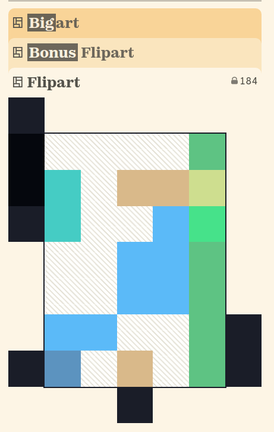
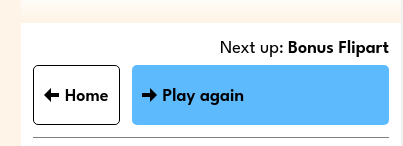

+++
title = 'More puzzles, now in card form!'
date = 2024-09-02T00:00:00-05:00
authors = ["gary"]
tags = ["changelog"]
theme = "outlook-hayesy-beta"
draft = false
comments = false
+++

Today, we're excited to announce that there will be more puzzles on the Today page each day,
along with a new way to organize those puzzles.

We wanted to come up with a way to provide same-difficulty puzzles each day, while also catering to our
players who enjoy the the difficulty scaling throughout the week. To accomplish this we're going to be
adding more daily puzzles for some of our games.

Starting today, we will have at least two versions of `Flipart`, `Typeshift`, and `Really Bad Chess`
available daily. For `Flipart` and `Typeshift`, there will always be both an easy/small puzzle as well
as a puzzle with difficulty that scales throughout the week. On days with a `Flipart` or `Typeshift`
remix, you'll have three puzzles for that game! Additionally, `Really Hard Chess` will now be
available every day, except on days with a `Really Bad Chess` remix.

One concern with adding more puzzles to the Today page, along with introducing more new games over time,
is that navigating the puzzles might become challenging. To address this, we're rolling out a new way to
organize related puzzles. All bonus and remix puzzles for a game will now appear as cards you can easily
navigate through.

You'll also be able to jump straight into the next puzzle without having to return to the homepage.

---

We've been testing this internally for a few weeks and have been enjoying the change and we're eager
to hear what everyone thinks and hope you enjoy all the extra puzzles! If you have any
feedback or just want to discuss these changes, [join our Discord](https://discord.gg/puzzmo)!