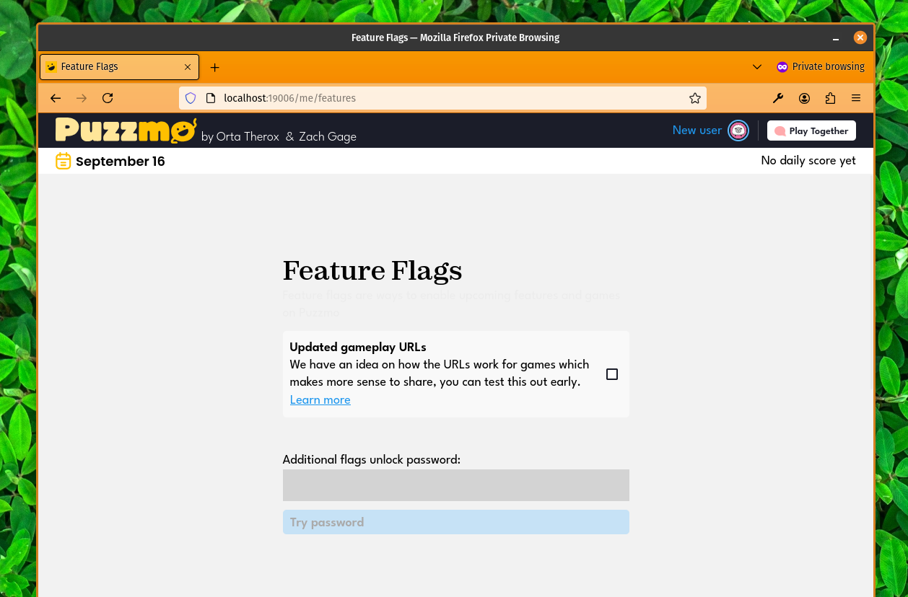
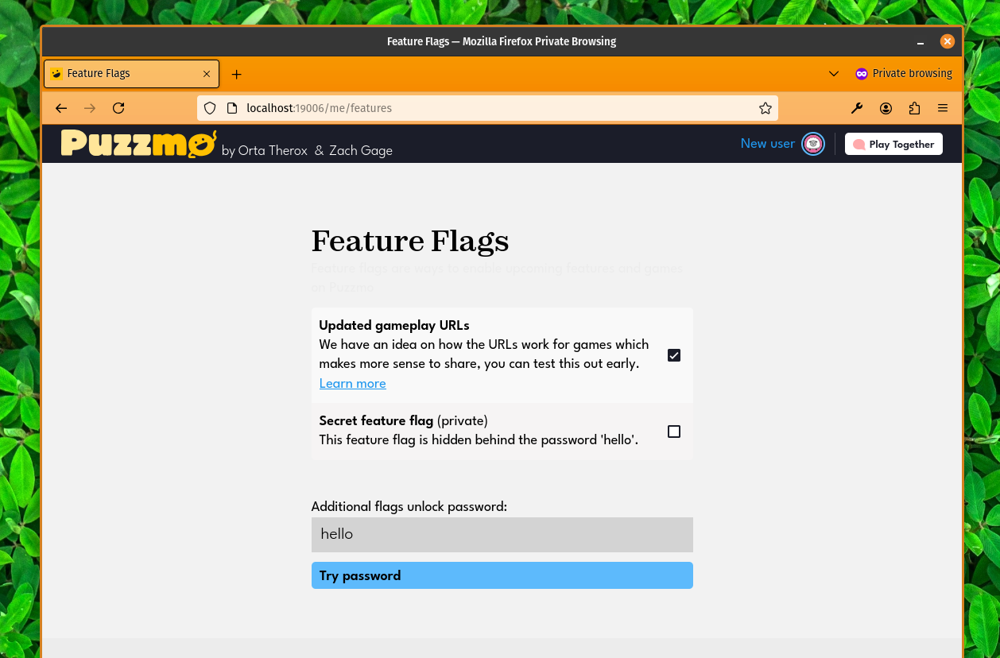

+++
title = 'New: Feature Flags and New Gameplay URLs'
date = 2024-09-16T14:28:19+01:00
authors = ["orta"]
tags = ["changelog"]
theme = "outlook-hayesy-beta"
+++

Hey folks, we've been reflecting on the Pile-Up Poker launch and one of the things we've come to understand is that we can have a difference in how we approach secrecy between the games and the rest of Puzzmo.

Games as a medium is a pretty high stakes, "winner gets mindshare" ecosystem where a good idea is copied and replicated very quickly. Replicating the app and infrastructure for Puzzmo however, is a much trickier game for others to pull off.

Previously I have used this sort of reasoning to make all of my work [open to the public](https://artsy.github.io/blog/2019/04/29/how-did-artsy-become-oss-by-default/), but Puzzmo's not there (and may never get there.)

Anyway, the point is, that we're exploring ways to allow us to test ideas on Puzzmo more publicly. So, on that note we have two new things worth talking about, one for making it possible to test new things and the other is something worth testing!

## Feature Flags

Feature Flags gives us a way to turn on individual features which are still a work in progress, they're a clever idea conceptually - but they are the main cause of "App Store Release Notes" being just "Features and Bug Fixes" en-masse. We wanted to make one that's engaging, well hidden and available for us to have both public feature flags and private feature flags.

So, where do you find them? 


They are available by tapping on your avatar. If there are feature flags available for you to opt-in on, we will indicate that there are optional flags. If there are none (because those projects have been made available for everyone), this dropdown will not show a feature flag section.

Clicking on that button, will take you through to the Feature Flag screen



This page will list all of the available flags for you, and offer a chance to put in a password to potentially unlock some of the secret feature flags.



For example, here I used the password "hello" and it showed me an extra feature!

Then, feature flags which you have enabled are shown in the dropdown


We'll also do changelog entries like this, so you can keep up either via the blog, Discord of by looking at news on the Puzzmo homepage.


## New Puzzle URLs

Today, the URL for a game looks like this:

```
https://puzzmo.com/play/flip-art/oo2i2r7c
```

We try to do a lot with this URL, because _we don't know what you want to do with it_. What do I mean by this? There are three main cases for passing the URL to someone:

- Inviting someone to play this puzzle themselves
- Inviting someone to play _your game_ in Co-op
- Sharing your score for your game

We try to figure out which thing you are interested in by _asking you_ when you load the page up. We think there is a better way to handle URLs for puzzles, and so for the last few months I've been expanding the URLs for our puzzles to be better at describing what they are and being more obvious what will happen when you use them.

With the new URLs feature flag enabled, when you click on the Cross|word thumbnail, instead of a URL like https://puzzmo.com/play/crossword/2ngl12xsd - you get a URL like:

```
https://www.puzzmo.com/puzzle/2024-09-16/crossword
```

This link will always take you to your puzzle for that day and it's very explicit about what you're getting. We are still keeping the old URLs around for when you explicitly want to share your game (for coop, or for bragging) but now the link to play your game would take someone to play a new version of the puzzle. 

Meaning of the three cases we saw before, here are the links for today's Really Hard Chess:

- Play themselves: https://www.puzzmo.com/puzzle/2024-09-16/really-bad-chess/hard/1
- Share invite for Coop: https://puzzmo.com/play/really-bad-chess/sdr162rtn
- Share for bragging: https://puzzmo.com/play/really-bad-chess/sdr162rtn/share

This isn't really something you have to think about as a user ideally, as we give these links to you at specific points for sharing with others. But _not all of our users are just **users**_, some are contributors! For those folks, it's now really easy to link to your puzzle!

Here's the two Cross|words I've had published:

- Creature Feature (with my Wife + Brooke):
  https://www.puzzmo.com/puzzle/2023-12-11/crossword
  
- Pick a Side (with Brooke): 
  https://www.puzzmo.com/puzzle/2024-08-29/crossword

Simple, easy to remember if you are good with dates but very reasonable URLs.

Puzzmo already supports these URLs out of the box, but it's a pretty substantial change to use them daily and we'd like to give it a chance to breathe with more folks than just Puzzmo staff testing it out, so if you're interested - head over to the [features flag section on Puzzmo.com](https://puzzmo.com/me/features) and turn it on.