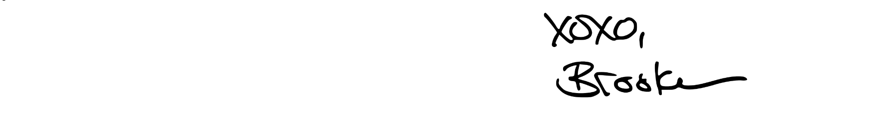

+++
title = "Announcing Puzzmo's first crossword book"
date = 2024-10-24T23:02:20-04:00
authors = ["brooke"]
tags = ["crossword", "merch"]
theme = "bright-white"
comments = false
+++

Today, we announced Puzzmo’s first crossword book. It contains 30 crossword reruns from 2024, 10 book-exclusive crosswords, more than 10 pages of paper remixes of Flipart and Really Bad Chess by [Zach](https://www.puzzmo.com/press/team-zach) and [Jack](https://www.puzzmo.com/press/team-jack), and a few quick essays from the three of us. You can place an order [here](https://shop.puzzmo.com/products/puzzmo-crossword-puzzles-vol-1-pack-of-two-identical-books)!

The book is very Puzzmo-coded! We’ve included word separation boundaries in the grids, and have a QR code that’ll let you access all the hints. The answer key has constructor notes for every crossword and a one-line bio for every creator. The editing byline has the clue editor’s name, not mine (unless I was the clue editor!). The crossword puzzles I chose for the book represent the work of 46 constructors (6 of the 40 puzzles are collaborations), 12 clue editors, 6 hinters, and 13 test solvers and fact checkers, all of whom are credited.

Besides the printing, putting together this book has been an in-house operation: we’re handling design, layout, editing, distribution, packaging, and shipping on our own. One of the constraints of doing it this way is we can only send books in sets of two. We hope you can pair up with someone and split the cost, or that you know someone you’d like to give one as a gift.

We printed a few empty books to make sure the size and weight are what we wanted, and I have to say it’s a very beautiful, good-feeling object! I also solved some of the paper Fliparts on Wednesday, and I *loved* them. We’re all so excited for this book to be out in the world, and can’t wait to hear what you think.

* * *

I started writing and editing crosswords because I thought they should be different than the ones I was solving. This book is my best attempt at making a different, better version of a crossword book. What could a crossword book be? And what *should* it be?

I’ve known for awhile that I wanted to make a book of Puzzmo Cross|words. I want the puzzles that our creators work so hard to make to reach people who might be unlikely to solve online, and I want the creators themselves to have a physical version of their art.

In my capacity as Puzzmo’s crossword editor, I’m always thinking about what conventions our crossword should adhere to, and which ones we can cast aside. For example, [I talked to our summer intern Madison](https://blog.puzzmo.com/posts/2024/07/31/puzzmo-constructors/) about how the physical constraints of the newspaper page continue to inform even crosswords that exist online only: there isn’t a lot of variation in size or shape, and a terse crossword-speak clue language continues to be prevalent despite online-only venues not needing to fit the space limitations imposed by a designated section of a newspaper page.

Crossword conventions exist outside the grid, too. When I first started submitting crosswords to edited venues, I was surprised to learn that payment is nearly always rendered upon publication, not upon acceptance — and the time between acceptance and publication can be years! When I worked with the Puzzmo team to design the creator’s contract for our constructors, it was crucial to me that constructors be paid upon acceptance. For example, our upcoming [October 30 Cross|word](https://www.puzzmo.com/puzzle/2024-10-30/crossword) has been in the Puzzmo queue for something like two years, because it had to run on October 30 (you’ll see), and our fall 2023 launch schedule was in too much flux for me to schedule a date-specific crossword during our launch period. It makes a lot of sense to me that the constructor got paid two years ago instead of now!

Most crossword creator’s contracts at mainstream venues also involve you giving all your rights exclusively to the publisher, who can then reprint your puzzle as many times as they want (such as in, ahem, crossword books) without paying you anything more... or even notifying you. This is also something I wanted to do differently when designing Puzzmo’s crossword program. First, our exclusivity rights are only for two years from acceptance, after which constructors can republish their puzzles essentially as they like. And second, our creator’s contract also outlines a royalty structure for any reprints… such as reruns in a crossword book.

Many venues that publish crossword puzzles release books of reruns. With permission, here’s an excerpt of a text conversation I had with my friend and fellow crossword constructor/editor [Ada Nicolle](https://www.patreon.com/luckyxwords), with whom I wrote a [mainstream crossword](https://www.xwordinfo.com/Crossword?date=7/2/2021). At the time of publication, Ada was going by a different name that she no longer uses.

**Ada**: i bought a puzzle book and i found our puzzle

**Me**: w o a hhhhhh

**Ada**: this is wild. just was like flipping through it prepping for [lolla](https://en.wikipedia.org/wiki/Lollapuzzoola)

**Me**: that’s so cool

**Ada**: you make multiple appearances. yeah it’s kinda dope. i mean eh deadname sucks, but we’re in a book!!! this is kind of a dream?

So let’s break it down:
- Ada and I were not informed we were going to be in a crossword book
- The book is presumably making money for the publisher, but the creators are not paid
- The byline uses Ada’s deadname

Needless to say I did not adhere to any of these “conventions” for Puzzmo’s book!
- Each constructor (or constructing team) in the book was informed in advance which puzzle I chose and reviewed proofs of any edits I had to make so the puzzle’s clues fit on the physical page
- Clue editors got proofs too (their names are on the bylines, after all!)
- Each constructor sent me puzzle notes and a one-line bio to accompany their puzzle’s solution in the answer key
- Each constructor whose puzzle has already appeared on puzzmo.com's daily page gets a rerun payment
- The puzzle bylines are more formal than some constructors use on Puzzmo’s website (think: "Will Nediger" instead of "[bewilderingly](https://www.puzzmo.com/user/xwc/bewilderingly)"), but they accurately reflect the constructors’ names — as they should!

As Puzzmo’s crossword editor, it’s important to me to look at everything considered conventional in crosswords, question whether it’s time for a change, and make that change happen if so. I sincerely hope you like the results.

