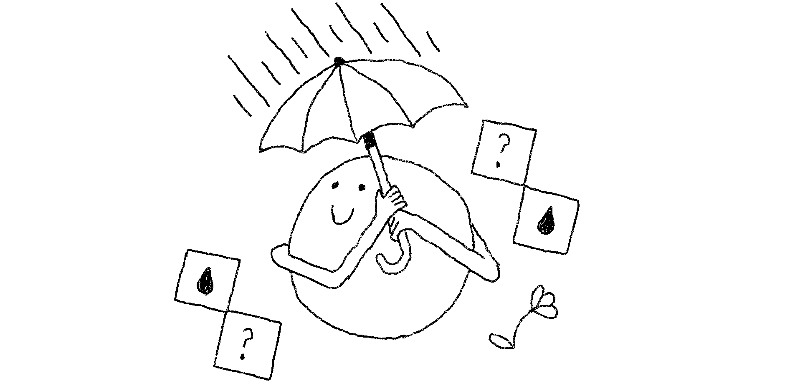

+++
title = 'Games changelog, October 2024'
date = 2024-10-29T08:00:00-07:00
authors = ["saman"]
tags = ["games", "changelog", "memoku", "crossword", "typeshift", "pile-up poker"]
theme = "puzzmo-light"
+++

Here's what's new in games since the last changelog.

### Weather Memoku

- Released a new game, **Weather Memoku**. Play it for free on [Weather Channel's Puzzmo page](https://www.puzzmo.com/+/weather/play/weather-memoku/), or anywhere if you are a Puzzmo subscriber.

### Cross|word

- Added a new user profile statistic for plonks.
- Fixed bug that could cause plonks to be miscounted if the player exited and revisited the game.
- Fixed a bug where the color of letters could be incorrect after the completion animation completes.

### Pile-up Poker

- Improve performance while dragging cards.
- Added an "are you sure?" confirmation message to the fantasyland "Finish" button.

### Flip art

- Improved the social share link image design. It is now more consistent with newer games.
  

### Typeshift

- Improved the social share link image design. It is now more consistent with newer games.
  

---

If you have any feedback or just want to talk about these changes, [join our Discord](https://discord.gg/puzzmo)!
