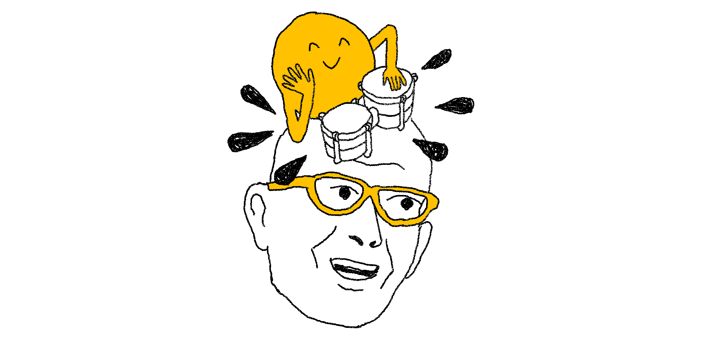

+++
title = 'Games changelog, November 2024'
date = 2024-11-27T08:00:00-07:00
authors = ["saman"]
tags = ["games", "changelog", "bongo", "memoku"]
theme = "puzzmo-light"
+++

Here's what's new in games since the last changelog.

### Bongo

- Released a new game, **Bongo**. [Play it now](https://www.puzzmo.com/+/play/bongo/)!

### Memoku

- Fixed a bug where sometimes the time displayed on the end screen could be incorrect.

### Spelltower

- Added additional 3, 4, and 5 letter words to the word list.

### Cubeclear

- Added additional 3, 4, and 5 letter words to the word list.

---

If you have any feedback or just want to talk about these changes, [join our Discord](https://discord.gg/puzzmo)!
