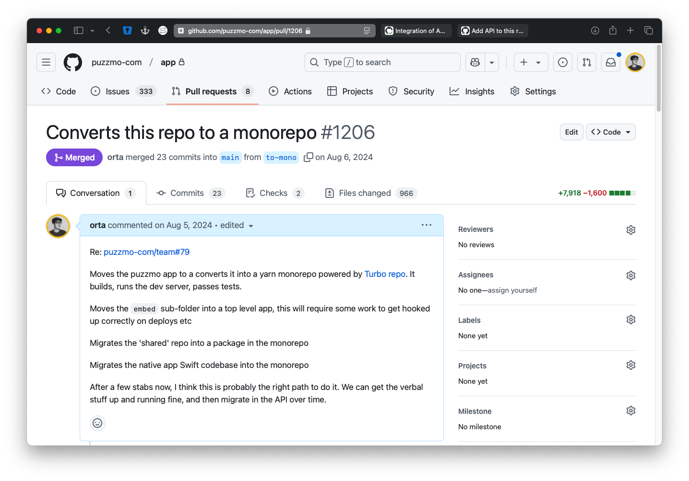
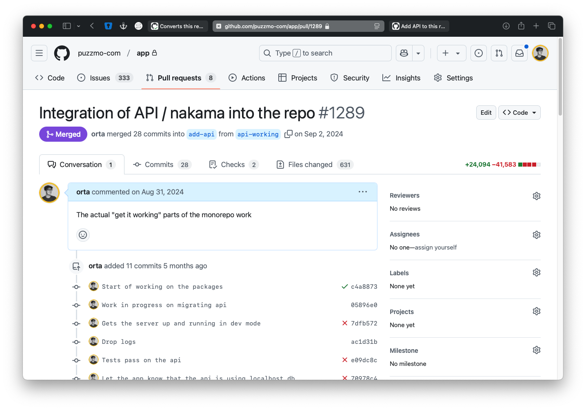
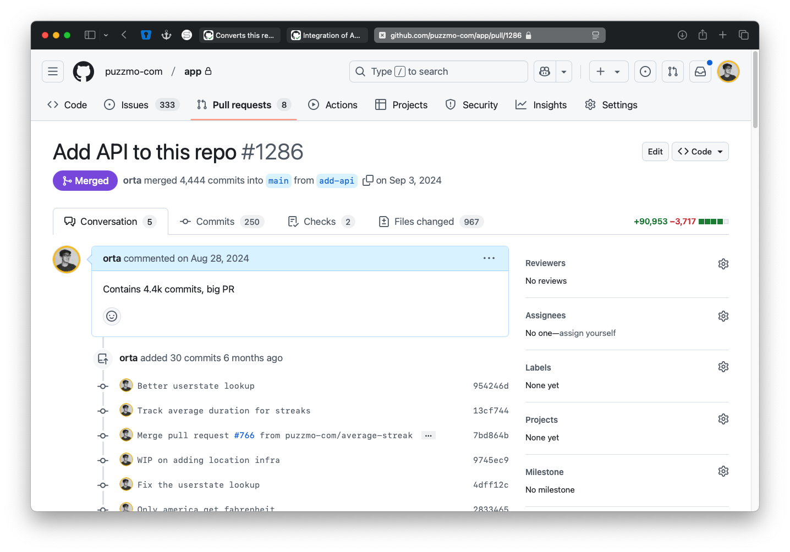

+++
title = 'Settling in to a monorepo'
date = 2025-01-22T12:58:51Z
authors = ["orta"]
tags = ["tech", "monorepo"]
theme = "outlook-hayesy-beta"
+++

One of my goals with blogging for the last decade has been to write the blog post I wish I had had. So, with Puzzmo now migrated to two monorepos ("app" and "games") I'd like to go through the process of setting up a monorepo and a few of the interesting trade-offs we've made now it's fully settled. This post includes all the config files which makes our monorepo work and a bit of a narrative about how they came together.

## Why?

We're a small team, 3 devs on the "app" side and 2 on the "games" side. Everyone is multi-functional but usually with a specific focus. When I [started Puzzmo](https://youtu.be/68TGvXlSSVY), it felt pretty obvious to make an "api" and a "client" repo. This was in part to my advantage because [RedwoodJS](https://redwoodjs.com) has opinions about your repo structure, and to some extent so did [Expo](https://expo.dev). Since launch, we've migrated off both technologies and that gave freedom to migrate them into one place.

This post is solely based on the "app" monorepo, the "games" one barely constitutes. That is mostly some clever vite/rollup work and a sub-folder which handles the opengraph image server.

I believe that when making an API-driven client-side project you are constantly making decisions about where to place complexity as the project grows. If you freely contribute to both the server and the client then you are much better placed to understand where that complexity should live. A monorepo makes that much easier.

## Build Basics

A monorepo is really just a way of saying a multi-contextual place to keep your code, I've built pretty complex monorepos like [the TypeScript-Website](https://github.com/microsoft/TypeScript-Website/) using a few simple build scripts. For the Puzzmo monorepo, I wanted to explore using a build system instead. The advantage of these build systems are that if you make a change in one project then they know which other projects it affects and can make is so that you have significantly less work happening when you verify your changes later. I looked at [rush](https://rushstack.io), [nx](https://nx.dev/getting-started/intro) and [turbo](https://turbo.build/repo/docs). After a small prototype of each I opted for Turbo, they all have similar features, I just knew the team and felt pretty good with that dependency.

A turbo monorepo is defined by a `turbo.json` root package, and then you usually work with yarn or pnpm to set up workspaces for multi-package repos like ours. This file declares what's available as commands like: `yarn turbo exec [xxyy]`. We have a few key tasks: `build`, `dev`, `type-check`, `lint`, `deep-lint`, `test` and `relay`.




```json
{
  "$schema": "https://turbo.build/schema.json",
  "globalEnv": ["NODE_ENV", "LOG_LEVEL"],

  "tasks": {
    "build": {
      "dependsOn": ["^build", "//#relay", "build:pre"],
      "env": ["REDWOOD_ENV_*"],
      "inputs": ["$TURBO_DEFAULT$", ".env", ".env.*", "!apps/puzzmo.com/src/__generated__/*", "!apps/studio/src/__generated__/*"],
      "outputs": ["dist/**", "web-build/**"]
    },
    "build:pre": {},
    "//#lint": {},
    "type-check": {},
    "deep-lint": {},
    "dev": {
      "cache": false,
      "persistent": true
    },
    "test": {},
    "test:watch": {
      "cache": false,
      "persistent": true
    },
    "//#relay": {
      "cache": false
    },
    "//#relay:watch": {
      "cache": false,
      "persistent": true
    }
  }
}
```



We use yarn, I explored switching to pnpm during this transition but it was too much of a change to all of the existing projects and I've been using [yarn since it came out](https://artsy.github.io/blog/2016/11/14/JS-Glossary/#yarn) (it was the first JavaScript package manager to use a lockfile) and it's just been really solid for a decade.

To declare multi-package in yarn, you add a section for "workspaces" which has globs describing where to find the packages:

```json
{
  ...
  "workspaces": [
    "apps/*",
    "packages/*"
  ]
}
```

Turbo will understand this too. Here is a truncated version of our root `package.json`

```json
{
  "name": "puzzmo-monorepo",
  "engines": {
    "node": "18",
    "yarn": "4.x"
  },
  "packageManager": "yarn@4.6.0",
  "scripts": {
    "build": "turbo build",
    "build:studio": "turbo build --filter=studio.puzzmo.com",
    "dev": "turbo dev relay:watch",
    "dev:app": "turbo dev relay:watch -F '*' -F '!api'",
    "postinstall": "husky install",
    "relay": "relay-compiler",
    "relay:watch": "relay-compiler --watch",
    "test": "turbo test",
    "deep-lint": "turbo deep-lint --continue",
    "lint": "oxlint -c oxlint.json",
    "lint:fix": "oxlint -c oxlint.json --fix",
    "test:watch": "turbo test:watch",
    "type-check": "turbo type-check",
    "validate": "turbo run --output-logs=new-only //#relay build test type-check //#lint --affected --summarize",
  
  },
  "workspaces": [
    "apps/*",
    "packages/*"
  ]
}

```




```json
{
  "name": "puzzmo-monorepo",
  "devDependencies": {
    "@eslint/js": "^9.17.0",
    "@puzzmo-com/turbo-run-info": "workspace:*",
    "@trivago/prettier-plugin-sort-imports": "^4.3.0",
    "eslint": "^9.17.0",
    "eslint-plugin-oxlint": "^0.15.6",
    "eslint-plugin-react": "^7.37.3",
    "eslint-plugin-react-compiler": "^19.0.0-beta-e552027-20250112",
    "eslint-plugin-react-refresh": "^0.4.18",
    "globals": "^15.14.0",
    "husky": "^8.0.0",
    "jest": "^29.0.0",
    "jest-mock-extended": "^3.0.0",
    "oxlint": "^0.15.6",
    "prettier": "^3.3.3",
    "prettier-2": "npm:prettier@^2.8.8",
    "relay-compiler": "^18.0.0",
    "turbo": "^2.3.3",
    "typescript-eslint": "^8.19.1"
  },
  "engines": {
    "node": "18",
    "yarn": "4.x"
  },
  "packageManager": "yarn@4.6.0",
  "prettier": {
    "printWidth": 140,
    "semi": false,
    "importOrder": [
      "<THIRD_PARTY_MODULES>",
      "^@(.*?)/(.*)$",
      "^src/(.*)$",
      "^[./]"
    ],
    "importOrderSeparation": true,
    "importOrderSortSpecifiers": true,
    "plugins": [
      "@trivago/prettier-plugin-sort-imports"
    ]
  },
  "resolutions": {
    "@prerenderer/renderer-puppeteer@npm:^1.2.4": "patch:@prerenderer/renderer-puppeteer@npm%3A1.2.4#~/.yarn/patches/@prerenderer-renderer-puppeteer-npm-1.2.4-afb1a2c21f.patch",
    "@types/node": "^20.1.0",
    "react": "^19.0.0",
    "@types/react": "^19.0.0",
    "@types/relay-runtime": "14.1.13",
    "typescript": "5.7.2",
    "rollup": "4.21.1",
    "styled-rn@1.0.7": "patch:styled-rn@npm:1.0.7#.yarn/patches/styled-rn-npm-1.0.7-0801839821.patch",
    "react-native-typing-animation@npm:0.1.7": "patch:react-native-typing-animation@npm%3A0.1.7#~/.yarn/patches/react-native-typing-animation-npm-0.1.7-707cc3f194.patch",
    "@react-navigation/elements@npm:^1.3.30": "patch:@react-navigation/elements@npm%3A1.3.30#~/.yarn/patches/@react-navigation-elements-npm-1.3.30-83c1721d32.patch",
    "@babel/types": "^7.26.3"
  },
  "scripts": {
    "build": "turbo build",
    "build:studio": "turbo build --filter=studio.puzzmo.com",
    "dev": "turbo dev relay:watch",
    "dev:app": "turbo dev relay:watch -F '*' -F '!api'",
    "postinstall": "husky install",
    "relay": "relay-compiler",
    "relay:watch": "relay-compiler --watch",
    "test": "turbo test",
    "deep-lint": "turbo deep-lint --continue",
    "lint": "oxlint -c oxlint.json",
    "lint:fix": "oxlint -c oxlint.json --fix",
    "test:watch": "turbo test:watch",
    "type-check": "turbo type-check",
    "validate": "turbo run --output-logs=new-only //#relay build test type-check //#lint --affected --summarize",
    "migrate-db": "yarn workspace api script migrateDB",
    "db-migrate": "yarn workspace api script migrateDB",
    "stripe-listen": "stripe listen --forward-to localhost:8911/stripeWebhook",
    "push:app": "git push origin main:prod-app",
    "push:api": "git push origin main:prod-api",
    "push:nakama": "git push origin main:prod-nakama",
    "diff:app": "git --no-pager log --oneline --decorate --abbrev-commit  origin/prod-app..origin/main; echo '\nView full diff at https://github.com/puzzmo-com/app/compare/prod-app...main'",
    "diff:api": "git --no-pager log --oneline --decorate --abbrev-commit  origin/prod-api..origin/main; echo '\nView full diff at https://github.com/puzzmo-com/app/compare/prod-api...main'",
    "diff:nakama": "git --no-pager log --oneline --decorate --abbrev-commit  origin/prod-nakama..origin/main; echo '\nView full diff at https://github.com/puzzmo-com/app/compare/prod-nakama...main'"
  },
  "workspaces": [
    "apps/*",
    "packages/*"
  ]
}

```



We have `yarn x` commands for pretty much everything you want to do which forwards the commands to turbo basically, so to most developers on the team turbo is a hidden abstraction.

Each project in the rep can then opt-in to the turbo tasks defined about (`build`, `test` etc) as `"scripts"` in the `package.json` if they have that particular task.

## CI

There are many ways to get good performance, but the easiest wins are nearly always "do less" and "cache more." One interesting aspect of using a build system is that it can come with a very clever caching system, turborepo allows for having a central asset cache for all builds. So in theory I could build locally after a change and CI could re-use my build assets.

However, true to the stereotype of being a [thrify Yorkshireman](https://en.wikipedia.org/wiki/Culture_of_Yorkshire#Traditions_and_stereotypes) I didn't use the Vercel's Remote Cache, but I did find [an open-source equivalent](https://github.com/rharkor/caching-for-turbo?tab=readme-ov-file#caching-for-turborepo-with-github-actions) for using on CI. Though, in researching this blog post, I have learned that Vercel made remote caching this free for folks using turborepo. So, it's worth my time to explore using their version sometime.

The workflow eventually ended up looking like this:

```yml
name: CI
on:
  push:
    branches:
      - main
  pull_request:

jobs:
  test:
    name: Lint, typecheck & test
    runs-on: ubuntu-latest

    steps:
      - name: Checkout
        uses: actions/checkout@v4
        with:
          fetch-depth: 0

      - name: "Ensure main branch is up to date, and exists locally"
        if: github.ref != 'refs/heads/main'
        run: git rev-parse --verify main || git remote set-branches origin main && git fetch --depth 1 origin main && git branch main origin/main

      # I have fully audited this action
      - name: Cache for Turbo
        uses: rharkor/caching-for-turbo@15d13818611ff349fbe5b31d0f3535be6a0ea1c0

      - name: Setup Node
        uses: actions/setup-node@v4
        with:
          node-version: 18.x
          cache: yarn

      - name: Install
        run: yarn install --frozen-lockfile

      - name: Build
        run: yarn build --cache-dir=.turbo --affected

      - name: Force a prisma generate 1
        run: yarn workspace api prisma generate

      - name: Typecheck
        run: yarn type-check --cache-dir=.turbo --affected

      - name: Force a prisma generate 2
        run: yarn workspace api prisma generate

      - name: Tests
        run: yarn test --cache-dir=.turbo --affected

      - name: Send bundle stats to RelativeCI
        uses: relative-ci/agent-action@v2
        # Only send bundle stats if the webpack-stats.json file exists
        if: hashFiles('apps/puzzmo.com/web-build/webpack-stats.json') != ''
        with:
          webpackStatsFile: apps/puzzmo.com/web-build/webpack-stats.json
          key: ${{ secrets.RELATIVE_CI_KEY }}
          token: ${{ secrets.GITHUB_TOKEN }}
```

Where a CI run takes somewhere between 4 to 7 minutes, more or less perfectly split between each task at about a minute or two depending on the PR.

## Migrating repos in

There were two repos I really cared about when making the main Puzzmo monorepo: the client and the api. When deciding how to start, I opted to migrate everything into the client repo because that repo had the longest history, and most issues.

I migrated it in three steps, first converting the "client" repo into "app" and copy & pasting the code from some other projects directly into the repo:



Once that had settled and we were in a smooth state, I integrated the API in a similar fashion:



Then after, a PR adding all of the prior commits from the other repo after re-writing them to use the new monorepo folder paths:



This last one is based on [git-filter-repo](https://github.com/newren/git-filter-repo?tab=readme-ov-file#table-of-contents) which is a technique I found in this blog post [from Simon Knott and Phil Hawksworth](https://developers.netlify.com/guides/migrating-git-from-multirepo-to-monorepo-without-losing-history/). On that subject, git-filter-repo is about to get used again.

## Migrating repos out

I may have taken a break from open source to build Puzzmo, but we're still shipping open source!  I wanted to be able to migrate the public repos for our open source code into the monorepo and still be able to contribute back. I've found that the open source we've made over the last few years doesn't really get contributors, so I opted to treat our public repos as "open-source mirrors" which means we can validate integrations in-house and still push changes to the public when they get used internally.

The example for this integration is [obebel](https://github.com/puzzmo-com/obebel) an OSS library which offers a builder pattern for making babel ASTs. This project lives in our monorepo, and changes to that sub-project are synced out to the OSS repo via GitHub Actions. It looks like this:

```yml
name: Sync Obelel to OSS Repo

on:
  push:
    paths:
      - packages/obebel/**/*
      - .github/workflows/Obebel-Sync.yml
    branches:
      - main
jobs:
  sync:
    name: Clone, re-create repo, create PR
    runs-on: ubuntu-latest

    steps:
      - name: Checkout monorepo
        uses: actions/checkout@v4
        with:
          fetch-depth: 0
          path: monorepo
          token: ${{ secrets.PUSH_TOKEN_GITHUB }}

      - name: Checkout obebel
        uses: actions/checkout@v4
        with:
          repository: puzzmo-com/obebel
          fetch-depth: 0
          path: obebel
          token: ${{ secrets.PUSH_TOKEN_GITHUB }}

      # https://www.mankier.com/1/git-filter-repo
      - name: Install git repo tooling
        run: sudo apt install git-filter-repo

      - name: Sync the repo from packages/obebel down to be the root of the repo
        working-directory: monorepo
        run: |
          git filter-repo --subdirectory-filter packages/obebel

      # This creates novel commits on the repo, so we just be overwriting history for now,
      # based on https://dev.to/carlossantillana/how-to-open-source-code-from-a-private-monorepo-262o
      - name: Update the obebel local copy
        working-directory: obebel
        run: |
          git checkout -b sync/${{ github.run_id }};
          git remote add source ../monorepo;

          git config pull.rebase false

          git config user.name "github-actions[bot]"
          git config user.email "41898282+github-actions[bot]@users.noreply.github.com"

          git pull source main --allow-unrelated-histories --strategy-option theirs --no-edit;
        env:
          GITHUB_TOKEN: ${{ secrets.PUSH_TOKEN_GITHUB }}

      - name: Push commits
        working-directory: obebel
        run: |
          git remote set-url --push  origin https://github.com/puzzmo-com/obebel.git
          git push --set-upstream origin sync/${{ github.run_id }};
        env:
          GITHUB_TOKEN: ${{ secrets.PUSH_TOKEN_GITHUB }}

      - name: Create PR
        uses: peter-evans/create-pull-request@v3
        with:
          token: ${{ secrets.PUSH_TOKEN_GITHUB }}
          commit-message: "Sync Obebel to OSS Repo"
          title: "Sync Obebel to OSS Repo"
          body: "Sync Obebel to OSS Repo"
          branch: "sync/${{ github.run_id }}"
          base: "main"
          labels: "sync"
          assignees: "orta"
          draft: false
```

Roughly:

- Take any commits which affect the folder `packages/obebel`
- Extract the obebel bits and change their paths to act like they were done in the root
- Apply those commits to the new repo via a bot-generated merge commit

All the commits have different shas from the originals but authors, dates etc are all accurate. Then CI pushes the changes to a branch based on the time the deploy started. Pull requests then look [like this one](https://github.com/puzzmo-com/obebel/pull/3). I'd need to make one of these per open source repo which is a bit of a pain but its a fair trade to me.

## Overall

In the end, I'm happy with our monorepo setup, Turbo repo was well documented, and I've been getting used to reading rust code as a part of dependency vetting now that we're pretty deep into the vite/turbo/oxlint generation of web tooling and while I don't taste in Rust, I can at least have a sense of how something works from a read though. Hope some of these files are useful to you.