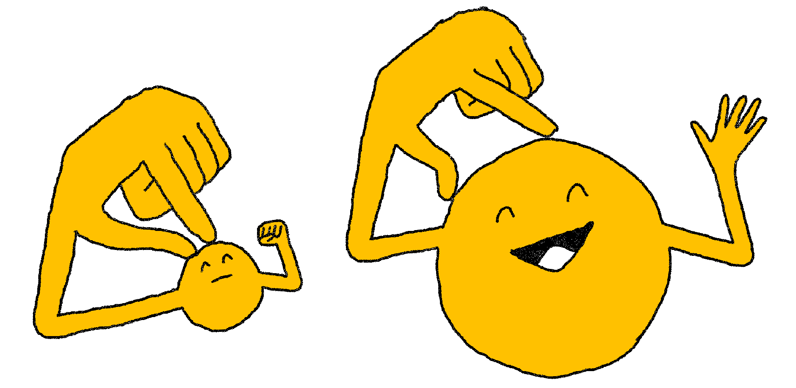

+++
title = 'Games changelog, January 2025'
date = 2025-02-03T08:00:00-07:00
authors = ["saman"]
tags = ["games", "changelog", "memoku", "bongo", "crossword"]
theme = "puzzmo-light"
+++

Happy new year! This changelog covers all changes since [November 2024's changelog](https://blog.puzzmo.com/posts/2024/12/27/november-games-changelog/).

Here's what's new:

### Cross|word

- Added text formatting support to clues (italics, bold, links, and more).
- Adjusted the column layout on narrow desktop and tablet screens so clue lists are always wide enough to read.
- Adjusted the initial scale of the grid on mobile so the entire grid is always in view.
- Increase contrast on circle square highlights.
- Improved the feel of zoom and pan gestures.
- Enabled zooming and panning on larger screen sizes.
- Performance optimizations to support bigger grids.
- Fixed a bug that caused a crash in Safari 16.3 and below.

### Bongo

- Allow moving keyboard selected letter tile from grid cell to an empty grid cell
- Fixed bug where you could grab a tile moving to a location mid-animation.
- Fixed bug where a duplicate purple words would be colored as purple even though they aren't scored.

### Weather Memoku

- Added user profile metrics.

---

If you have any feedback or just want to talk about these changes, [join our Discord](https://discord.gg/puzzmo)!
