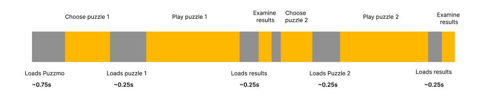
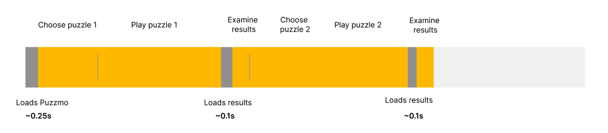
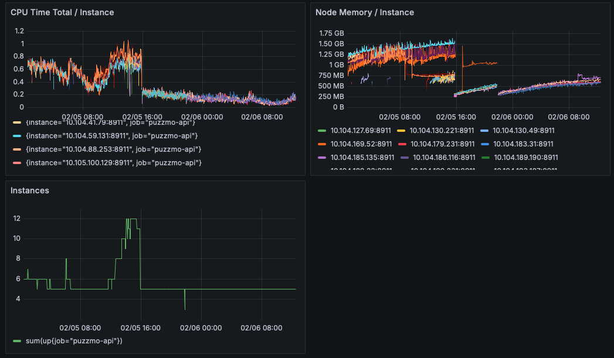

+++
title = 'Puzzmo Perf Wins'
date = 2025-02-06T16:29:23Z
authors = ["orta"]
tags = ["tech", "performance"]
theme = "outlook-hayesy-beta"
+++

Like many companies, we schedule by quarters. So far, we've had a [tick-tock](https://en.wikipedia.org/wiki/Tick–tock_model) strategy of a game launch with a lot of application and API infrastructure and one with less, this gives us a chance to release some big changes and then refine and try apply it to the back catalogue.

For 2025, we broke this pattern for Q1 because of three major factors:

- I agreed to focus almost solely on writing an iOS app for Puzzmo
- [Saman](https://trashmoon.com), who normally heads up our game efforts felt like it was time to take a serious look at design of puzzmo.com
- [Gary](https://github.com/gmjosack), who handles our API got monitoring and debugging to a point where he was happy to use these tools to inspect performance

This week we released enough incremental work on these three projects that puzzmo.com both feels significantly faster, and I want to talk through how each project has contributed to it.

### iOS App Infrastructure

The iOS app is going to be a hybrid web-view app, with native Swift code to handle a lot of the Apple integrations. This means that it will feel like a full-screen version of the website in Safari, but with the ability to pay via the App Store and we'll use native features when it makes sense. There is a different set of expectations that people have with an "app" version of Puzzmo, and that is offline support. People expect a website to need to be online, but expect that an app can run offline.

Now, I don't want to be re-writing puzzmo.com for every mobile platform, using different tools and languages. So, we need to add offline support to the Puzzmo website! This is tricky, and still a work-in-progress but this week some of the initial work has landed on the production version of Puzzmo.

What we have in today is the ability for the entirety of Puzzmo's today page to run exclusively from the information given in Today page. So, if you load up to see the puzzles, clicking on a puzzle does not _need_ additional information to start up the game. Making it significantly faster to get into a game!



> Previously: We show a full-screen loader before showing each puzzle



> After: 1 upfront-loader, and then we only need a loader for the puzzle results

This works by storing ["inline fragments"](https://relay.dev/docs/api-reference/graphql-and-directives/#inline) for games into a global which lives outside of the React tree 

```ts
export const playGameReadyFragment = graphql`
  fragment usePlayGameReady on GamePlayed @inline {
    id
    slug
    boardState
    completed
    elapsedTimeSecs
    additionalTimeAddedSecs
    ...[the rest]
  }
`

const localStorageOfOffline = new Map<string, { gameplay: usePlayGameReady$key; dateKey: string }>()

/** Store any puzzle on a today page into a cache based on the URL path */
export const useLocalTrackingOfOfflineGameplays = (today: TodayScreenQuery$data) => {
  useEffect(() => {
    for (const rec of today.todayPage.daily.puzzles) {
      const gameplay = rec.puzzle.currentAccountGamePlayed
      if (gameplay && rec.urlPath) localStorageOfOffline.set(rec.urlPath, { gameplay, dateKey: today.todayPage.daily.dateKey })
    }
  }, [today])
}

/** Prior cached data for a puzzle based on the URL path we'd find */
export const useGetLocallyTrackedOfflineGameplayInfo = (urlPath: string) => {
  if (!localStorageOfOffline.has(urlPath)) return null

  const item = localStorageOfOffline.get(urlPath)!
  const gameplay = readInlineData(playGameReadyFragment, item.gameplay)
  return { gameplay, dateKey: item.dateKey }
}

```

We then split playing the Play Game page to first try boot up entirely from this data, and then in the background load the rest of the information for that page. Moving that request to not block playing a game!

### API Performance Improvements

Gary wrapped up adding prometheus and grafana to the Puzzmo API two weeks ago, so now we can look at graphs like this:



Which is how we know how impactful yesterday's improvement is:



What you're looking at is the average time it takes to handle an API call from puzzmo.com. Half-way through the day we deployed a single change which flattened the average request time drastically. We'll see what it looks like comparing peak daily traffic to peak daily traffic.

The change was only a few lines of code, but it replicates this [Pull Request](https://github.com/redwoodjs/redwood/pull/9039) sent to Redwood. Effectively, on each networking request we were recreating the whole GraphQL schema before doing any of the actual work needed for that request. This is one of those [boiling frog](https://en.wikipedia.org/wiki/Boiling_frog) problems where you don't notice when the codebase is small and then it feels like the entrance fee for the abstractions you choose as you get further along in the process.

I can understand the design too, you may want to offer different GraphQL schemas to different sets of users (think admin vs users for example) but this isn't something we do in practice. So, switching to only create the schema on process launch has drastically reduced the computational overhead on each individual instance to the point that we have been at the minimum bounds of our auto-scaler since!



So far, this looks to be halving the round-trip time for a network request on Puzzmo!

### Playing Performance

Performance improvements aren't always so easily quantified though, we've had some substantial "feel" improvements just deploy too.

[One of our goals from last year](https://blog.puzzmo.com/posts/2024/10/30/tech-stack/#future-goals) was to move away from React Native, and we are significantly further into that than I would have expected.

There are two places that ended up being really important here:

- Navigational metaphors which come from a native design
- Animation performance from shared abstractions

Saman talks about the impedance mismatch for web developers using React Native Web in his pos here, but the technical parts that are interesting is that in native you keep the whole history of your backlog's DOM in memory vs web where you may use [`pushState`](https://developer.mozilla.org/en-US/docs/Web/API/History/pushState#javascript) with an object representation of your prior state.

Roughly, this means the Today Page is still in the background as you open up the Play Game page! That's the simple case, the more complicated case is that you can have prior games still live also in the background! This comes with a lot of unexpected surprises because off-screen content isn't normally something you need to handle in web development.

But as a native developer, you actually want that - [here's my writeup in 2017](https://github.com/artsy/emission/issues/501) talking about how that _not_ happening is a down-side to a navigational abstraction.

We have almost removed every React Native dependency, and as of this week [Saman](https://trashmoon.com) and [Jason](https://github.com/cod1r) got that list to also includes the navigation stack! So, we are now only rendering what you can see (hah, we've "just added [fustrum culling](https://en.wikipedia.org/wiki/Hidden-surface_determination#Viewing-frustum_culling) to Puzzmo's navigational stack!") which means a lot less is happening while you play.

The other issue is that we have started migrating animations in the app to use CSS animations instead of using the React Native API for animations. There will have been cases where the React Native APIs would use the GPU for doing work, but now we can be sure of it and the amount of animation work showing up in performance reports is now negligible.

### So, are we fast enough?

Good question, there's probably more optimizations to find but I'm not sure we'll make such a substantial jump as we have this week and so I thought it was notable enough for a blog post!
