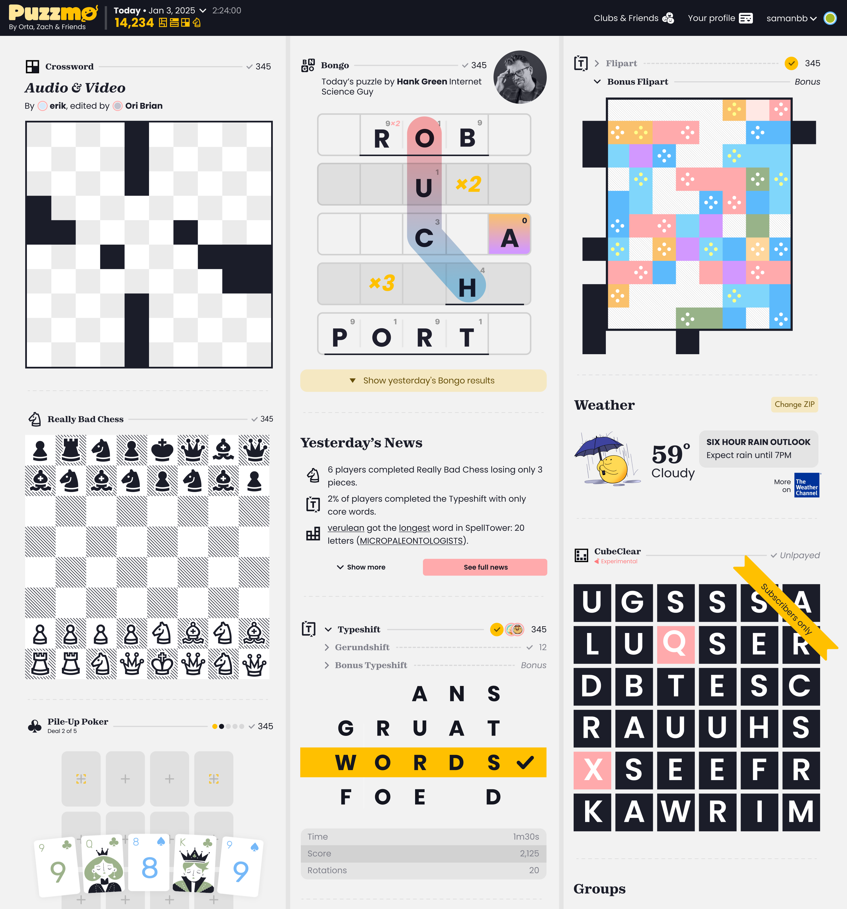
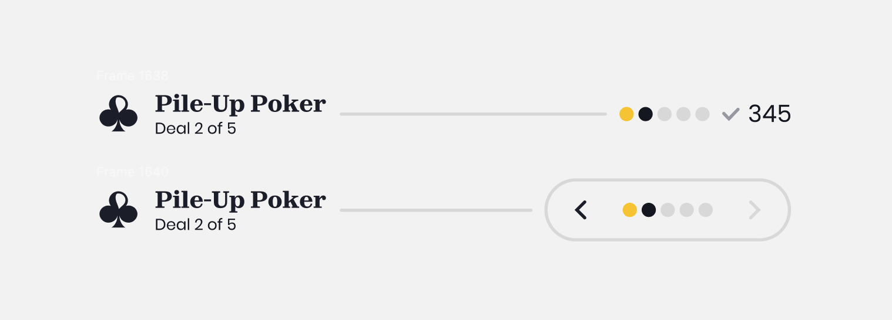
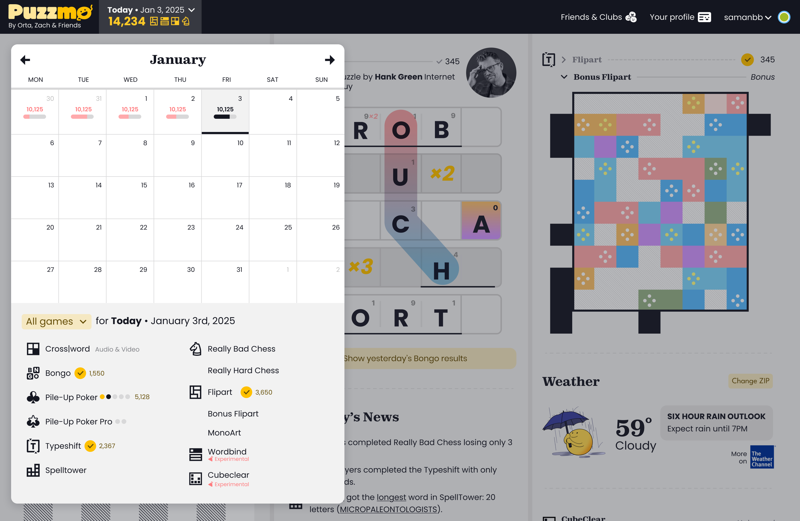
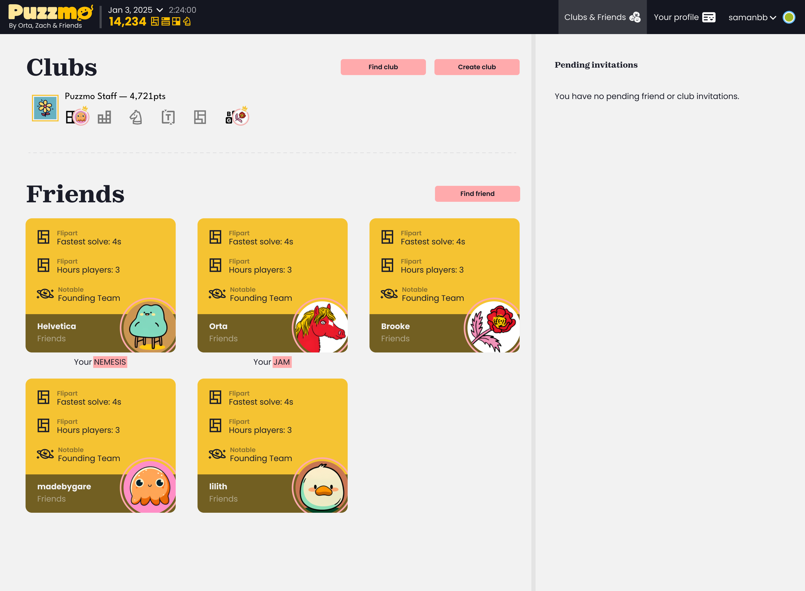
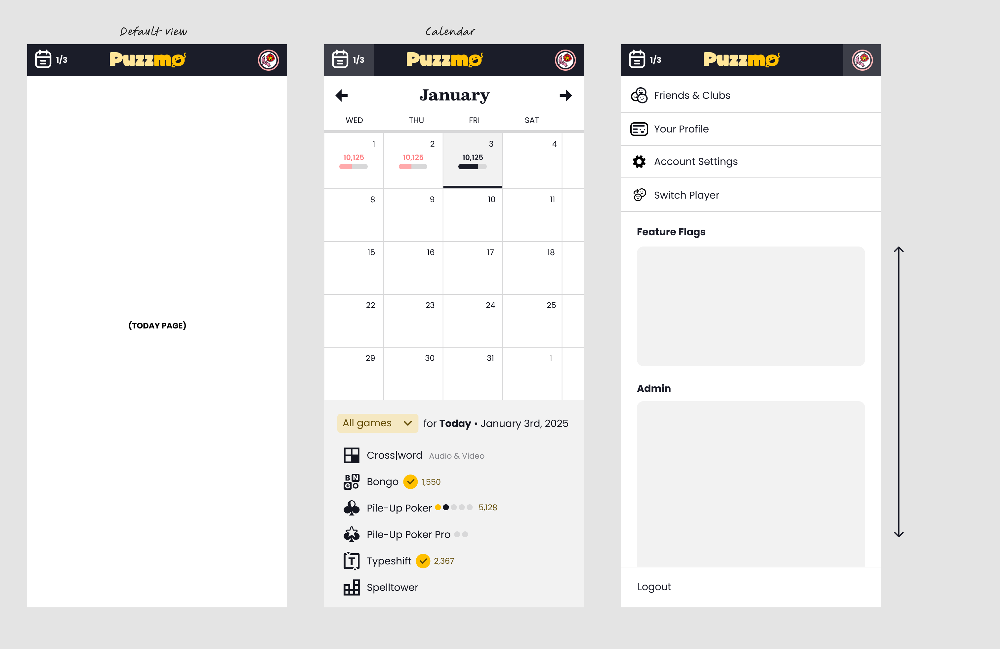
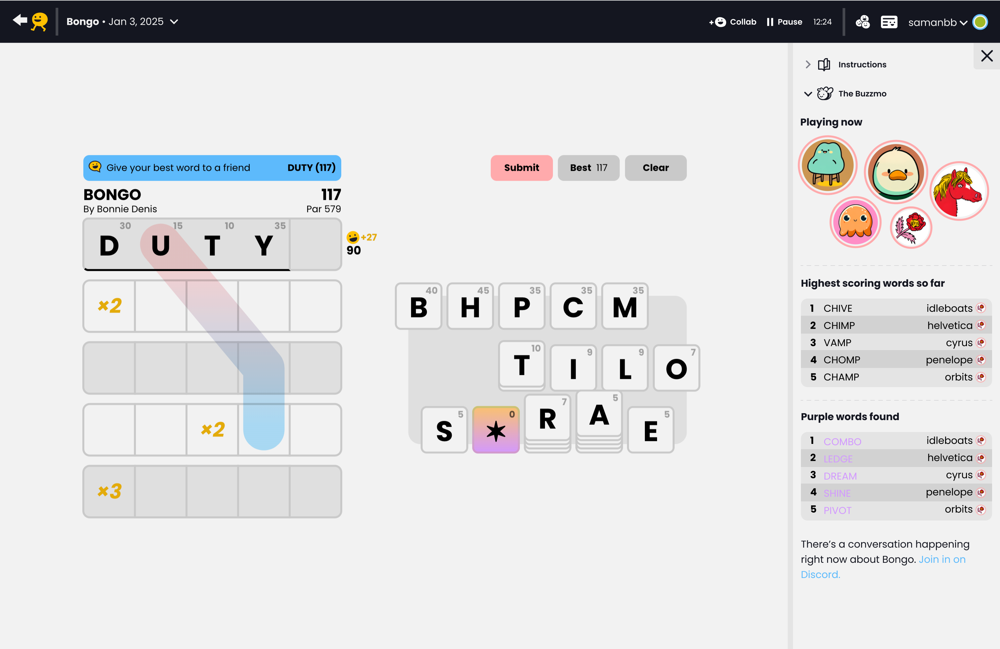
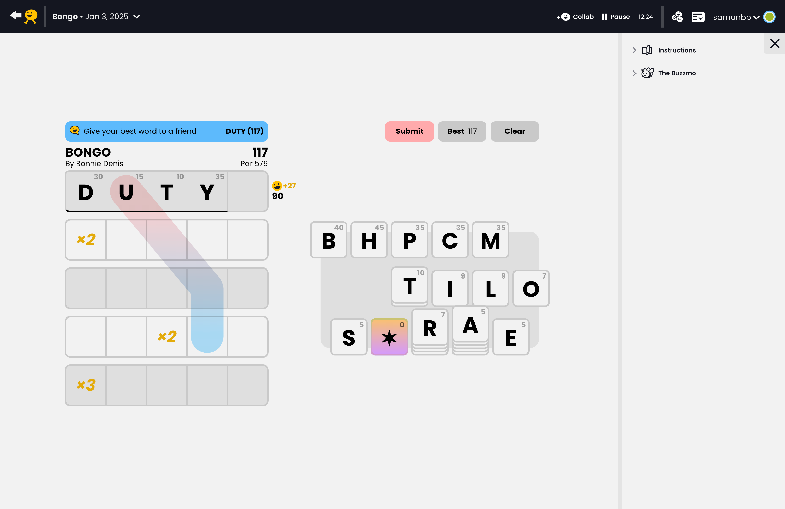
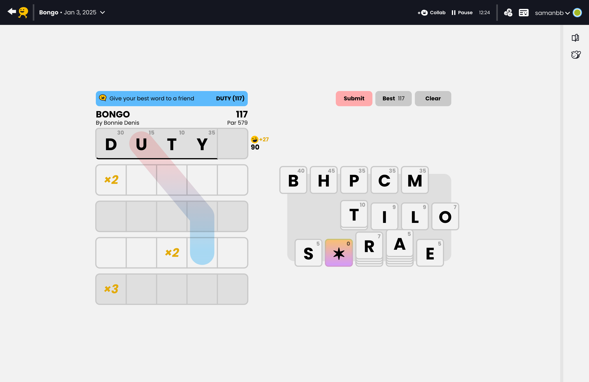
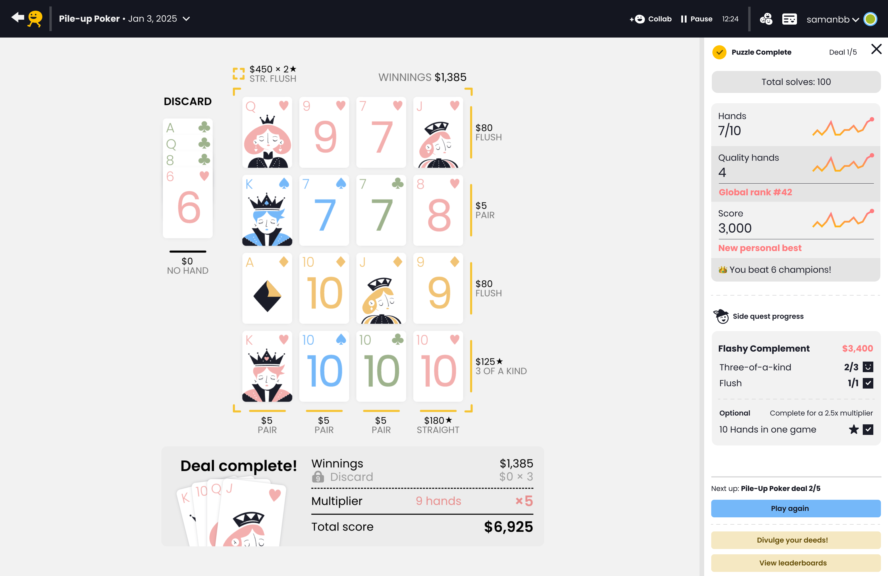

+++
title = 'A preview of upcoming Puzzmo.com design changes'
date = 2025-02-06T01:38:22Z
authors = ["saman"]
tags = ["design"]
theme = "puzzmo-light"
+++

Every game we launched last year came with at least one big new feature: **Bongo circles, Pile Up Poker Series, Weather Memoku's weather widget**. We launched game variants, customizable group leaderboards, time series sparklines on completion screens, game replays, and even a year-end recap. I could keep going. We've been busy since launch. Along the way, we gathered tons of valuable feedback from players about what they love and what they can't stand about Puzzmo.com.

We're going to make a set of systemic changes designed to improve the core Puzzmo experience and make space for even more experimentation in the future. Let's take a look at the work we plan to roll out over the next couple of months. Note that these mock-ups may be incomplete, and everything I'm sharing here is subject to change.

## The New Today Page

There are loads of subtle changes here, but a few big ones worth noting:

- The toolbar beneath the header that housed the calendar and your daily progress will be incorporated into the main header, giving more space for games and making it easier to find the archives.
- Game headings have been de-emphasized to focus the page on thumbnails. There's one exception: Crossword titles are now _more_ prominent. Titles are a part of what makes each day's Crossword unique.
- The design of variant and series headings have been brought in line with the design of standard game headings. Series will now have a progress indicator that transforms into a pager when tapped:
  

## The New Calendar

We never planned for the calendar to play double duty as an index of games for a given day, but we found that many players used it this way. We've decided to make it serve this purpose more effectively by adding more structure and clarity to the list of games. We plan to make the index available for non-subscribers.

## The New Clubs & Friends Page

Social presence on Puzzmo [changed a lot](https://blog.puzzmo.com/posts/2024/12/06/rm-chat/) over the past year. We removed chat, and we've been investing more in ambient and asynchronous social rather than real-time collaboration. Turns out, our players are a lot more interested in leaderboards, daily news, and profile stats than with than trying to collab on a typeshift. In the short term, as you can see from the mock-up above, we're making straightforward changes to simplify managing your friends and groups. Stay tuned for more experiments related to Puzzmo's social dimension later in the year.

## Mobile Navigation

The mobile experience will be _mostly_ unchanged outside of a visual refresh. We do plan to remove the social tab, and drop the secondary toolbar from all screens.

## The New Games Page

I decided to save the best for last. We're redesigning the games page to bring more focus on the game itself, and to give players more control over which meta layers they want to experience alongside the game. This design maximizes the amount of space on the page that the game occupies, so you can play comfortably on any screen size.

Everything on the game page is now unified under a single sidebar:

If you want to close the Buzzmo section, just press the section title:

If you want to minimize the sidebar completely, you can (if you are a subscriber—free accounts will still see an ad in the sidebar):

Finally, here's a preview of the new game complete sidebar - this is mostly the same as it is today:

## A Brief Technical Afterword

This will be brief, for the frontend engineers in the audience.

The original puzzmo.com website was [written in React Native](https://www.youtube.com/watch?v=2NItowAgfNA) because we planned to release a cross-platform native app. We have since changed our mobile app strategy (we're excited about the new plans!), which means we don't need to use React Native Web. This is great. React Native for Web is an impressive project, but ultimately quite a leaky abstraction that we all found quite challenging to work with. We are switching to standard React (bundled with Vite), and this project is the first step toward making it happen.

We've already switched out React Native's router for [wouter](https://github.com/molefrog/wouter), and we've started moving all styling over to [stylex](https://stylexjs.com/), and reworking our internal components to use [Base UI](https://base-ui.com/). These changes have already been _great_ for performance, bundle size, and usability (finally, we will have hover states and real anchor links), and they unlock more flexibility around animation and interactivity in the future.

By the end of this refactor, there should be very little React Native remaining.

## Next steps

We plan to release pieces of this redesign as they're ready, under public feature flags so there will be opportunities for feedback throughout the process.

Everything I shared in this post is subject to change and we're open to feedback. To let us know know what you think or just to stay up to date on the latest releases, [join our Discord](https://discord.gg/puzzmo)!
