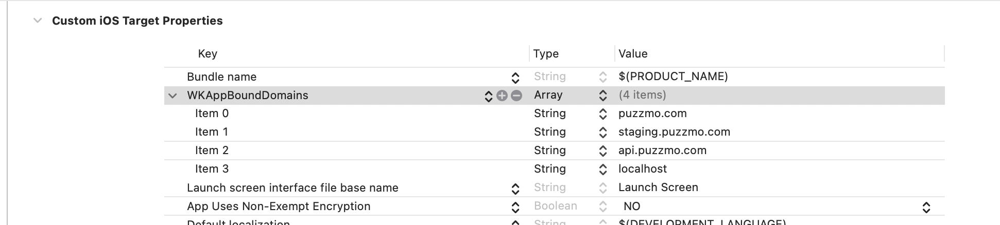

+++
title = 'iOS App Architecture'
date = 2025-05-19T10:00:38+01:00
authors = ["orta"]
tags = ["tech"]
theme = "outlook-hayesy-beta"
+++

Well, "finally" we got a Puzzmo iOS App. From day 1, I had been anticipating needing to build a native app for Puzzmo eventually, in part because of Zach's rich history of shipping iOS games but also when you tell someone you make games one of the first questions they ask is "do you have an app?".

My theory on blogging has always been write what I wish I had read at the start of a project. So, lets look at the process of making the iOS app, key components and techniques I shipped or abandoned in the process of writing the app.

1. 2.5 years of React Native
1. 0.5 years of Swift
1. Messaging systems and where responsibilities can lay
1. Offline Support

## Not so React Native

Before Puzzmo, I had a decade or so experience in making native apps, they all generally fall into one "type" of App though, which I call a "**"pretty JSON parser"**:

> Eigen is an app where we take JSON data from the server, and convert it into a user interface. Each view controller can nearly always be described as a function taking data and mapping it to a UI.



These types of apps can be summerized as taking some API data, making it look pretty and providing some ways for a user to interact back with the data. Puzzmo may be a game system, but everything outside of the games is server-driven data being rendered on a screen in your design system.

I don't think it makes sense to re-implement the core guts of these applications three separate times for the three major platforms most modern companies care about (the web/the mobile duopoly). If you are super well funded as a project and can afford the engineers, I'm still not fully convinced it's worth it for these apps - there's like a set of core shared experiences and then such a slim amount of platform specific work. For example at Artsy we were many years into using React Native, but I still shipped [Augmented Reality](https://artsy.github.io/blog/2018/03/18/ar/) features natively.

There are other key reasons to re-implement though. The team you have may devs _enjoy_ platform specific stuff either, like preferring Kotlin or SwiftUI, or even that they just enjoy focusing on a single platform because they use it and feel like it connects with them. I was one of [those people](https://artsy.github.io/blog/2012/05/11/on-making-it-personal-in-iOS-with-searchbars/). As a company are often [shipping your org chart](https://www.microsoft.com/en-us/microsoft-365-life-hacks/organization/what-is-conways-law), and IMO the desires to make native products for a lot of companies at this point are often about keeping career ladders moving and using the resources you already have.

But Puzzmo is a pretty JSON parser, most of the code in this platform (~200k LOC of TS) is outside of running games (~80k LOC of TS) and replicating huge chunks of that in each language and platform is asking for bugs, process and time to ship stuff. I'd like to keep those things all as low as possible. So, I knew I'd be looking for an abstraction.

You can see a week into starting working on Puzzmo in this [a 12m video](https://youtu.be/2NItowAgfNA), that I considered React Native Web as the base for Puzzmo's front-end to probably be a good option from a set of trade-offs. So, I started the codebase using [Expo](https://expo.dev) (a set of extra tools on top of React Native) and while it was just me writing the code, I regularly would Expo's [EAS](https://expo.dev/eas) to create native builds for running a mini-[testflight](https://developer.apple.com/testflight/) experience with Zach.

And for a time, it was good.

My initial working premise was this: We can build and focus on Puzzmo as a React Native codebase with web being the key platform. The goal was always to ship the web first, and then can work bit-by-bit on getting the native builds solid. Had Puzzmo not [been acquired](https://www.theverge.com/2023/12/4/23984103/puzzmo-acquired-hearst-zach-gage), I think this would have been doable. But the acquisition verson Puzzmo meant bigger budgets, extended scope and a larger team. So, in that world, there were three main things which I felt were blocking the idea of a single React Native codebase working for us:

1. Our team is very web slanted, and React Native's abstractions are based on native concepts, not web
2. The complexity of legal and SDK requirements inside the codebase
3. Game code could crash the entire app, and the games team didn't have an easy way to know this ahead of time

So, I ran a dev team meeting to discuss some of these trade-offs and we concluded that we should migrate the puzzmo.com codebase from React Naive and the iOS app is going to be a webview wrapper with native integrations.

## Native

The app itself is about 3k lines of Swift code which is an even split between the app and a natively implemented game tgat lives inside the same codebase.

My iOS knowledge is about 7-8 years out of date, but its still pretty useful in terms of understanding how to build a modern app. I got a lot of respect for Swift the language, but it still feels like a really pedantic language, great for building an Operating System or Camera app, but over-engineered for CRUD / pretty JSON parser. However, nowadays we I have GitHub copilot and the built-in Swift LLM recommendation tools in Xcode. Which certainly soften some of the hard edges.

Because I knew the codebase would stay reasonably small, I fully vendored all our (one) dependencies using SwiftPM into the monorepo which meant that anyone with Xcode installed can open it up and have a working local build. This also meant it worked out of the box with Xcode Cloud (apple's CI service) which I use for all deploys nowadays.

Xcode itself has had a few interesting improvements since I last used it, I enjoy the different fonts for comments and forgot how much I use `cmd + j` a lot and I want it in VS Code. Not having automatic code formatting as you type does make it always feel a bit broken.

## Webview Wrangling

My initial goal was to replicate the same type of architecture that we used at Artsy for our iOS app: use a native navigation pattern and then have router layer which knew whether to show a webview or a native view for a particular URL route.

This pattern worked well back a decade ago, but expectations on a mobile website are higher now, Puzzmo's internal architecture and changes in the tech powering webviews has made this a dead end nowadays.

Today the idea of shipping drastically simplified mobile versions of apps is pretty much dead, with a lot of designers and engineers instead going for a 'mobile-first' approach where the majority of focus is on the mobile and then the desktop is offered a flourish here and there. While I don't do this (I don't use a phone, and our puzzmo.com traffic is roughly 50/50 desktop/mobile) I do agree that we should have feature parity with desktop and mobile.

This means there's a lot of connective code which operates between pages in puzzmo both on mobile and on desktop, which makes for loading a fresh web page for every single navigation both slow and doesn't feel right. We use Relay as this fast internal key-value cache for all sorts, and with the "per screen webview" technique it's being re-created from web data on every page load.

Finally, it's now only possible to use Apple's WKWebView tech which runs out-of-process, so user-land systems for sharing caches between webview instances are not possible.

The final nail in the coffin for this technique was that I had hoped that I could use a native `UINavigationController` menubar (e.g. the one built into the system) to handle the titlebar info but that too was dropped because we had a team working on a re-design of these components in web-tech and didn't know what it would look like in the end. I didn't want us to be forced into making native builds when there were titlebar design changes - and was especially worried about design slippage between the puzzmo.com on mobile and the iOS version.

After looking at all these dead ends, I eventually just had to conclude that we would have a single webview for puzzmo.com as the root of the site and try to handle making the web view feel more native.

Is this an optimal solution? Not really, I think it's harder nowadays to make a hybrid webview app which could explain why React Native and Flutter usage rises while I rarely hear of much from the "use a webview" crowd.

## Message Systems

One of the first things I built was a bi-directional message sending system for going between puzzmo.com's embedded app and the iOS native codebase. Inside the Puzzmo codebase we have to distinguish between running in a few different contexts. So, I consolidated some of our logic into a new "app runtime" which gives a sense of the three core but different runtime environments that the codebase needs to support:

```ts
const isApp = navigator.userAgent.includes("Puzzmo")
const isEmbeddedApp = document.location.pathname.includes(...)
const appRuntime = isApp ? "native-apple" : isEmbeddedApp ? "app-embed" : "web"
```

On the web side, our messaging is built off the same style of event emitting which we use for playing the games inside `<iframe>`s, which is this:



```ts
type IncomingMessages = import("@puzzmo-com/shared/hostAPI").AllIncomingMessagesToApp
type Events = Partial<{
  [key in IncomingMessages]: Function[]
}>

// Based on https://css-tricks.com/understanding-event-emitters/
export function createEventEmitter<EventMap extends Record<string, any>>(verboseLogging = false) {
  const events: Partial<Record<keyof EventMap, Function[]>> = {}

  return {
    events,
    subscribe: (name: keyof EventMap, cb: Function) => {
      if (!events[name]) events[name] = []
      events[name]?.push(cb)

      return {
        unsubscribe: () => {
          // triple shift to always get a positive number
          // If indexOf returns -1, it'll get converted to a positive number
          // where all 32 bits are 1, which is 2^32 - 1, so nothing gets deleted
          events[name]?.splice(events[name]!.indexOf(cb) >>> 0, 1)
        },
      }
    },
    emit: (name: keyof EventMap, ...args: any[]) => {
      if (verboseLogging) console.log(`Emitting event ${String(name)}`, args)

      if (!events[name]) return
      events[name]?.forEach((fn) => fn(...args))
    },
    _: "" as keyof EventMap,
  }
}

export const appEventsEmitter = createEventEmitter<Events>()

/**
 * Subscription hook
 * Unsubscribes when cacheKey changes.
 */
export function makeUseEmitterSubscription<Map extends Record<string, any>>(messageEmitter: { subscribe: any }) {
  return <Key extends keyof Map>(cacheKey: string, key: Key, fn: (data: Map[Key]) => void) => {
    useEffect(() => {
      // only create a listener if we have a cacheKey.
      const listener = cacheKey ? messageEmitter.subscribe(key, fn) : null
      return () => {
        if (listener) return listener.unsubscribe()
      }
    }, [key, fn, cacheKey])
  }
}
```



The iOS native message system builds on this event emitter abstraction and co-locates all of the messages sent and received into a single file.



```ts
import { useCallback, useEffect } from "react"

import { AvailableHaptics, Theme } from "@puzzmo-com/shared/hostAPI"
import { PublishingPartnerAppearance } from "@relay/PuzzmoCurrentUserFragment.graphql"
import { PublishingPartnerNavBackground, PublishingPartnerNavForeground } from "@relay/PuzzmoQuery.graphql"
import { TodayScreenQuery$data } from "@relay/TodayScreenQuery.graphql"

import { useAppContext } from "../../AppContext"
import { createEventEmitter, makeUseEmitterSubscription } from "../lib/createEmitter"

// This is immutable! Do not _remove_ or _change_ the strings in these fields.
// The native app needs these to operate.

type AppSpecificPartner = {
  backURL: string
  navHeight: number
  logoLongBlack: string
  logoLongWhite: string
  logoHeight: number
  logoWidth: number
  ourLogoOffsets: readonly number[] // [number, number]
  theirLogoOffsets: readonly number[] //[number, number]
  appearance: PublishingPartnerAppearance
  navBG: PublishingPartnerNavBackground
  navFG: PublishingPartnerNavForeground
  ourLogoFG: PublishingPartnerNavBackground
  ourLogoFGOverride: string | null | undefined
}

type MessagesSentToNativeApp =
  // An offer of runtime-specific info to give to the native app
  | {
      type: "app-context"
      userStateID: string
      accountID: string | undefined
      sound: string | null | undefined
      haptics: string | null | undefined
      appBackgroundColor: string
      userID: string | undefined
      partnerID: string | undefined
      partner: AppSpecificPartner | null | undefined
      theme: Theme
    }
  // A request to get the pricing information for the apple store
  // this happens on the subscription screen and other buttons
  | {
      type: "request-pricing-apple"
    }
  // Starts a puzzmo subscription
  | { type: "start-appstore-subscription"; accountID: string; productID: string }
  // NOOP
  | { type: "start-iap"; id: string }
  // Opens the manage subscription page modal in-app
  | { type: "manage-appstore-subscription" }
  // A request to get the cached version of the today screen's data
  | { type: "today-cache" }
  // A request to trigger a specific haptic feedback event
  | { type: "haptics"; method: AvailableHaptics }
  // Deprecated: This is used to tell the native app that the page has been loaded,
  // it is not used for a more general tracking, it simply tells the app
  // when specifically marked pages have loaded
  | { type: "page-loaded"; page: "today" }
  // A request to show the game center leaderboard
  | { type: "show-game-center-leaderboard"; id: string; scope?: "friends" | "global"; timeScope?: "today" | "week" | "all" }
  // A request to show the game center
  | { type: "show-game-center"; scope: "leaderboards" | "achievements" | "challenges" | "dashboard" | "localPlayerProfile" }
  | {
      type: "critical-failure"
      errorMessage: string
      info?: { query: string; stack: string }
    }
export type MessagesReceivedFromNativeApp = {
  "response-pricing-apple": {
    prices: {
      id: string
      /** Likely always "Puzzmo Plus" */
      name: string
      /** The price of the sub, e.g. "$39.99" */
      price: string
      /** The type of the sub, e.g. "Auto-Renewable Subscription" or "Consumable" (always "Auto-Renewable Subscription" for us) */
      type: "Auto-Renewable Subscription" | "Consumable"
      /** Is the sub a monthly version? */
      monthly: boolean
      /** Is the sub an annual version? */
      annual: boolean
      /** Does an intro offer exits (e.g. 1 month free trial) */
      hasIntroOffer: boolean
      /** The period of the intro offer (e.g. "1 Month") */
      introOfferPeriod: string | null
      /** Whether the user is eligible for the intro offer */
      introEligibility: boolean
      /** Whether this user has subbed to this offer */
      isSubscribed: boolean
      /** Whether someone is in a grace period (maye a trial?) */
      isGracePeriod: boolean
    }[]
  }
  "apple-tracking-transparency": {
    enabled: boolean
  }
  "response-today-cache": {
    data?: TodayScreenQuery$data
  }
  "game-center-id-set": {
    // Correct data will always start with "A:"
    gameCenterID: string | null
  }
}

const showingIPCLogs = typeof localStorage !== "undefined" && localStorage.getItem("showIPCLogs") === "true"
const nativeEventsEmitter = createEventEmitter<MessagesReceivedFromNativeApp>(showingIPCLogs)
;(globalThis as any).nativeEventsEmitter = nativeEventsEmitter

export const useSubscribeToNativeMessage = makeUseEmitterSubscription<MessagesReceivedFromNativeApp>(nativeEventsEmitter)

export const useSendNativeMessage = () => {
  const { appRuntime } = useAppContext()

  return useCallback(
    (message: MessagesSentToNativeApp) => {
      if (appRuntime !== "native-apple") return
      if (!("webkit" in window)) throw new Error("No webkit on window")
      if ((window as any)?.webkit?.messageHandlers?.app === undefined) {
        throw new Error("No native handler")
      }
      console.debug(`Sending native message ${message.type}`)
      console.debug(message)
      ;(window as any).webkit.messageHandlers.app.postMessage(message)
    },
    [appRuntime]
  )
}

export const useNotifyAppOfPageLoad = (page: "today") => {
  const sendMsg = useSendNativeMessage()
  useEffect(() => {
    sendMsg({ type: "page-loaded", page })
  }, [sendMsg, page])
}
```



TLDR: we call `messageHandlers.app.postMessage()` to send to the iOS app codebase, and listen to a global constant of `nativeEventsEmitter`.

For a time, I explored making a rust CLI tool which converts these types into Swift `struct`s based on the oxc compiler tools. So that the TypeScript unions can be the single source of truth. This was before I had explored using the chat parts of these code assistant tools, and so I didn't get too far but it could be worth giving a second shot nowadays. I'm finding the "chat" bits to be quite useful when working on low-stakes things in environments you don't fully comprehend.

On the native side, we need to set up `messageHandlers.app` which will automatically set up the `postMessage` function too:



```swift
import Foundation
import WebKit
import RevenueCat

class AppComms: NSObject, WKScriptMessageHandler {
    private weak var networkMonitorManager: NetworkMonitorManager?
    private weak var webView: WKWebView?

    var context: MessagesSentAppContext?

    init(webView: WKWebView, networkMonitorManager: NetworkMonitorManager) {
        self.webView = webView
        self.networkMonitorManager = networkMonitorManager
        super.init()

        // Allow injecting code into the webview
        webView.configuration.userContentController.add(self, name: "app")
    }

    func userContentController(_ userContentController: WKUserContentController, didReceive message: WKScriptMessage)  {
        guard let dict = message.body as? [String: AnyObject] else { return }
        guard let type = dict["type"] as? String else { return }

        if (isSimulator) {
            print("<- a message from the webview: '\(type)'")
            print("    with payload: \(dict)")
        }

        if type == "app-context" {
          // ...
        }


        if type == "start-appstore-subscription" {
            print("Received request to start sub")
            guard let account = dict["accountID"] as? String else {
                return print("> Account ID not found in message")
            }
            guard let productID = dict["productID"] as? String else {
                return print("> Product ID not found in message")
            }

            Purchases.shared.logIn(account) { info, created, error in
                Task {
                    let product = await Purchases.shared.products([productID]).first
                    if (product == nil) { return print("Could not find product ID") }

                    let result = try? await Purchases.shared.purchase(product: product!)
                    let anyTransactions = (result?.transaction?.sk2Transaction?.purchasedQuantity ?? 0) > 0
                    if (anyTransactions) {
                        self.webView?.load(URLRequest(url: URL(string: "https://puzzmo.com/success")!))
                    } else {
                        self.webView?.reload()
                    }
                }
            }
            return
        }
    }

    func sendMessage(_ key: String, jsonObjString: String) {
        if (isSimulator) {
            print("-> sending message to webview: '\(key)'")
            print("    with payload: \(jsonObjString)")
        }

        DispatchQueue.main.async {
            let js = """
            // This comes from the native codebase, message: '\(key)'
            if (!window.nativeEventsEmitter) throw new Error("nativeEventsEmitter not found on globalThis")

            window.nativeEventsEmitter.emit('\(key)', \(jsonObjString))
            """
            self.webView?.evaluateJavaScript(js)
        }
    }
}
```



That gives you a way to have a button in the web app's code which triggers native code, and the other way around.

### Pricing and Subscriptions

For the web, we use Stripe and are super happy with it - it's been incredibly flexible and has allowed for us to have all sorts of interesting dynamic deals and discounts running off a bunch of booleans in our codebase.

Apple's subscription infrastructure is a lot more ahead-of-time and static. Each subscription offer and in-app purchase needs to go through review processes and sticks around on your app store permanently, in addition to Apple taking a 30% cut of all sales.

But somewhat critically for our puzzmo.com - the information about pricing, availability, the strings we should show are all things that can only be accessed from the device itself. So, for a "Pretty JSON parser" app, we actually need to be infusing information taken from the app if we want to be able to say "Get a subscription for €40."

This meant that our subscription page, and CTA-style buttons needs some information from puzzmo.com(what available subscriptions are possible) but then need to ask the iOS app "get me info about these app store products"

What we do is have at launch, and upon request via a message is a Swift lookup for all possible App Store subscriptions:



```swift
import Foundation
import StoreKit

// These are keys available in App Store connect
let productIDs = [
    "annual.plus.puzzmo.com",
    "monthly.plus.puzzmo.com",
]

var pricingInfoFromStoreKit: [ProductInfo] = []

struct ProductInfo: Encodable {
    let id: String
    let price: String
    let name: String
    let type: String
    let annual: Bool
    let monthly: Bool

    let hasIntroOffer: Bool
    let introOfferPeriod: String?
    let introEligibility: Bool
    let isSubscribed: Bool
    let isGracePeriod: Bool
}

func getPricingInfoForProductIDs() async -> Void {
    do {
        let productList = try await Product.products(for: productIDs)
        print("Fetched products: \(productList)")
        for item in productList {
            try await pricingInfoFromStoreKit
                .append(
                    ProductInfo(
                        id: item.id,
                        price: item.displayPrice,
                        name: item.displayName,
                        type: item.type.rawValue,
                        annual: item.subscription?.subscriptionPeriod.unit == .year,
                        monthly: item.subscription?.subscriptionPeriod.unit == .month,
                        hasIntroOffer: item.subscription?.introductoryOffer != nil,
                        introOfferPeriod:  item.subscription?.introductoryOffer?.period.debugDescription ?? nil,
                        introEligibility: item.subscription?.isEligibleForIntroOffer ?? false,
                        isSubscribed: item.subscription?.status.contains(where: { subStatus in
                            return subStatus.state == .subscribed
                        }) ?? false,
                        isGracePeriod: item.subscription?.status.contains(where: { subStatus in
                            return subStatus.state == .inGracePeriod
                        }) ?? false,
                    )
                )
        }
    } catch {
        print("Error fetching products: \(error)")
    }
}
```



Which is then able to be sent as JSON to the client as the information to build the subscription page. We also re-designed the subscription page, but not comprehensively enough to account for all of the stripe cases, so now there is "subscription page" and "subscription page 2" in the codebase.

I guess it's worth the footnote but in the US and the EU now, it's possible to not support Apple's purchases and subscription infrastructure (30% of all revenue is a massive ask) but doing so would effectively ruin _your_ reputation/relationship with Apple and also because support is piecemeal then you are still going to have the duplicate systems regardless.

## Offline

For both Zach and I, working offline was one of the core tenets of "being an app". So, perhaps the majority of the four months I worked on the app was within this space.

There is no such thing as just "add offline mode" though, its like a tonne of small systems that all together interlock to get you a tight experience when you're on the subway and/or off wifi. It's really something that needs to be thought of from the get-go and constantly

In the end, timelines got me and we never finished what we'd call a _good enough_ experience for classing the Puzzmo iOS app as having "offline support." Some of this came from the complexity of not shipping the codebase as a React Native app but other parts are just that Puzzmo is a series of interlocked systems built intentionally to be separately deployed/updated and wrangling all these together is a nightmare.

So, let's try walk through some of the dead ends, some of the "this is actually in"s and get a sense of where progress could happen if/when we pick it back up.

Let's start from the start of someone's experience using the app on a daily basis. App launch. To load the app up from scratch without internet access we need (at least) two things: the code to run puzzmo.com inside the webview and today's gameplay data.

### Getting Puzzmo.com running offline

When you are faced with making a webview run offline, there are two options. Have the source code locally and run a server from your device, or use a service worker. I opted for a service worker, because that means adding offline support for the iOS app also benefits all web users too! This also means less conceptual forks in how the entire app is loaded, no-one working on puzzmo.com is going to be loading up the iOS app to work on their features, so having a completely separate system here is just asking for things to break in the future.

Making a webview support a service worker is one of those esoteric bits of knowledge you find spread across the internet, here's the key thing to that search: you need to use `WKAppBoundDomains`.

These can be set on your app target:



Which is a list of hard-coded into the app, reviewable for Apple, website hostnames which you can then have referenced in the `WKWebViewConfiguration` when you are making the webview for your app.

```swift
let appVersionStr = Bundle.main.infoDictionary?["CFBundleShortVersionString"] as? String
let appVersion = (appVersionStr != nil) ? appVersionStr! : "-"

let webConfiguration = WKWebViewConfiguration()
webConfiguration.applicationNameForUserAgent = "Puzzmo/\(appVersion) (iPhone)"
webConfiguration.preferences.setValue(true, forKey: "developerExtrasEnabled")

// WKWebViews cannot load service workers by default, so you have to declare
// up-front the domains you could use in info.plist and then this flag
// allows it to load up.
webConfiguration.limitsNavigationsToAppBoundDomains = true

webView = WKWebView(frame: self.view.bounds, configuration: webConfiguration)
```

So, service workers, truly one of the dark corners of the DOM APIs - we already had a service worker for puzzmo.com because I added web notification support before launch. However, I knew we were going into 'thar be dragons' territory when every single search result for information in the space leads to a Google Chrome team library (workbox) which handles a lot of edge cases and every bundler level integration brings that library in by default.

So, perhaps with a hint of hubris and wanting to avoid hundreds of kb of dependencies for just the service worker - I opted to handle the caching of files and assets all myself.

We use vite, so I was already using `vite-plugin-pwa` to hook up a service worker. I extended the worker with a event emitter system that allows pre-caching all of the built assets which vite emitted.

Then I created a new page on puzzmo.com /dev/offline which gives information about the current cache of necessary assets for loading the website. This system I turned off and on a few times, because there's a lot of different things that should and shouldn't be cached it seems.

### Today's Puzzles

When you load up the app, and service worker has correctly loaded your JS/CSS/images offline - your app is going to ask your API for today's data. You're gonna now need a way to provide that!

There is a iOS native API called "background fetch requests" which has an equivalent in Chrome on mobile but not on Safari iOS. So, this is going to have to come from the native app.

We've got to be pretty creative here to not cause a lot of trouble for folks maintaining puzzmo.com. We use GraphQL, so the home page of puzzmo.com (the "today page") makes a GraphQL request to grab its data. This request changes relatively frequently. If we needed to make an iOS deploy for every change to the today page in order to keep offline mode working then the offline mode has systemically failed.

So, we need a level of dynamic introspection which can happen when the device does not have the app running. My eventual answer for this is pretty convoluted, but is flexible.

We start with the native API:

```swift
extension AppDelegate {
    func setupBackgroundFetch() {
        BGTaskScheduler.shared.register(forTaskWithIdentifier: "com.puzzmo.todayPageDownload", using: nil) { task in
             self.handleAppRefresh(task: task as? BGAppRefreshTask)
        }

        let request = BGAppRefreshTaskRequest(identifier: "com.puzzmo.todayPageDownload")

        // TODO: Set to tomorrow's daily 00:00
        // request.earliestBeginDate = Date(timeIntervalSinceNow:  60 * 60)
        do {
           try BGTaskScheduler.shared.submit(request)
        } catch {
           print("Could not schedule app refresh: \(error)")
        }

        // if its a sim, we can't do bg tasks, so trigger it on launch
        #if targetEnvironment(simulator)
        print("running bg task on simulator, skipping")
        self.handleAppRefresh(task: nil)
        #endif
    }

    func handleAppRefresh(task: BGAppRefreshTask?) {
        let operation = DownloadTodayPageDataOperation()

        task?.expirationHandler = { operation.cancel() }
        operation.completionBlock = {
            task?.setTaskCompleted(success: !operation.isCancelled)
        }
        OperationQueue.main.addOperation(operation)
    }
}
```

Simple enough, you pass an `NSOperation` for the OS to handle which downloads the necessary data and stores it somewhere.

Let's look at `DownloadTodayPageDataOperation` because this is where things start getting weird. My answer to the need to have a dynamic lookup of the today page data is to have a `JSContext` run a script which runs off puzzmo.com that uses the latest version of the today page query.

So, how do we do that?



```swift
import Foundation
import UIKit
import JavaScriptCore

class DownloadTodayPageDataOperation: Operation, @unchecked Sendable {
    override func main() {
        // We need to use a group to handle the async trickiness where we jump into the JSContext
        // and then come back with a JSON string of the today page
        let group = DispatchGroup()
        group.enter()

        // Avoid deadlocks by not using .main queue here
        DispatchQueue.global(qos: .default).async {

            // Start a little JS environment
            guard let context = JSContext.extendedContext else { exit(-1) }

            context.isInspectable = true
            context.name = "DownloadTodayPageDataOperation JS"

            // Adds this instance to the runtime as "JSDownloadRuntime"
            let jsDownloadRuntime = JSDownloadRuntime()
            context.setObject(jsDownloadRuntime, forKeyedSubscript: "JSDownloadRuntime" as (NSCopying & NSObjectProtocol))

            // This is what triggers when the JS declares it is done,
            // it tells the dispatch queue that the operation has finished
            jsDownloadRuntime.setCompletionHandler { result in
                print("got a return value from JS \(result.lengthOfBytes(using: .utf8) ) bytes")

                TodayCache.setCachedJSONData(result)

                group.leave()
            }

            // Set up the two callbacks which are the exit points for the dispatch group we operate in
            jsDownloadRuntime.setErrorHandler { errMessage in
                print("Error downloading today page: \(errMessage)")
                group.leave()
            }

            context.exceptionHandler = { context, exception in
                print("JS Error: \(String(describing: exception!))")
                group.leave()
            }

            // Setup the variables to match the main query, there is a big warning
            // in the app's source code not to change these variables
            let todayVariables = TodayScreenQueryVariables(
                userToken: "",
                gameplayID: "wk5XHTO1OiHkrScPPo2aR",
                variables: TodayScreenQueryVariables_Variables(myUserStateID: "[id]")
            )

            let jsonEncoder = JSONEncoder()
            jsonEncoder.outputFormatting = [.prettyPrinted]
            guard let jsonData = try? jsonEncoder.encode(todayVariables) else {
                fatalError("Could not encode JSON")
            }
            let todayVariablesJSONString = String(data: jsonData, encoding: .utf8)!


            // Grab and evaluate the offline downloader script, then trigger a call to getTodaysDailyInfo
            // which passes it back to the app
            context.evaluateScript("""
            JSDownloadRuntime.fetch("\(webBaseURL)/offline-downloader.iife.js").then(r => {
               try {
                    eval(r)
                    getTodaysDailyInfo("\(apiBaseURL)/graphql", JSON.parse(`\(todayVariablesJSONString)`))
                } catch(e) {
                    console.log("Failed to eval")
                    JSDownloadRuntime.error(e.message)
                }
            })
            """)

        }

#if targetEnvironment(simulator)
        // NOOP as blocking isnt valuable in a simulator, this will only
        // get called in a background fetch environment where we need to provide
        // a locked operation until the work is done
#else
        group.wait()
#endif
    }
}

// The object exposed to the JS runtime
class JSDownloadRuntime: NSObject, JSDownloadRuntimeExports {
    var completionHandler: ((String) -> Void)?
    public func setCompletionHandler(_ handler: @escaping (String) -> Void) {
        self.completionHandler = handler
    }

    public func complete(_ jsonString: String) -> Void {
        self.completionHandler!(jsonString)
    }

    var errorHandler: ((String) -> Void)?
    public func setErrorHandler(_ handler: @escaping (String) -> Void) {
        self.errorHandler = handler
    }

    public func error(_ message: String) -> Void {
        self.errorHandler!(message)
    }

    // We expose a blank closure so that we can use the name 'fetch' and not an auto-generated
    // selector based on the objc naming system.

    // https://tabris.com/rename-selectors-exported-to-javascriptcore-in-swift/
    var fetch: FetchClosure = { link, opts in
        return fetchish(linkValue: link, optsValue: opts)
    }
}

 func fetchish(linkValue: JSValue, optsValue: JSValue) -> JSPromise {
    let promise = JSPromise()
    let link = linkValue.toString() ?? ""
    let params = optsValue.toDictionary() ?? [:]

    if let url = URL(string: link) {
        var req = URLRequest(url: URL(string: link)!)
        req.httpMethod = params["method"] as? String ?? "GET"

        if let headers = params["headers"] as? [String: String] {
            req.allHTTPHeaderFields = headers
        }

        if let bodyData = params["body"] as? String {
            req.httpBody = bodyData.data(using: .utf8)
        }

        print("\(req.httpMethod!) \(link) \(req.httpBody != nil ? "(with body)" : "")")

#if targetEnvironment(simulator)
//        if let bodyData = req.httpBody {
//            print(String(data: bodyData, encoding: .utf8) ?? "no body")
//        }
//        if let headers = req.allHTTPHeaderFields {
//            print(headers)
//        }
#endif


        URLSession.shared.dataTask(with: req){ (data, response, error) in
            if let error = error {
                promise.fail(error: error.localizedDescription)
            } else if let data = data, let string = String(data: data, encoding: String.Encoding.utf8) {
                promise.success(value: string)
            } else {
               promise.fail(error: "\(url) is empty")
            }
        }.resume()
    } else {
        promise.fail(error: "\(link) is not url")
    }

    return promise
}


typealias FetchClosure = (@convention(block) (JSValue, JSValue) -> JSPromise)


// Exposing these fns to the objc runtime means that they can be seen inside the JSContext above
@objc protocol JSDownloadRuntimeExports: JSExport {
    func complete(_ jsonString: String) -> Void
    func error(_ jsonString: String) -> Void
    var fetch: FetchClosure { get }
}

// { userToken?: string; gameplayID: string; variables: TodayScreenQuery$variables }
//
//export type TodayScreenQuery$variables = {
//  day?: string | null | undefined;
//  myUserStateID: string;
//  partnerID?: string | null | undefined;
//  partnerSlug?: string | null | undefined;
//};

struct TodayScreenQueryVariables: Codable {
    var userToken: String?
    var gameplayID: String
    var variables: TodayScreenQueryVariables_Variables
}

struct TodayScreenQueryVariables_Variables: Codable {
    var day: String?
    var myUserStateID: String
    var partnerID: String?
    var partnerSlug: String?
}
```

This gets us a lot of the way there, but it's not all of the infra we need. To be able to use a promise inside the JavaScript runtime, we need to have our own runtime implementations, here is the one I ended up with

```swift
// Based on https://gist.github.com/cute/ebf7a4bc414ca269ed8e82cd57a4150b

import JavaScriptCore

extension JSContext {
    subscript(key: String) -> Any {
        get {
            return self.objectForKeyedSubscript(key) as Any
        }
        set{
            self.setObject(newValue, forKeyedSubscript: key as NSCopying & NSObjectProtocol)
        }
    }
}

@objc protocol JSConsoleExports: JSExport {
    static func log(_ msg: String)
    static func error(_ msg: String)

}

class JSConsole: NSObject, JSConsoleExports {
    class func log(_ msg: String) {
        print(msg)
    }
    class func error(_ msg: String) {
        print("ERR", msg)
    }
}

@objc protocol JSPromiseExports: JSExport {
    func then(_ resolve: JSValue) -> JSPromise?
    func `catch`(_ reject: JSValue) -> JSPromise?
}

class JSPromise: NSObject, JSPromiseExports {
    var resolve: JSValue?
    var reject: JSValue?
    var next: JSPromise?
    var timer: Timer?

    func then(_ resolve: JSValue) -> JSPromise? {
        self.resolve = resolve

        self.next = JSPromise()

        self.timer?.fireDate = Date(timeInterval: 1, since: Date())
        self.next?.timer = self.timer
        self.timer = nil

        return self.next
    }

    func `catch`(_ reject: JSValue) -> JSPromise? {
        self.reject = reject

        self.next = JSPromise()

        self.timer?.fireDate = Date(timeInterval: 1, since: Date())
        self.next?.timer = self.timer
        self.timer = nil

        return self.next
    }

    func fail(error: String) {
        if let reject = reject {
            reject.call(withArguments: [error])
        } else if let next = next {
            next.fail(error: error)
        }
    }

    func success(value: Any?) {
        guard let resolve = resolve else { return }
        var result:JSValue?
        if let value = value  {
            result = resolve.call(withArguments: [value])
        } else {
            result = resolve.call(withArguments: [])
        }

        guard let next = next else { return }
        if let result = result {
            if result.isUndefined {
                next.success(value: nil)
                return
            } else if (result.hasProperty("isError")) {
                next.fail(error: result.toString())
                return
            }
        }

        next.success(value: result)
    }
}

extension JSContext {
    static var extendedContext:JSContext? {
        let jsMachine = JSVirtualMachine()
        guard let jsContext = JSContext(virtualMachine: jsMachine) else {
            return nil
        }

        jsContext.evaluateScript("""
            Error.prototype.isError = () => { return true }
        """)
        jsContext["console"] = JSConsole.self
        jsContext["Promise"] = JSPromise.self


        return jsContext
    }
}
```



For the code downloaded from puzzmo.com I added a new sub-project to the Puzzmo monorepo called "offline-downloader" - it is a TypeScript project using vite with some dynamic code to upload a small script on puzzmo.com which uses the latest version of the today page GraphQL query from the built relay assets to request some data.



This script understands that it is in a custom runtime, so APIs like fetch do not exist and need to be handled via an exposed runtime of `JSDownloadRuntime`.

```ts
/// <reference types="vite-plugin-compile-time/client" />
import { promises } from "node:fs"
import { resolve } from "node:path"
import type { TodayScreenQuery$variables } from "puzzmo-com/src/__generated__/TodayScreenQuery.graphql"
import { transformWithEsbuild } from "vite"

// We want to reduce the size of the built asset to just the query string, instead of all the relay
// compiler metadata. So we do build-time eval of the imports and just extract the query strings.

const todayQuery = compileTime(async () => {
  const path = resolve(__dirname, "../../apps/puzzmo.com/src/__generated__/TodayScreenQuery.graphql.ts")
  const content = await promises.readFile(path, "utf8")
  const js = await transformWithEsbuild(content, path)
  const dataUri = "data:text/javascript;charset=utf-8," + encodeURIComponent(js.code)
  const module = await import(dataUri)
  const query = module.default.params.text.replace("query TodayScreenQuery", "query TodayScreenQueryBGFetch")
  return query
})

const outer =
  typeof globalThis !== "undefined" ? globalThis : typeof self !== "undefined" ? self : typeof window !== "undefined" ? window : ({} as any)

declare const JSDownloadRuntime: {
  /** Tracks the reason for a failure, either this or complete _has_ to be called or you can end up in a deadlock */
  error: (message: string) => void
  /** Indicates a successful download of today data */
  complete: (jsonString: string) => void
  /** A fetch-ish API polyfill */
  fetch: (url: string, options: { method?: "GET" | "POST"; headers?: Record<string, string>; body?: string }) => Promise<string>
}

// We _do not have ES Promises_ in the JSC runtime, so do not write async functions.

outer.getTodaysDailyInfo = (apiURL: string, config: { userToken?: string; gameplayID: string; variables: TodayScreenQuery$variables }) => {
  if (typeof JSDownloadRuntime === "undefined") {
    throw new Error("JSDownloadRuntime is not defined in the runtime")
  }

  const headers: Record<string, string> = {}
  const token = config?.userToken || "~"

  headers["auth-provider"] = "custom"
  headers["authorization"] = `Bearer ${token}`
  headers["puzzmo-gameplay-id"] = config.gameplayID
  headers["runtime"] = "app"

  const body = {
    query: todayQuery,
    operationName: "TodayScreenQueryBGFetch",
    variables: config.variables,
  }

  JSDownloadRuntime.fetch(`${apiURL}?${body.operationName}`, {
    method: "POST",
    headers: {
      ...headers,
      "Content-Type": "application/json",
    },
    body: JSON.stringify(body),
  })
    .then((jsonResponse) => {
      if (jsonResponse.startsWith("<")) {
        JSDownloadRuntime.error("Received HTML from server")
        return
      }

      JSDownloadRuntime.complete(jsonResponse)
    })
    .catch((err) => {
      console.error("Error fetching data", err)
      JSDownloadRuntime.error(err.message)
    })
}
```



This technique sure jumps around a lot! You have an NSOperation which runs a JavaScript runtime with custom built Promise/fetch that grabs the latest version of the query generated at site build time. All that to grab and store some JSON data which is executed from inside that script!

I think when looking at this a second time, I think we can instead just export out the graphql query as a static string, have the NSOperation download that and run the code. This omits the whole JavaScript runtime system, but runs the risk of query params not being correct. But both versions have that problem. So, it'd be a good simplification.

So, now we have the data - that needs to be available to the app runtime! This is stored in the native app's cache directory, and we have the native iOS code respond to the request from the JS app:

```swift
func userContentController(_ userContentController: WKUserContentController, didReceive message: WKScriptMessage)  {
    guard let dict = message.body as? [String: AnyObject] else { return }
    guard let type = dict["type"] as? String else { return }

    // ...
    if (type == "today-cache") {
        let response = TodayCache.getCachedJSONData()
        if(response != nil) {
            sendMessage("response-today-cache", jsonObjString: "{ data: JSON.parse('\(response!)')")
        } else {
            sendMessage("response-today-cache", jsonObjString: "{}")
        }
       return
    }
}
```

Then, the JS app sends this message instantly on boot-up and if it is set, puts the data into the relay cache:

```TS
/**
 * The native app, via offlineDownloader.ts grabs the today page data via a bg
 * fetch request, we want to make a request for this as early as possible and keep it available
 * for later when the today page asks for the data.
 */
export const useSetupCachedTodayQuery = () => {
  const { appRuntime } = useAppContext()
  const sendNativeMessage = useSendNativeMessage()

  const run = appRuntime === "native-apple"
  useEffect(() => {
    if (!run) return
    sendNativeMessage({ type: "today-cache" })
  })

  useSubscribeToNativeMessage("app", "response-today-cache", (res) => {
    if (res.data) {
      console.debug("Taken data from bg fetch for today page", res)
      actualData = res.data
    } else {
      actualData = null
    }
  })
}


// * undefined = not set, null = known to not be there
let actualData: TodayScreenQuery$data | null | undefined = undefined
```

Then you could either override the data that the relay fetch makes to return `actualData`, or fake the query entirely using the `commitLocalUpdate` API, or use `getRequest` + `createOperationDescriptor` and finally `env.commitPayload` which is what we do for storing the user's logged in state offline, which you can see below:



```ts
import { useEffect } from "react"
import { Environment, createOperationDescriptor, getRequest } from "relay-runtime"

import { storageKeys } from "@consts/constants"
import { PuzzmoCurrentUserFragment$data } from "@relay/PuzzmoCurrentUserFragment.graphql"
import { PuzzmoCurrentUserStateFragment$data } from "@relay/PuzzmoCurrentUserStateFragment.graphql"
import { PuzzmoQuery$data } from "@relay/PuzzmoQuery.graphql"

import { RootAppQuery } from "../../Puzzmo"
import { bigIntJSONParse, bigIntJSONStringify } from "../../util/bigIntJSON"

/** Stash the results of the main puzzmo query */

export const useLocalCachePuzzmoQuery = (
  currentUser: PuzzmoCurrentUserFragment$data | null | undefined,
  userState: PuzzmoCurrentUserStateFragment$data,
  publishingPartner: PuzzmoQuery$data["publishingPartner"] | null | undefined,
  system: PuzzmoQuery$data["system"] | null | undefined
) =>
  useEffect(() => {
    if (typeof localStorage === "undefined") return
    // For quick launch, you can see the other side of this in RelayProvider
    localStorage.setItem(storageKeys.puzzmoBootstrapData, bigIntJSONStringify({ userState, currentUser, publishingPartner, system }))
  }, [currentUser, userState, publishingPartner, system])

/**
 *  We _don't_ want to make a lookup for the current user on launch, so we store the
 * user in local storage and load it into the relay cache here.
 */
export const hydrateLocalCacheWithPuzzmoQuery = (env: Environment, partnerSlug: string | null) => {
  if (typeof localStorage === "undefined") return

  const existingLogin = localStorage.getItem(storageKeys.puzzmoBootstrapData)
  if (!existingLogin) return

  try {
    const req = getRequest(RootAppQuery)
    const operationDescriptor = createOperationDescriptor(req, { partnerSlug })

    const priorData = bigIntJSONParse(existingLogin) as PuzzmoQuery$data

    if (priorData.system) {
      // @ts-expect-error - this isn't in the query response, but relay would sneakily request it
      priorData.system.id = "main:sys"

      // We should be assuming that they may be opening from a different day, so we should
      // set up the date key to be the current date in the servers timezone

      // As we make a request for the real data, this should get overwritten pretty quickly
      const date = new Date(new Date().toLocaleString("en-US", { timeZone: "America/Chicago" }))
      const year = date.getFullYear()
      const month = date.getMonth() + 1
      const day = date.getDate()
      const speculativeDateKey = `${year}-${month < 10 ? "0" + month : month}-${day < 10 ? "0" + day : day}`
      // @ts-expect-error - its marked readonly but its a clone which is mutable
      priorData.system.todayDateKey = speculativeDateKey
    }

    const payload = priorData

    env.commitPayload(operationDescriptor, payload)
  } catch (error) {
    console.error("Error parsing existing login from localstorage", error)
    localStorage.removeItem(storageKeys.puzzmoBootstrapData)
  }
}
```



Tada, you've got an offline version of your homepage. In theory, some of this is turned off right now because I've not gone through all the edge cases (and it's a complete nightmare to test because of how many systems need to be in place to test it, and background fetch only runs on a real iOS device and not a simulator.)

That is, in theory, enough to show the root homepage of puzzmo.com.

### But the homepage is more complex than that, Game Sync

I said we operate with 2 monorepos, that means a vite build knows everything about puzzmo.com - but it knows nothing about games.

Our games are built in a different repo, with different deployment infrastructure and their own choices of technology. Hrm.

Again, working from a user first opening up Puzzmo, the homepage has game thumbnails which are code maintained by the games team. So how do they work offline?

To get thumbnails working offline, we need to know all of the built assets for the game ahead of time also. This I handled in a custom vite plugin:

```ts
/** Makes manifest files that we control which gives the studio tooling infra, and offline mode a way to what assets used are used in a game */
export const createManifestsPLugin = () => ({
  name: "manifests",
  generateBundle: {
    order: "post",
    async handler(opts, bundle) {
      const assets = Object.keys(bundle)
      const files = assets.filter((v) => !v.endsWith(".map"))
      const subfolder = files[0].split("/").slice(0, 1).join("/")

      const skip = subfolder === "really-bad-chess"
      this.emitFile({
        type: "asset",
        fileName: `${subfolder}/offline.meta.json`,
        source: JSON.stringify({ files, skip }),
      })

      // Inject the metadata for a game into the manifest if it exists
      const lookingFor = `${process.cwd()}/${gameName}/metadata.ts`
      if (existsSync(lookingFor)) {
        const module = await import(lookingFor)

        if (module.metadata) {
          this.emitFile({
            type: "asset",
            fileName: `${subfolder}/metadata.json`,
            source: JSON.stringify(module.metadata),
          })
        }
      }
    },
  },
})
```

These manifests are at a predictable position in a game's file system, so after we have enough data to grab the data for the home page, we send a message to the service worker with all of the games seen on the today page. This is handled in a relay hook fragment:

```ts
import { useEffect } from "react"
import { graphql, useFragment } from "react-relay"

import { gameBootstrapURLInfo } from "@puzzmo-com/shared/gameBootstrapURLInfo"
import { usePrecacheGameAssets$key } from "@relay/usePrecacheGameAssets.graphql"

import { useAppContext } from "../../../AppContext"
import { useCoreContext } from "../../CoreContext"

const fragment = graphql`
  fragment usePrecacheGameAssets on TodayPage {
    daily {
      puzzles {
        puzzle {
          id
          game {
            slug
            assetsPath
            assetsSha

            cssPath
            devCSSPath
            devJSPath
            jsPath
            devThumbnailPath
          }
        }
      }
    }
  }
`

/** Uses the service worker "workbox" APIs to pre-cache assets for the games  */
export const usePrecacheGameAssets = (data: usePrecacheGameAssets$key) => {
  const { environment } = useAppContext()
  const { ambientContext } = useCoreContext()
  const dailyPuzzles = useFragment(fragment, data)
  const hasSW = !!navigator.serviceWorker
  useEffect(() => {
    if (!ambientContext.precacheAllGameAssets) {
      if (environment.isDev()) console.log("Skipping precache of game assets")
      return
    }
    // In a private browser, service workers are disabled
    if (!navigator.serviceWorker) return console.log("SW: Service worker not available")

    // Start with the iframe used to play a game
    const urlsToCache = [environment.embedURL()]

    for (const rec of dailyPuzzles.daily.puzzles) {
      const gameURLs = gameBootstrapURLInfo(document.location, rec.puzzle.game)
      urlsToCache.push(`${gameURLs.root}`)
    }

    // Send the list of URLs to the service worker
    navigator.serviceWorker.ready.then((reg) => {
      if (!reg.active) {
        console.error("Service worker not active")
        return
      }
      reg.update()
      reg.active.postMessage({ type: "CACHE_GAME_URLS", payload: { urlsToCache } })
    })
    //                                                                  \/ this is intentional, because it affects behavior!
  }, [dailyPuzzles, environment, ambientContext.precacheAllGameAssets, hasSW])
}
```

These are handled inside the server worker via the event listener system:

```ts
const sw = self as unknown as ServiceWorkerGlobalScope & typeof globalThis
// Messages sent from the app to the SW
sw.addEventListener("message", (event) => {
  logger.debug("SW Event", event.data)
  const data = event.data as ServiceWorkerMessagesReceived

  switch (data.type) {
    case "CACHE_GAME_URLS": {
      const uniqueURLs = new Set<string>(event.data.payload.urlsToCache)
      event.waitUntil(getAllPossibleFilesToCache([...uniqueURLs.values()]))
      break
    }
    // ...
  }
})

/**
 * The game sends over roots of the current active games on the today page, we need to go
 * to each of those games and get the offline manifest, and then cache all the files in that
 * which are mentioned into the service worker cache so that it can be offered as a response
 * in the 'fetch' event above.
 */
const getAllPossibleFilesToCache = async (initialGameRoots: string[]) => {
  logger.debug("SW: Getting all possible files to cache", initialGameRoots)

  const htmlFiles = initialGameRoots.filter((url) => url.endsWith(".html"))
  // TODO: I've added a 'skip' attribute to the manifest in the games repo,
  //       so we can skip caching some files declaratively later
  const gameRoots = initialGameRoots.filter(
    (url) => (url.includes("puzmo.blob") || url.includes("cdn.")) && !url.includes("really-bad-chess")
  )

  const failLog = (url: string) => {
    logger.debug(`SW: Failed to fetch game manifest at ${url}`)
    return null
  }

  // Grab the offline manifests from the CDN which describe the assets we need ahead of time
  const manifests = await Promise.all(
    gameRoots.map(async (url) => {
      const res = await fetch(`${url}/offline.meta.json`)
      if (!res.ok) return failLog(url)
      if (res.status !== 200) return failLog(url)
      if (!res.headers.get("Content-Type")?.includes("application/json")) return failLog(url)

      const json = await res.json()
      return [url, json] as const
    })
  )

  // Get all those assets, and their manifests into a flat array
  const allFiles = [...htmlFiles]
  for (const manifest of manifests) {
    if (!manifest) continue
    if (manifest[1].skip) continue
    for (const file of manifest[1].files) {
      const dropFinalPathComponent = manifest[0].split("/").slice(0, -1).join("/")
      allFiles.push(dropFinalPathComponent + "/" + file)
    }
    allFiles.push(manifest[0] + "/offline.meta.json")
  }

  // Chess is a bit of an issue due to the AI being a bg service worker and I've not figured out how to handle it yet, so avoid it
  const droppingChessAI = allFiles.filter((url) => !url.includes("aiWorker"))

  // Incrementally add the files to the cache, there are helper methods
  // which do batch work, but you dont get to see the errors.
  await manuallySyncURLsToCache(cacheKeys.games, droppingChessAI)
}

/**
 * A fn which probably manually replicates the logic in `cache.addAll` but
 * we get better logs, and can see what failed.
 */
const manuallySyncURLsToCache = async (cacheName: string, urls: string[]) => {
  const cache = await caches.open(cacheName)
  if (!cache) throw new Error("Failed to open cache")

  let found = 0
  let downloaded = 0

  // Incrementally add the files to the cache, there are helper methods
  // which do batch work, but you dont get to see the errors.
  const promiseStack = urls.map(async (file) => {
    const exists = await cache.match(file)
    if (exists) {
      found++
      return
    }
    try {
      downloaded++
      const res = await fetch(file)
      if (!res.ok) throw new TypeError("bad response status")
      await cache.put(file, res)
    } catch (error) {
      console.error("Failed to cache", file, error)
      // throw error
    }
  })

  await Promise.all(promiseStack)

  console.debug(`SW Caching files to ${cacheName}`, { urls })
  console.debug(`SW ${cacheName} Found`, found, "Downloaded", downloaded)
}
```

That should be enough information for the service worker to be able to cache the thumbnails, and most of the game assets! Which is great, because we've still not got around to going into a game yet.

### Starting a Game

Puzzmo has always tried to operate on the relay-style "one navigation, one networking request" policy. The page to play a game is architected on a db model called "GamePlayed" which is when a user/anon plays an instance of a puzzle. So, my first thoughts in this space were: if you have offline play enabled, then when we load the today page and have interacted, behind the scenes the app will make a request to "play" every single game. This would fill up the relay cache with the correct data on the client and acts exactly like the model we've just shown for the home page.

For a while this idea really shook me, it lived well within the seams of the client's architecture but would require creating a gameplay for every puzzle for every user in the database. Super lossy, we're already making almost a million GamePlayeds a week and this would add an ordinal of additional (potentially unused) network traffic to the app as it prepared for all the games to be able to play offline.

That wasn't going to work.

After letting the idea settle for a while, I came up with an amended different plan. These big networking requests for the play game page are nearly all for the "wrapping" around the game (help, sidebars, attribution, tutorials, daily info) but they aren't necessary to play the actual game. For that you need a few things: an iframe, the HTML in that iframe, a set of asset URLs that the iframe requests, a puzzle, any existing game played state and the [viewer metadata](https://blog.puzzmo.com/posts/2024/09/19/plugins-are-back-in-style/#viewer-metadata).

Next, I converted the server API to lie to the client, in our GraphQL API you would ask a `Puzzle` for its `currentUserGamePlayed` to get the state of your current gameplay (or it would be `null` if you haven't played.) Now it will always return a gameplay, either as a blank object waiting to be filled or your own. This drops the problem of creating unnecessary database rows and allows for consistent client-side data modelling.

Next I created what I frame as the minimal possible amount of data necessary to open up a game. This was the idea I talked about in the ["Puzzmo Perf wins"](https://blog.puzzmo.com/posts/2025/02/06/digging-into-perf/) blog post. Roughly, I added a new concept "Core Gameplay data" which is enough information to boot up and play a game. This subset is small enough that was about 90% accounted for already inside the home page query! The next step was then to introduce a fragment hook with a way to pass information between screens.



```ts
import { useCallback, useEffect } from "react"
import { graphql, readInlineData } from "react-relay"

import { BootstrapGameData, GameConfig } from "@puzzmo-com/shared/hostAPI"
import { TodayScreenQuery$data } from "@relay/TodayScreenQuery.graphql"
import { usePlayGameReady$data, usePlayGameReady$key } from "@relay/usePlayGameReady.graphql"
import { useTheme } from "@theme/useTheme"

import { useAppContext } from "../../../AppContext"
import { useGetUser } from "../../CoreContext"
import { usePlayGameSelector } from "../../lib/playGameContext/usePlayGameSelector"
import { useSubscribeToGameEvent } from "../../lib/playGameContext/useSubscribeToGameEvent"
import { useIsMobile } from "../../screenMetricsContext/useIsMobile"

export const playGameReadyFragment = graphql`
  fragment usePlayGameReady on GamePlayed @inline {
    id
    slug
    boardState
    completed
    elapsedTimeSecs
    additionalTimeAddedSecs
    createdAt
    hintsUsed
    cheatsUsed
    resetsUsed
    ownerID
    nakamaMatchID
    metric1
    metric2
    metric3
    metric4
    metricStrings
    pointsAwarded
    viewerOwnsPuzzle
    combinedTimeSecs

    puzzle {
      id
      slug

      name
      gameNameOverride

      emoji
      puzzle
      difficulty
      difficultyPointsCap

      seriesNumber
      accessOverride
      viewerMetadata(viewerID: $myUserStateID, partnerSlug: $partnerSlug)
      forceSettings

      authors {
        id
        name
        username
        usernameID
        publishingName
      }

      game {
        assetsPath
        assetsSha
        cssPath
        devCSSPath
        devJSPath
        devThumbnailPath
        displayName
        exposedGlobalFunction
        flags
        jsPath
        layout
        mobileAdPosition
        readiness
        slug
        thumbnailGlobalFunction
        thumbnailJSPath
      }

      mostRecentDaily(fullInclude: true, playerID: $myUserStateID) {
        daily {
          day
          dateKey
          isToday
        }
        status
        vanillaPartnerSlug
      }
    }
  }
`

export const usePlayGameReady = (gamePlayed: usePlayGameReady$data) => {
  const sendMessage = usePlayGameSelector((state) => state.gameUIState.sendMessageToGameFn)
  const theme = useTheme()
  const isMobile = useIsMobile()
  const user = useGetUser()
  const { appRuntime } = useAppContext()

  const onReady = useCallback(async () => {
    if (!sendMessage) return
    const hostFlags: GameConfig["hostFlags"] = []

    if (!isMobile) hostFlags.push("desktop")
    if (appRuntime === "native-apple") hostFlags.push("native-ios")

    const dataToSend = JSON.parse(
      JSON.stringify({
        type: "READY_DATA",
        data: {
          startOrFindGameplay: {
            gamePlayed,
          },
          theme,
          hostFlags,
          hostContext: [],
          appRuntimeContract: "1.0",
          userState: user.userState,
          currentUser: user.currentUser,
        } satisfies BootstrapGameData,
      })
    )

    sendMessage(dataToSend)
  }, [isMobile, gamePlayed, sendMessage, theme, user.currentUser, user.userState, appRuntime])

  useSubscribeToGameEvent(gamePlayed.slug, "READY", onReady)
}

const localStorageOfOffline = new Map<string, { gameplay: usePlayGameReady$key; dateKey: string }>()

export const useLocalTrackingOfOfflineGameplays = (today: TodayScreenQuery$data) => {
  useEffect(() => {
    for (const rec of today.todayPage.daily.puzzles) {
      const gameplay = rec.puzzle.currentAccountGamePlayed
      if (gameplay && rec.urlPath) localStorageOfOffline.set(rec.urlPath, { gameplay, dateKey: today.todayPage.daily.dateKey })
    }
  }, [today])
}

export const useGetLocallyTrackedOfflineGameplayInfo = (urlPath: string) => {
  if (!localStorageOfOffline.has(urlPath)) return null

  const item = localStorageOfOffline.get(urlPath)!
  const gameplay = readInlineData(playGameReadyFragment, item.gameplay)
  return { gameplay, dateKey: item.dateKey }
}
```



This means the game could start up at the same time as we start making the API request for the play game screen! Which is a big perf win for everyone. OK, is that enough to play a game? No.

First off, I had to re-architect the play game screen to be able to operate solely on the core gameplay data above. A non-trivial task as this screen has very messy state management. Then we need to start dealing with a new problem: failing networking requests.

Puzzmo's "network request failed" error screen is a big full-screen modal, and there's a lot of assumptions baked into the web app that you are indeed online and have reasonable network access. It is, after all, a website. This model doesn't work when you are building offline support and so I had to introduce a new concept: failable relay queries.

Effectively, we now have a hook which replaces `useLazyLoadQuery` when it's OK for that networking request to fail.



```ts
import { useEffect, useState } from "react"
import { GraphQLTaggedNode } from "react-relay"
import { useRelayEnvironment } from "react-relay"
import { OperationType, fetchQuery } from "relay-runtime"

/**
 * Typically a fail in a relay query will trigger an error, for this
 * hook - a network fail is considered generally OK and is just logged
 */
export const useOfflineableRelayQuery = <T extends OperationType>(
  query: GraphQLTaggedNode,
  variables: T["variables"],
  fetchKey: string,
  initialData?: T["response"] | null
) => {
  const environment = useRelayEnvironment()

  // We want the variables to be memoized so that we don't trigger a new query
  // when the variables object changes, but we do want to refresh if the inner
  // values of the object change
  const [vars, setVars] = useState(variables)

  useEffect(() => {
    const oldVars = JSON.stringify(vars)
    const newVars = JSON.stringify(variables)
    if (oldVars !== newVars) {
      setVars(variables)
    }
  }, [variables, vars])

  useEffect(() => {
    // To make the react linter happy
    // eslint-disable-next-line @typescript-eslint/no-unused-expressions
    fetchKey

    // Create a relay observable
    const observable = fetchQuery<T>(environment, query, vars, {
      fetchPolicy: "store-or-network",
    })

    const sub = observable.subscribe({
      next: (data) => {
        console.log("offline relay data", data)
        setData(data)
        setError(null)
      },
      error: (e: Error) => {
        console.error("offline relay error on network request")
        setError(e)
      },
      complete: () => {
        console.log("offline relay complete")
      },
    })

    return () => {
      sub.unsubscribe()
    }
  }, [environment, query, vars, fetchKey])

  const [data, setData] = useState<T["response"] | null>(null)
  const [error, setError] = useState<T["response"] | null>(null)

  return [data || initialData, error] as const
}
```



So, we've switched over the `useLazyLoadQuery` to our `useOfflineableRelayQuery` does that load the game offline? Again. no.

### Game Frames

The iframe, and its JavaScript needs to be able to run offline. The architecture I designed for the iframes is a full, separate build in the monorepo (because this code is also re-used in external sites [like this Polygon page](https://www.polygon.com/24074129/flipart-puzzmo)).

It looked something like this:

```html
<iframe src="https://puzzmo.com/_embed/latest.html?gameplay=1a2b3c&bg=FFEEBB" width="100%" height="100%"></iframe>
```

Not great, we have a query param which changes for every game played (`gameplay`) and (`bg`) is per theme, changing your theme should not break your offline status! To make this URL safely cachable, I made it possible to pass these params as search params instead. Allowing for a URL like:

```html
<iframe src="https://puzzmo.com/_embed/latest.html#gameplay=1a2b3c&bg=FFEEBB" width="100%" height="100%"></iframe>
```

A browser won't distinguish this, and we can add a hardcoded rule in the service worker for tracking `https://puzzmo.com/_embed/latest.html`. That's enough to play a game right? No.

Lets look at the head for that HTML:

```html
<head>
  <meta charset="UTF-8" />
  <meta name="viewport" content="width=device-width, initial-scale=1, user-scalable=no" />
  <title>Puzzmo Embedded Game Runner</title>
  <meta name="description" content="Puzzmo Embedded Game Runner" />
  <meta name="robots" content="noindex, nofollow" />
  <script type="module" crossorigin="" src="https://www.puzzmo.com/_embed/assets/index-BTMQ_Qqs.js"></script>
  ...
</head>
```

Ah, we're bundling our JS, and now we need to be able to know where all that JavaScript lives too. This could easily become a game a whack-a-mole where any runtime change would make for broken builds. Hrm.

I solved this by throwing away the idea of separating out the embedded runner and the puzzmo.com runtime. I converted the embed's JavaScript to act as a referenceable package within the monorepo and added a new build target to puzzmo.com which has the same code as the iframe but inside the app. Now there is a `runtime.html` in the root which replicates the HTML inside `https://puzzmo.com/_embed/latest.html` but uses the same bundling pipeline as Puzzmo.com (which makes it available in the original service worker manifest.) Meaning URLs can be:

```html
<iframe src="https://puzzmo.com/runtime.html#gameplay=1a2b3c&bg=FFEEBB" width="100%" height="100%"></iframe>
```

Can games now load offline? Yes, yes they can.

### Game State

They can load, but they will almost instantly crash
