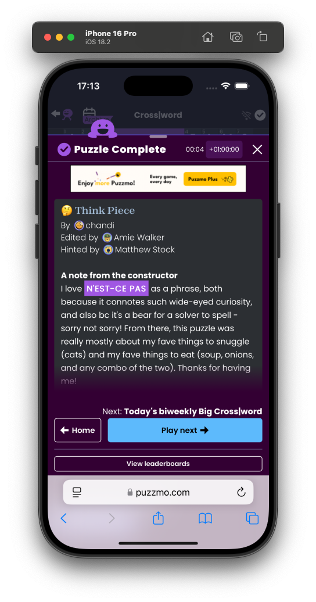

+++
title = 'Introducing: Clue Glossary Popovers'
date = 2025-05-24T16:16:03+01:00
authors = ["orta"]
tags = ["changelog", "tech"]
theme = "outlook-hayesy-beta"
+++

This is kinda an _off year_ for working on the parts of puzzmo.com which users see for me, followers of Puzzmo in the [discord](https://discord.gg/puzzmo) might note that [Saman](https://www.puzzmo.com/+/polygon/user/puz/saman) and [Lilith](https://www.puzzmo.com/user/puz/lilith) have been the vanguard on the big, now shipped, re-design effort focusing on the navigation, today page and the play game page.

_Me?_ I was working on [the iOS app](https://www.theverge.com/games/668478/puzzmo-is-finally-getting-an-app), which is mostly invisible work but my main focus is ole' [bizdev](https://en.wikipedia.org/wiki/Business_development). Plumbing Puzzmo [into libraries](https://www.businesswire.com/news/home/20250326593738/en/Hoopla-Digital-Launches-New-Gaming-Experience-with-Puzzmo-BingePass), converting some of our existing infrastructure into services and working with big partners to put puzzles in unexpected places.

It's like critical work to get Puzzmo off the ground, and helps towards making enough money that the suit-y folks will let us do whatever we think is a good idea in the games world. But, sometimes you just need a break.

So, I took a chunky design problem which has been rummaging around in my head the last few years: **Referencing clues inside the completion notes of a Cross|word is kinda sucky**.

In our post-completion write-ups clues can be referenced in a few ways: referencing the answer directly, talking about the clue text from the author, about the hint we've added to assist fols.

On a desktop, it's usable enough because we show both the grid and the notes together on one screen. For a hint though, after you've finished the puzzle, you can click on "hint" for any clue to see what we're talking about, but you have to find the position in the grid and when there are multiple clues you've got more searching to do.



On mobile, it's worse, we show the completion notes in a modal - so you need to remember the reference to find it and then find your way back to continue reading the notes!



There's just no space at all! So, I wanted to try address this.

I figured that the macOS dictionary was a good user-interaction pattern to find inspiration from in this case. So, I put together a quick prototype to get a feel for the design space.


My initial draft built on the fact that whenever we reference a clue by answer, it is in the markdown as a codespan (e.g. `ICE`) and that text corresponds to the answer inside our Crossword's puzzle.

The next week, [Zach](https://www.puzzmo.com/user/puz/helvetica), [Brooke](https://www.puzzmo.com/user/puz/brooke) and I chatted through the prototype. Collectively we sketched out a polished design, and changed how we declare the popovers in our completion notes.

[Brooke](https://www.puzzmo.com/user/puz/brooke)'s opinion was (paraphasingly) that _"automation can sometimes be more work than doing it manually."_ Which I think is a very astute position. First of all, clue answers aren't the only time we want to make a reference (e.g. "See 2-Across") but also there are _always_ edge cases. For example our Crossword puzzle above only cares about these letters `NESTCEPAS` but a human opted to write `N'EST-CE PAS` in the screenshots above. Keeping all that in your head, and getting it right every time is probably more work than just writing the link intentionally in markdown.

So, I knew what I was looking for, but getting it all together is a pretty tricky problem!

1. Where do I find or create this data to show in the popover?
1. How do I get it exposed inside the markdown?

## The church-and-state of puzzle files

We operate a pretty tight "church and state" around the puzzles in Puzzmo, the only systems which are allowed to understand how the internals of a puzzle works are the game engines and thumbnail renderers. Every other system, like the site, the API, the iOS app all have to just treat it as an opaque string (e.g. a string which may have semantics but you can only use it as a "token".)

This leaves games devs + designers with the most amount of flexibility in how they design their file formats, with no backwards compatibility issues or surprises from broken systems, but kinda leaves the rest of us having to get creative.

So, I got creative and introduced a new structured data element which comes from a completed game. About a year ago I revised the "game completed" data with two new systems: [Deeds and Augmentations](/posts/2024/07/16/augmentations/). These systems are generalizable ways in which the completed game information can talk to our API which lets it handle user stats, [leaderboards](/posts/2024/07/24/groups-to-clubs/), notables etc.

These systems are sometimes useful to the application layer, but for the most, the front-end passes that data right on to the API. This last week, I have added a "Glossary" system where it is data from the played puzzle is sent explicitly for the application layer. The shape of the data isn't particularly clever:

```ts
export type Glossary = Record<
  string,
  {
    xwd?: {
      answer: string
      clue: string
      plonked: boolean
      meta: any
    }
  }
>
```

Then the corresponding code in the Crossword engine to fill that object isn't notable either:

```ts
// Sets up a glossary of terms which gets used by the host (the app) to display tooltips
const glossary = {} as Glossary

for (const clue of [...state.props.clues.across, ...state.props.clues.down]) {
  const aOrD = state.props.clues.across.includes(clue) ? "a" : "d"
  let answerWithSpaces = clue.answer
  for (const splitPos of (clue.splits || []).reverse()) {
    answerWithSpaces = answerWithSpaces.slice(0, splitPos + 1) + " " + answerWithSpaces.slice(splitPos + 1)
  }

  const key = `${clue.number}${aOrD.toUpperCase()}`
  glossary[key] = {
    xwd: {
      answer: answerWithSpaces,
      clue: clue.body,
      meta: clue.metadata,
      plonked: !!state.plonksRecord.find(([dir, num]) => dir === aOrD && num === clue.number),
    },
  }
}
```

This glossary object is passed up as rich structured data along with the existing completion data. From there it's a matter of plumbing glossary data into the React component tree which makes up the interface for Puzzmo.

## Get down with the markup

This codebase started as a React Native app, and I was incredibly suspicious of React Native dependencies. One of those genres of dependencies I avoided were React Native components which render and show markdown. This is because markdown is a spec for which the end-result is HTML. HTML is a web browser concept, and does not have corresponding native app abstractions. Its a hard problem to solve for generically in way that feels good for all platforms.

Instead I took an off-the-shelf [markdown to abstract syntax tree](https://www.npmjs.com/package/markdown-ast) dependency and built my own AST -> React components layer inside Puzzmo. It's usable, if occasionally janky. However, because it's built entirely in-house, it's very easy to extend in useful ways. We can override how to render particular links, add unique syntax for special cases and add interactivity on specific components.

I extended our markdown component to listen out for links which start with a hash, e.g. `[text](#23A)` to see if there are corresponding field in glossary from a game completed. If there is, then it will instead render a dotted link which comes with a popover handler.

Cross-cutting features like this are traditionally hard to build systemically. The difficulty comes from crossing boundaries which can be different technology stacks. Those stacks can all have their own deployment, testing and verification strategies - luckily, all of Puzzmo is TypeScript with each system built to be deployed interchangingly. Only two monorepos "app" and "games." Once the code was ready, it only took a hour or two to having it running fully on production!

## Et Voila

Now with it ready, [Brooke](https://www.puzzmo.com/user/puz/brooke) recommended I update one of the Crosswords I was a collaborator on to validate it works, and so I changed the markdown from:

> `(For an explanation of this "apt pair" theme, click on the hints for 14- and 22-Across.)`

to:

> `(For an explanation of this "apt pair" theme, click on the hints for [14-](#14A) and [22-Across](#22A).)`

Which looks like this on puzzmo.com today!



and it works [on mobile](./mobile-complete.png)!

[Brooke](https://www.puzzmo.com/user/puz/brooke) has been rolling it out on new Cross|words on the daily [starting from May 23rd](https://www.puzzmo.com/puzzle/2025-05-26/crossword).
