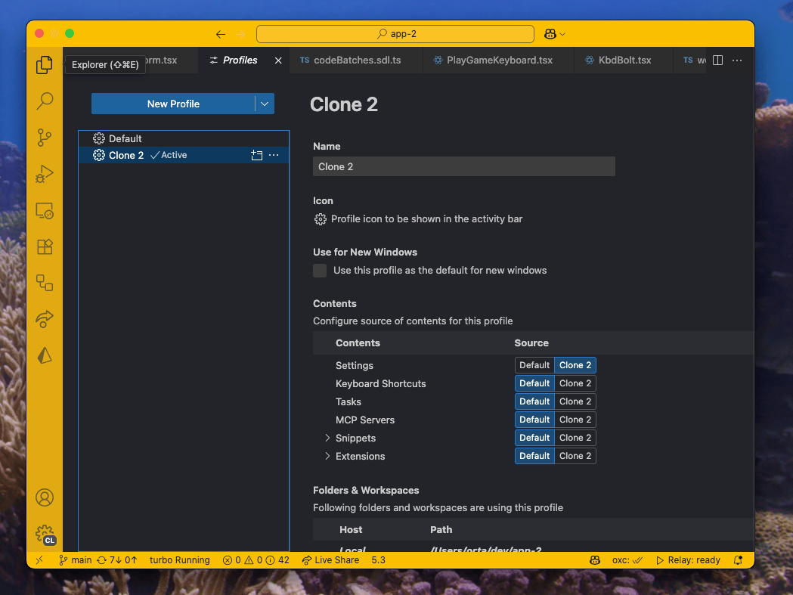
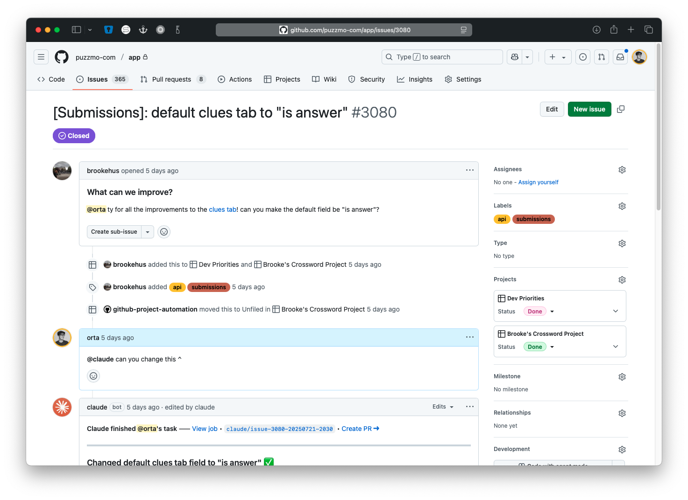
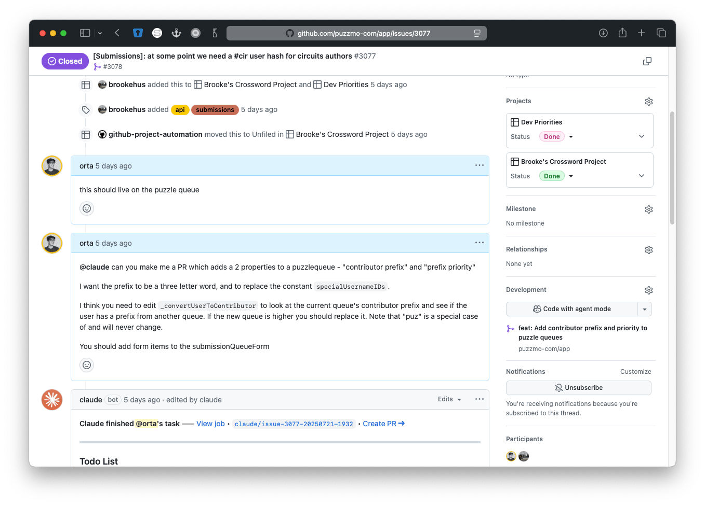
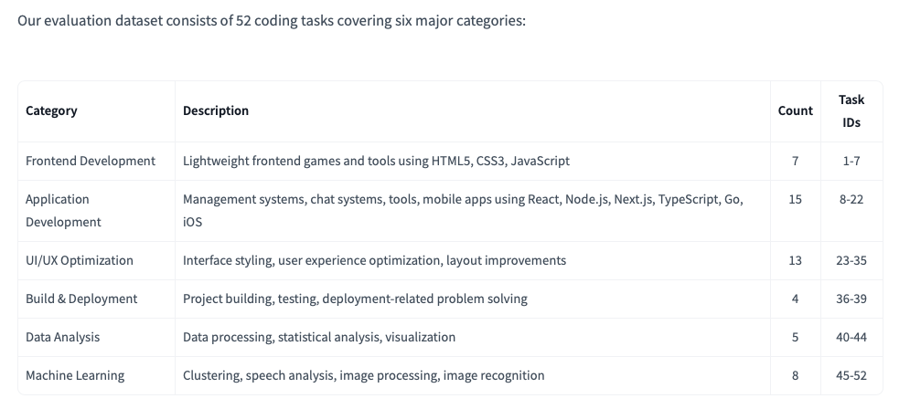

+++
title = '6 Weeks of Claude Code'
date = 2025-07-30T00:53:23+01:00
authors = ["orta"]
tags = ["tech", "claude", "llms", "programming"]
theme = "outlook-hayesy-beta"
series = ["Coding with LLMS"]
+++

It is wild to think that it has been only a handful of weeks.

Claude Code has considerably changed my relationship to writing and maintaining code at scale. I still write code at the same level of quality, but I feel like I have a new freedom of expression which is hard to fully articulate.

Claude Code has decoupled myself from writing every line of code, I still consider myself fully responsible for everything I ship to Puzzmo, but the ability to instantly create a whole scene instead of going line by line, word by word is incredibly powerful.

I believe with Claude Code, we are at the _"introduction of photography"_ period of programming. Painting by hand just doesn't have the same appeal anymore when a single concept can just appear and you shape it into the thing you want with your code review and editing skills.

If this feels like an intimidating line-of-thought then welcome to the mid-2020s, nothing is stable anymore and change is the only constant. Sorry. I didn't make it so nearly all of culture's changes are _bad_, and I think that LLMs are already doing social damage and will do much worse in the future - but this genie is fully out of the bottle and it is substantially going to change what we think of as programming.

## A Retrospective on the last 6 Weeks

This article builds on ["On Coding with Claude"](/posts/2025/06/07/orta-on-claude/) which I wrote after using Claude for a week. If you think that I am AI-pilled, you can get my nuanced take on LLMs at [the start](/posts/2025/06/07/orta-on-claude/#before-we-start) of that post.

That said, this is transformative and I want to try give you some perspective from the last 6 weeks of activity in the Puzzmo engineering space to try and show you what I've been seeing.

### Maintenance is Significantly Cheaper

I have been on many projects with people which have taken weeks full-time to perform some sort of mundane task: "converting this JS codebase to TypeScript", "Update to Swift X", "Switch to a monorepo" they're the kind of things which are delicate migrations which require a gazillion rebases.

Here is a list of things which I have completed, **solo**, since getting access to Claude Code:

- Converting hundreds of React Native components to just React
- Replaced 3 non-trivial RedwoodJS systems with home-grown or mature, supported, replacements
- Built complex REPLs for multiple projects
- Switched almost every db model to have a consistent 'flags' system
- Converted from Jest to Vitest
- Created our front-end testing strategies for React
- Moved many things defined in code to run via the CMS
- Made significant headway on server-side rendering
- Re-wrote the iOS app's launch system due to deprecations
- Built a suite of LLM created (and framed as such) documentation for the codebase
- Re-created our entire API networking stack away from Redwood
- Converted a significant amount of our design system primitives to use base-ui
- Migrated significant code from inline styles to stylex
- Converted all animations in puzzmo.com to use the same techniques as games
- Fixed multiple bugs which have been around since the start of Puzzmo
- Updated all Vite integrations
- Migrate all Puzzmo production projects to node 22
- Convert the games repo to a real monorepo
- Built iPad support for the Puzzmo app

None of these projects are the "actual work" which I need to do on a day to day basis as the 'bizdev' guy on Puzzmo for this year. These are _literally side-projects_ which I did _on my own_ while working on something else.

For clarity in the back because this is shocking to me, while I was still working on the existing roadmap I had prior to Claude Code over the last 6 weeks, I accomplished all of these things on my own. Mostly in the background (and then with a polish pass day for some of the larger ones). I didn't go from working ~10 hour days to working ~16 hours or anything like that either.

This was years of _"tech debt" / "tech innovation"_ backlog for me! Done in just over a month and a half.

If you understand what you are doing, the capacity for building and handling the breadth of tasks which typically live within the remit of "technical debt" \_do not need to be treated as debt\_ and you can just do it as you are working on other things.

_'carving out some time on the schedule'_ is now so incredibly cheap that getting started and making a serious dint is _something you can prime before going into a meeting_, then deciding if you thought it was the right thing after. Mind-blowing.

### Write First, Decide Later

A habit I have been trying to form is to give an idea a shot before I fully shoot it down. For example, since day 1 on Puzzmo I had been waiting on figuring out a testing strategy for the front-end because I wanted to be able to hire someone to fully own "puzzmo.com" and a part of that is figuring out how to not do as many regressions as we get.

Figuring out a testing strategy for the front-end isn't pretty, and I have seen a lot of really bad test suites which over-test and become brittle things that engineers don't like to work with. The mix of networking, react, the scope of contexts, the dom, flakiness in tooling just leads to answers where you are looking for the least bad solution which you've used yourself and feel comfortable maintaining.

I wondered if I needed to wait for someone else, so instead of just "adding a test suite" - I opted to have Claude Code write tests for every pull request I made to the front end over the course of two weeks.

Then, after seeing the tests, I deleted them. It added an extra 5m to my process, but gave me an insight each time into different ways in which other projects. After weeks of this, I was ready to start looking at that problem systemically.

The idea of writing tests for every pull request and then deleting it would just be so much time, there would be no way I'd be OK with doing.

Or a recent example from slack where I just vibed for half a day in the background on trying to make an abstraction for CRUD resources in our CMS tools:



Did it work? Nope, was it worth an exploration - sure.

### Living the Two Clones lifestyle

Anthropic have information about how to use [worktrees](https://docs.anthropic.com/en/docs/claude-code/common-workflows#run-parallel-claude-code-sessions-with-git-worktrees) - I would like to argue for a simpler approach. Two clones, different [VS Code profiles](https://code.visualstudio.com/docs/configure/profiles).



This means you can work in each independently and still visually recognize the different in you work flow by having a different theme:



My best argument is simply that each clone represents a single pull request that you can work on at a time. If you are writing pull requests and collaborating with others then that is still pretty important. I made it so that our dev servers close any processes using the ports you want and its trivial to jump between the two clones as Claude Code is working stuff out before you are looking build.

### Game design collaboration

Since Puzzmo was created this was the process of creating a game:

- We create some prototypes using all sorts of technologies
- Collectively we work through the prototypes with feedback
- We decide if this game is worth shipping
- The game team re-write the from scratch in our tech stack, and with puzzmo's system integrations

The process of this is weeks before any production code is written, if at all. At our current throughput, we roughly release a game a quarter at the level of polish we want to achieve.

In a post-Claude Code world, this model can be simplified greatly and it is a space we are exploring. I created a new Puzzmo monorepo (that's three now, "app", "games" and this new one "prototypes") which emulates the infrastructure of the games repo but has significantly different expectations on the type of code being shipped. With this repo, a game designer can go from an idea to something running on puzzmo.com for admins in a couple of hours, you write the code, then go into our admin CMS and click a few buttons and it's done.

To go from "this is good for the team" to "we should make this public" takes a bit of hands-on work from me and Saman, but it's a different ball park of effort compared to our current production pipeline.

We released [Missing Link](https://blog.puzzmo.com/posts/2025/07/04/missing-link/) using this technique, which seems to be a hit. This... actually is a bit of a problem for us. I am happy for us to have a game designer's code running on Puzzmo for a time-gated experiment, but I am not OK with this turning into Puzzmo canon with the rest of the games.

The flexibility which allows a game designer to make a prototype is the part that makes it un-suitable for writing long-term production code. This leaves us with a few options:

- Finish the experiment and stop having the game on the site
- Re-write the game as production code
- Declare some games as not quite having every Puzzmo integration feature
- Explore making it more possible to write 'production worthy' code in prototypes
- Extend the experiment to give ourselves time to figure another option

All of these have trade-offs, and it isn’t obvious what the right idea is. The problem is novel because prior to Claude Code it wasn't worth the effort of integrating prototype code with Puzzmo's systems — now it's trivial and accomplishable by anyone on the team. We can really deliver on the idea of 'experimental' games that we launched with, which means we have to be much more thoughtful about the risk of launching too many games that people want us to keep around.

### Taking a Shot During Triage

One thing I have been experimenting with during our weekly triage of all raised GitHub issues is asking the Claude Code GitHub action to take a stab at a pull request while we are talking about what we thing



Or one where I was the one providing enough context myself in the issue:



As I am the one responsible for getting that Pull Request into production, that's the first few steps ready and for smaller things I've found it to be a solid one-shot now that the repo is very well set up.

## Who has been successful using it internally?

I think it's worth noting here that we offered Claude Code to everyone on the team from the moment it because obvious how powerful of a tool it was for me personally.

I would say from our team, the sort of people who have used and found value the most are people with both product, technical skills and agency to feel like they can try things.

One of them said that Claude Code freed them from the anxiety of the first step in programming constantly.

Justin Searls did an interesting write-up where he described an idea of [full-breadth developers](https://justin.searls.co/posts/full-breadth-developers/) where-in he argues that:

> Up until a few months ago, the best developers played the violin. Today, they play the orchestra.

Which I think is correct, within the Puzzmo team the people whose skill-sets are being self-driven, run their own verticals and feel like they have the freedom to explore and push those boundaries are doing really cool work. It bursts out of any explicit job role boundaries and it becomes a pleasure to collab at a larger/faster scale on ideas than before.

So I will double-down on saying that everything [in Justin's post](https://justin.searls.co/posts/full-breadth-developers/) echoes what is happening inside the Puzzmo engineering team and his post is really worth musing over.

### What Do I Think Makes It Successful in our Codebases

1. We use monorepos. I was lucky to have spent the time [a year ago](https://.puzzmo.com/posts/2025/01/22/turborepo/) to take every project and move it into a two main environments. This was originally done to reflect the working processes of the engineering teams. My goal was to make it possible to go from db schema change to front-end components in a single pull request.

   A monorepo is perfect for working with an LLM, because it can read the file which represents our schema, it can read the sdl files defining the public GraphQL API, read the per-screen requests and figure out what you're trying to do. Having a single place with so much context means that _I_ as user of Claude Code do not need to tell it that sort of stuff and a vague message like _"Add a xyz field to the user model in the db and make it show in this screen"_ is something that Claude Code can do.

2. My tech choices were made a decade ago. This video of a conference talk I [gave from 2018](https://www.youtube.com/watch?v=1Z3loALSVQM) is still the way I introduce people to the Puzzmo codebase and the mentality behind these tech choices. React, Relay, GraphQL, TypeScript and (now StyleX) are boring and _very explicit_ technologies. There are compilation steps in all of these systems which means everything has to be available locally and correct to run, this makes it a bit of a curve to learn but often when you have got it right - you know you have got it right. For our admin tools, its even more boring/mature, I'm still using [Bootstrap](https://getbootstrap.com)!

   For an LLM, these technologies are very well baked into its training set and Claude Code knows to do things like "run the Relay compiler" (when I saw Claude Code first do that, I knew I was in for a wild ride) which gives it incremental ways to be validating the changes it has done are working.

3. This isn't novel work. Most of the stuff we're doing on a day to day basis is pretty normal down-to-earth CRUD style apps.

4. These codebases aren't that big, nor that old. Nothing is older than 2021 and while I keep things up-to-date, I try to have a long-tail of support / backwards compatibility.

5. Our business is literally the test suite / benchmark for these models. For example, on the 28th of June, two days before posting this [GLM-4.5](https://z.ai/blog/glm-4.5) came out. Offering a way to run an ~80% as good as [Claude Code on your computer](https://simonwillison.net/2025/Jul/29/space-invaders/) locally. How do they measure that 80%? Here is [the table from](https://huggingface.co/datasets/zai-org/CC-Bench-trajectories#test-dataset) their benchmarks of what they use:

   

   Puzzmo's day-to-day work is represented in ~(39/52)% of their testing infrastructure!

### Quantifying the Change is Hard

I thought I would see a pretty drastic change in terms of Pull Requests, Commits and Line of Code merged in the last 6 weeks. I don't think that holds water though:



This is a 3 month chart, with a month of post-Claude Code. I just asked it to make a script to generate a CSV from looking at repos on my harddrive.

That said, I think anyone internally would feel like the pace of change inside Puzzmo has most definitely increased (at least in the areas I contribute) but those numbers haven't _really_ changed in reality.

There was a [recent paper](https://metr.org/blog/2025-07-10-early-2025-ai-experienced-os-dev-study/) (which is from the pre-Claude Code days) which says that developers with AI over-estimate its impact and maybe I am.

Doesn't _feel_ it though. Did you see that list at the top? I feel like I'm constantly trashing my usual estimation timings to the point where it's hard for me to gauge how long a task will take.

### You Don't Have To Obsess Over LLM Trends

While intoxicating at first, settling in to Claude Code usage just becomes mundane normal tool use after a while. You do not need to spend your time worrying about Sonnet or Opus, or grabbing every Claude Code competitor like Gemini CLI, Qwen Code or some other model that is cool. I have not used anything but Claude Code with whatever it does on the $100 a month account and I am doing very fine. I've heard good things about asking Gemini when Claude Code is stuck, but I've found that if Claude Code is stuck, I have not been doing a good job framing our work and a re-examination is worth the time.

I've never set up an MCP server, I've found doing voice-chat super awkward and not used it and I don't follow the "blue tick-y" people on Twitter who have some "\*.ai" bio. Those folks can do their thing, but I'm very happy not engaging.

There will be a future when it makes sense to think about looking at other ecosystem tools, but for me the difference between pre-Claude Code and post-Claude Code is so substantial that any increments between it and others (which will be better in some ways, worse in others) is not worth the hassle for such a small incremental win.

Running something locally is tempting, but the networked versions like Claude Code are always gonna be a step ahead, and as long as I do not need to think about usage limits ([yes, I know](https://techcrunch.com/2025/07/17/anthropic-tightens-usage-limits-for-claude-code-without-telling-users/)) then we're in a good spot.

### You Can Let Claude Rest

Like with a mobile phone, you can become consumed by the notion that because Claude Code can run at all times, you should make it run at all times. Effectively doom-scrolling in your terminal (or phone?!) instead.

It's worth remembering that any tool can be used at any time, but that you are the one driving it and your energy / capacity to make informed decisions is not infinite.

### I run via `claude yolo`

I have been trying to make a list of everything I'm OK with:



```json
{
  "permissions": {
    "allow": [
      "Bash(grep:*)",
      "Bash(yarn run *)",
      "Bash(yarn lint:*)",
      "Bash(yarn workspace:*)",
      "Bash(find:*)",
      "Bash(mkdir:*)",
      "Bash(rg:*)",
      "Bash(ls:*)",
      "mcp__ide__getDiagnostics",
      "Bash(awk:*)",
      "Bash(yarn build)",
      "Bash(yarn why:*)",
      "Bash(yarn info:*)",
      "Edit(*)"
    ],
    "deny": ["Bash(npx prisma migrate dev:*)", "Bash(git checkout:*)", "Bash(git add:*)"],
    "defaultMode": "acceptEdits"
  }
}
```



But it's still not enough to constantly feel like I'm being asked things that I don't need to confirm. So I run `claude --dangerously-skip-permissions` aka `claude yolo`. The worst things that have happened to me have been having my dev db wiped during a bad Prisma migration, and that Claude Code decided it should make a commit, and then a Pull Request.

My theory for the latter two is that if a human is expected to read it, a human should have wrote it. I'm OK with something like:

```
[Authored description, or one liner]

---

[Codegen'd PR template]
```

But I'm not slopping about in production.

### Parallel Construction for Juniors

One thing I've talked with folks earlier in their careers who want to still be doing a lot of the grunt work themselves is to consider writing their work, then comparing their results to the same requested by Claude Code.

[Parallel construction](https://en.wikipedia.org/wiki/Parallel_construction) is a way to have your cake and eat it. You're still learning and growing, but your results can be honed by seeing how the aggregate of training data in Claude Code has also decided to do it. Claude Code likely has a deeper ecosystem understanding, and may read more source code in the current codebase as well as knowing abstractions you've still not learned.

IMO treating it as a competitor which you can learn from is a much healthier alternative to either giving up and just accepting you don't need to know stuff anymore, or putting your head in the sand and assuming somehow this change won't affect you.

### "You can just do it" for Side Projects

Throughout my entire programming career, like all humans I have been largely constrained in my capacity for side-projects and one-offs by the fact I still want to have a life. I choose to devote myself to contributing to large-scale open source to make me feel good about the amount of time I commit to the craft.

In concrete terms, that means spending time on projects like CocoaPods, Danger, Jest, GraphQL were things I did instead of making fun projects to explore a technology, or to fix a smaller nit.

Now it's different. I can just take a stab and decide if I like the result. In one hour of exploration with Claude Code, I feel like can do roughly a weekends worth of exploration.

#### E.g. Inline Chats

For example, this blog post. When I was musing about it, I thought, _'it'd be nice to show the Claude Code conversations inline'_ and then subsequently, _"wouldn't it be fun to bring back Adium themes for it"_. So. I just got started.



So, I spec'd out a rough idea of what I was looking for. Described it pretty well up-front, took the dogs for an hour-long walk and came back to a reasonable approximation of the CLI which would have taken me a few hours to build by hand.

It wasn't a lot of code, but it was a lot of research, how do I re-create the Adium theme HTML, how do you make sense of claude code's message formatting, how do you handle keeping resources local for a preview.


With that working enough to be able to correctly mix the ideas, I gave it a polish pass.



I've polished and deployed enough npm modules ([174?!](https://www.npmjs.com/~orta)), so again, totally within my skills to do this without thinking too hard. Instead I treated this project as a fun side gig while watching [Apex Legends](https://www.youtube.com/watch?v=0LRyOw1R_SE).

If you read the chat, you'll see that I do spend some time figuring out how to filter some things, how to show messages in a particular way but this is systemic babysitting and code which I really don't care about.



A feature like this is a _full weekend_ project, easily about 10-12 hours to get right and feel shippable for me. Instead most of the work happened when I was away and then the polishing was sporadic. Maybe the whole thing took ~2 hours of my thinking time? _This is wild_.

If you want to see the rest of the conversations to get it to the point where I shipped this blog post, here they are:

- Chronologically continuing from the 2 above: [3](./claude-conversations/claude-conversation--Users-orta-dev-claude-code-to-adium-ebd791d4/conversation.html), [4](./claude-conversations/claude-claude-code-to-adium--Users-orta-dev-claude-code-to-adium-0ec8943e/conversation.html), [5](./claude-conversations/claude-claude-code-to-adium--Users-orta-dev-claude-code-to-adium-594e201d/conversation.html), [6](./claude-conversations/claude-conversation--Users-orta-dev-claude-code-to-adium-5f5c097b/conversation.html)

You can use it right now if you [install Adium](https://adium.im) then run `npx claude-code-to-adium` and it'll take you through a wizard which ends with a self-contained subfolder full of html/css/images.

### Some Examples of What These Conversations Look Like

I will try to cherry-pick some of the 147 conversations I've had over 19 separate repo/projects since starting. I'll aim for breadth of goals and give my opinion to the side.

#### Making a "delete 30 day old games" Task



This is a chat where I have a general sense of what I want, but know that I don't actually know the answer around postgres indexing and how it effects mass deletes.

So first I ask a general question where it is using my prisma definition file to determine what is currently set up in the db.

We iterate on a scripting improvement, and make it possible to test locally.

After trying locally, I give it a "kinda" and then ask for a more explicit technique.

With that set up I go through all the code, review it locally, fix up style make it work according to how I would write it.



You might note that it makes some guesses ("10-20%"" of our gameplays are anon users), then make bold promises from that guess:

> _That's an 80-85% reduction in index size!_

Which I doubt. However, the code was solid, it's got significantly more logs than I would have written (useful for a daily task) and I feel like I understand what the index does. I went and added a bunch of glue comments _"this script works with the index in migration y, so any updates..."_

#### Adding Barred Grid Support to a Crossword



I knew this was going to be nightmare PR, which you can [see here](https://github.com/puzzmo-com/xd-crossword-tools/pull/42).

I started by adding fixtures into the repo, and providing context via [an issue](https://github.com/puzzmo-com/xd-crossword-tools/issues/31) which I had left ideas in. To get started, I framed this task as 'this is the long term goal, to get started we will do Y.'. Y here being an ASCII snapshot of the bars.

We started by building out a way to visualize the work, and Claude Code got very close. In the end, I took it's work and finished the integration myself.

Once I had a way to visualize the solution, we could start looking at the main chunk of the work



I used tests based on ASCII snapshot to hardcode test using the explicit version of the bars in the imported file format jpz, then created a test which relied on the algorithm we were going to create. This meant I, and Claude, had a very explicit way to judge how the algorithm was working.

The import algorithm which existed for a jpz was too naive, and imported clues were wrong which meant we spent a long time trying to get the two snapshots to match. Claude kept cheating and hardcoding the answers! It took till I re-evaluated all of the clues (by making a separate test on the import for these clues) for a fresh re-examination of the algorithm to start getting somewhere.

#### Creating a REPL for a Puzzle



A quick, fully vibed prototype of a way to visually design a puzzle for the [game Circuits](https://circuitsgame.com).

I give a screenshot, and try to describe how the game works and how I see a REPL could work. We iterate a bit, and I basically never write any code.

This is then passed off to others to experiment with and figure out their opinions on how to make a working dev tool for the game.



#### Print Pages for Crosswords



I wanted to build a design for printable PDFs of Crosswords. I already had a working pipeline for generating them and needed to work on the layout specifically.

I would have considered this a relatively easy problem to work with, but it turned out that there just isn't a set of CSS primitives that allows for columns _and_ re-flows around an image.

Claude was good for trying the different css properties and systems I was working with, and I experimented with different ways to describe or show the problem but never managed to get it working.



I think I had the wrong core abstraction in mind in these conversations, either by being too specific in my recommendations or experimenting through half answers.

In the end, I will have to re-write it to use JavaScript to do the layouts I think.

### But Seriously, How Good Is This Thing?

Perhaps an interesting place to end it, is how do I think about this tool in terms of its capabilities. Claude Code knows a lot, and you can easily send it reference material in terms of links, screenshots and extra code for context. I've found it to sit somewhere at the stage of ["Post-Junior"](https://artsy.github.io/blog/2016/09/10/Help!-I'm-becoming-Post-Junior/), there's a lot of experience there and a whole boat-load of energy but it doesn't really do a good job remembering things you ask (even via `CLAUDE.md` and the scope of it's ownership is obviously trivial).

At Artsy, early on we had [a 5 step technical ladder](https://artsy.github.io/blog/2015/04/03/artsy-engineering-compensation-framework/) for engineers:

> Engineer 1 - Can ship a well defined product feature.
>
> Engineer 2 - Can independently own a product feature and can handle the communication with others around it.

Hitting part 2 requires actually being around in some form, and having some sort of sense of ownership. This is an interesting thing to muse about because which I guess it might have some ownership in the sense that parts of the codebase which are fully vibed and humans do not really [read are fully "owned" by these tools](https://www.youtube.com/watch?v=LCEmiRjPEtQ).

However, pragmatically, as a pairing partner with an experienced engineer constantly reviewing, amending and understanding the output - you can really treat Claude like a Pair Programming buddy with infinite time and patience, a bit too much sycophancy, and the ability to ship reasonable code given reasonable constraints in a speed I've not seen before.

And that is like a new way to build things.
