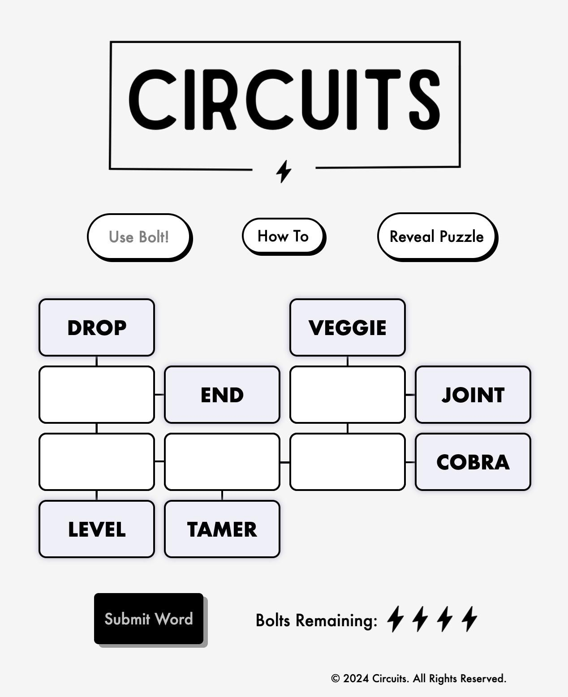

+++
title = 'The Making of Circuits Royale, a Communal Word Game for the Web'
date = 2025-09-05T09:00:00-07:00
authors = ["saman"]
tags = ["design", "games", "circuits", "multiplayer", "word-games"]
theme = "puzzmo-light"
+++

We’ve been tossing around ideas for a fast-paced multiplayer variant of a Puzzmo game for a while, and decided the _Circuits_ launch would be a great chance to have a go at it. _Circuits Royale_, released to celebrate the launch of [_Circuits_](https://www.puzzmo.com/play/circuits) on Puzzmo, is a game you can drop into, instantly understand, and play with a ton of people at once.



LLMs unlocked the gameplay by serving as word judge. We also leaned on LLMs for prototyping the idea and building the final game. In telling the story of the game's development, I talk a lot about LLMs (it's [turning into a theme on the Puzzmo blog](https://blog.puzzmo.com/posts/2025/07/30/six-weeks-of-claude-code/)). One of my favorite resources for understanding LLMs is [context.supply](https://context.supply/) by [@dame.is](https://bsky.app/profile/dame.is). The “about” section sums up my feelings on the topic and I hope you'll find the tool illuminating.



## What is _Circuits Royale_?

_Circuits_ is a daily word game designed by [Jacob Land](https://www.puzzmo.com/user/cir/jland) where you connect cells in a grid by finding two-word phrases, like water _bed_ or _day_ job. _Circuits Royale_ shares the same core mechanic. But rather than filling in the blanks in a grid, you find as many connections as possible to one base word. Your submission “falls” for ten seconds, then lands with a verdict. Score points if it’s valid. Duplicates don’t score, and you can see others’ submissions resolve in real time. The base word rotates roughly every 30 seconds, and every accepted answer adds two seconds to keep the round alive.


<p style="text-align: center; font-size: 0.9em; color: #666; margin-top: -1.5em;">Circuits Royale in action. <a href="https://royale.circuitsgame.com/">Play it now →</a>
</p>

## Imagining a communal experience

The original idea for _Circuits Royale_ was inspired by recent viral indie projects like [**One Million Chessboards**](https://onemillionchessboards.com/) and [**Every 5×5 Nonogram**](https://pixelogic.app/every-5x5-nonogram#3175001). Both take tight, elegant games and make them expansive and communal. How do we take _Circuits_ in that direction?

> “I kept imagining _Circuits_ as a folk game. You see a stop sign; someone says _sign_; everyone riffs: _road sign_, _sign language_, _sign off_. I played it with friends outside and it felt good. If it feels that good on a sidewalk, we can make it work on the web.”
> — Zach

We can build a digital game around this concept because LLMs are capable of validating open-ended pairs. But LLMs introduce a new problem: games that rely on real-time inference don’t flow. They pause for inference, show a spinner, and the whole vibe takes a hit. We needed the game to feel natural.

> “Plenty of online games already know how to deal with latency, we have to look outside of daily puzzle games. There are all these tricks in first-person shooters to hide lag, deciding very carefully what is server authoritative and what can be interpolated on the client. Even a 30 millisecond lag is really substantial as pretty much everybody has discovered with the failure of streaming video game services. If you design your game right, you can hide the lag.”
> — Zach

Zach sketched a rough mock-up: launch a rocket, watch its ten second flight path, and see the outcome on impact.


<p style="text-align: center; font-size: 0.9em; color: #666; margin-top: -1.5em;">Zach's initial sketch of the rocket launch concept</p>

I was skeptical at first—what’s with rockets?—but the idea made sense, so the sketch did its job. I scaffolded a basic React & Socket.io architecture, Zach vibe-coded the rest with Claude, and we tested it during an unrelated meeting that promptly ran late. It was already fun.

## Designing with time

The time-based mechanics carry the game’s tension. It started with the ten second launch and fell into place from there. Those ten seconds do a lot: pace the room so no one player sprints ahead; give you time to watch other answers resolve and plan your next idea; and let you queue another answer without turning it into a typing race.

The base word lasts for 30 seconds. Later we added extensions: each accepted answer adds two seconds to the round. It’s my favorite detail because it layers collaboration on top of competition. The base ten second cadence means no single player can keep a round alive much beyond the 30 second limit, but if a handful of players lock in, you can push rounds for minutes and rack up thousands of points together. It’s one of the best feelings in _Circuits Royale_.


<p style="text-align: center; font-size: 0.9em; color: #666; margin-top: -1.5em;">An example of an extended round where each player has thousands of points</p>

## Polishing the prototype

Starting with Zach’s core design, I took visual inspiration from a sketch Angie Wang made for the [World’s Most Distracting Notebook](https://shop.puzzmo.com/products/circuits-notebook), and swapped rockets for lightning bolts.


<p style="text-align: center; font-size: 0.9em; color: #666; margin-top: -1.5em;">Angie Wang's sketch from the World's Most Distracting Notebook</p>

My first draft fully swiped her illustration. It had a cozy vibe but hurt quick readability:


<p style="text-align: center; font-size: 0.9em; color: #666; margin-top: -1.5em;">Initial visual draft with cozy aesthetic</p>

Here’s the last mock-up before we started rebuilding the game (pretty close to the final!):


<p style="text-align: center; font-size: 0.9em; color: #666; margin-top: -1.5em;">Final Figma design direction</p>

At this point [Jason](https://www.puzzmo.com/press#jason-ho) and [Gary](https://www.puzzmo.com/press#gary-josack) joined the project and we built on top of Zach's vibe-coded prototype. It was surprisingly solid as a starting point. I pushed the game in a juicier direction than normal to make the spectator experience, while your bolt is falling, more fun. Claude played a key role. While wrangling some state synchronization bug, I could ask Claude for a sparkle emitter or a procedural bolt generator and get something shippable _while I kept moving_. Claude one-shotted the sparkle systems, most of the bolt generator, a gradient generator (each player gets a unique gradient), and even the settings menu. All nice-to-haves that make the game more fun and friendly.

## Letting the LLM judge: pipeline + rules

We entrusted an LLM with a very specific job: judging. Given a base word and a candidate, our validation pipeline decides whether the pair is an acceptable phrase, and returns a 1–5 cleverness score. We accept 3s and up.

For efficiency, the model is the last step in a short pipeline:

1. Cache decisions per phrase-pair.
2. Run fast prechecks against a banlist (for instant rejections) and the standard Puzzmo dictionary (for instant accepts – e.g., _high_ + _way_ → _highway_).
3. Make a JSON-mode call to GPT-5 mini with our judgement prompt.

To handle cheating, we rate-limit and do all validation server-side.

### Getting the prompt right

We were still refining the game's prompt until the day before launch. Every meeting became a tribunal: paste the misclassified pairs, debate for a few minutes, deploy a new prompt, play a few more rounds. We iterated more than a dozen times. Outcomes for tasks like this can feel arbitrary, and swapping models often means starting over (we moved to GPT-5 mini from 4o mini mid-project). We just had to iterate and playtest a lot.

Here are our actual prompts. We started with a simple, direct and binary (YES or NO) prompt:


Is "${word}" a common phrase, compound word, or idiom in American English? The phrase must contain the word "${baseWord}" as a complete word (not as part of another word).

Examples:

- "PARTY BUS" contains "PARTY" - valid
- "BIRTHDAY PARTY" contains "PARTY" - valid
- "PARTIES" does not contain "PARTY" as a complete word - invalid

Please respond with only "YES" or "NO".


This worked but it was easy to game (e.g., “**a** party” or “stone **s**” would slip through!). You can see how much we had to patch up in the final draft:


You are a strict English usage validator. Be conservative: if uncertain, answer NO.
Task: Decide if the input is a legitimate, established English phrase that most English speakers would recognize, AND assign a cleverness score from 1 to 5.
VALID (label YES only if at least one applies):

- Dictionary entry or subentry (compound words, phrasal verbs, idioms).
- Common collocation or set phrase widely used in general discourse.
- Established title, proper name, or cultural reference (books, films, works, organizations).
- Technical term or specialized vocabulary in broad circulation.
- Videogame terminology that is widely recognized.
  INVALID (label NO if any applies):
- Random or ad hoc combination with no established meaning.
- Merely the word with an article (the/a/an), a generic filler (guy, thing, stuff, person), or a bare category word (movie, book, song, item, object), unless it is itself a set phrase.
- Generic adjective/adverb + noun that is not a widely recognized fixed term.
- Grammatically incorrect or ill-formed combinations.
- Obvious misspellings, fused/missing spaces (e.g., 'ofmusic'), truncations, or stray single-letter fragments.
- Phrases that are offensive, derogatory, or hateful.
  cleverness scoring (1-5):
- 5 = extremely clever.
- 4 = smart.
- 3 = boring.
- 2 = dumb.
- 1 = barely applicable.

Important: Do NOT let mere frequency alone raise the score — prioritize fixedness/lexicalization over descriptiveness.
Important: Rate NO 1 if the phrase references sexual violence or abuse, domestic violence, child exploitation/abuse, self-harm/suicide, torture, human trafficking, severe addiction, graphic injury/death, graphic violence, genocidal or extremist violence. EXAMPLES:

- child abuse, sexual abuse, domestic abuse, abuse survivor
- rape victim, rape counseling, sexual assault hotline
- self-harm hotline, suicide prevention
- violence towards any protected classes (e.g., race, gender, religion, sexual orientation, disability, etc.)
- mass shootings
- child trafficking, human trafficking survivor

If label is NO, set score to 1.

Respond with JSON only in the form: {"label": "YES|NO", "score": <integer 1-5>} (no explanations).
Examples (gold labels):

```
renaissance fair -> {"label": "YES", "score": 5}
sensitive skin -> {"label": "YES", "score": 4}
keeping calm -> {"label": "YES", "score": 3}
warm water -> {"label": "YES", "score": 3}
hot water -> {"label": "YES", "score": 4}
water ice -> {"label": "NO", "score": 1}
the stone -> {"label": "NO", "score": 1}
stone bone -> {"label": "NO", "score": 1}
stone d -> {"label": "NO", "score": 1}
payback movie -> {"label": "NO", "score": 1}
quick payback -> {"label": "NO", "score": 1}
sound ofmusic -> {"label": "NO", "score": 1}
really stone -> {"label": "NO", "score": 1}
```



- We added detailed requirements based on play-testing (At one point "warp star" was rejected: that's where "videogame terminology that is widely recognized" comes from).
- We added a grading system (Cleverness, from 1–5), which rewards lateral thinking and eases up strictness if there's a clever submission (we'll accept "desk sharing" but not "lamp sharing").
- We added much-needed safety filters (in addition to our banned word list check).

Here are a couple example responses:

```
base: WATER
guess: "hot water"   → {"label":"YES","score":4}
guess: "quick water" → {"label":"NO","score":1}
```

## Preparing to launch

In the last couple of weeks, Gary shored up the backend: Postgres for persistence and leaderboards, multiple rooms, a pipeline for tracking winners and sending prizes, a lobby-rebalancing system. Jason got the audio system up and running. I took a vacation 😎.

From concept to launch, the project took a month – we started July 23 and shipped August 25. On the same day, we relaunched the rebuilt daily _Circuits_ on Puzzmo.

<div style="display: grid; grid-template-columns: 1fr 1fr; gap: 0.5rem; margin: 0.5rem -2rem;">
  <div style="display: flex; flex-direction: column;">
    <p style="text-align: center; font-size: 0.9em; color: #666;">The original Circuits game</p>
    
  </div>
  <div style="display: flex; flex-direction: column;">
    <p style="text-align: center; font-size: 0.9em; color: #666;">The Puzzmo redesign of Circuits</p>
    
  </div>
</div>

<style>
@media (max-width: 768px) {
  div[style*="grid-template-columns: 1fr 1fr"] {
    grid-template-columns: 1fr !important;
  }
}
</style>

### How'd the launch go?

- **46,000** players
- **17,000** rounds
- **645,000** guesses
- **388,500** unique word pairs (≈ **178,100** accepted)
- Cost: \~**\$300** total (≈ **\$0.47 / 1,000 guesses**)

> “Multiplayer first is fun. The trick was reducing model calls for cost and performance while keeping it fair. Now we also have a corpus of word combinations we can use later.”
> — Gary

> “What's coolest to me here is that in a very short time we went from a prototype-quality homebrew version of the daily puzzle on circuitsgame.com to a polished authored/edited version with animations, SFX, leaderboards etc. on puzzmo.com, a live MMOG version with Circuits Royale enabled by AI, and a physical print version in the notebook. One core game concept spawns three very different modes.”
> — [Andrew](https://www.puzzmo.com/press#andrew-daines)

<div style="background: #F5E8C2; padding: 1.5rem; margin: 2rem 0; border-radius: 8px; text-align: center;">
  <a href="https://royale.circuitsgame.com/" style="cursor: pointer;display: inline-block; background: linear-gradient(135deg, #4F46E5, #7C3AED); color: white; padding: 0.75rem 2rem; border-radius: 5px; text-decoration: none; font-weight: bold; font-size: 1.1em;">
    Play Circuits Royale
  </a>
</div>

## Technical details for nerds

- **Client/server:** React UI with some fancy SVG and canvas effects; Express + Socket.io; server-authoritative timers, cadence, and scoring;
- **Validation pipeline:** cache **per phrase-pair** → curated banlist + dictionary of obvious accepts → **GPT-5 mini** in JSON mode with strict timeouts; accept cleverness **≥ 3**.
- **Infra:** Everything runs on Render.com; Postgres for persistence and leaderboards; multi-room with lobby rebalancing; shipped in **33 days** (first commit Jul 23 → launch Aug 25).
- **Agents:** Claude Code handled the fun bits and prototyping; human software engineers owned the architecture.

## Advice for the game designers

If you want to use realtime inference in your game, design around the delay. Make it part of your game's rhythm. LLMs unlock game mechanics that are otherwise impossible to access, but are best when used narrowly. You still have to do the hard parts.
