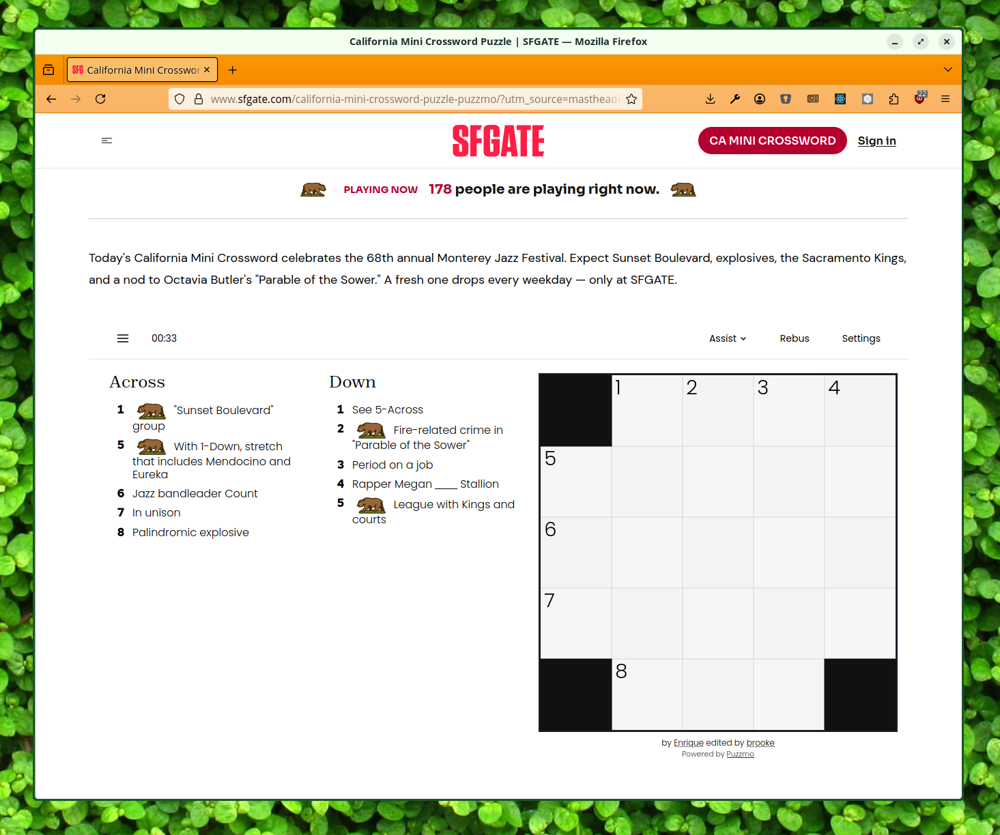
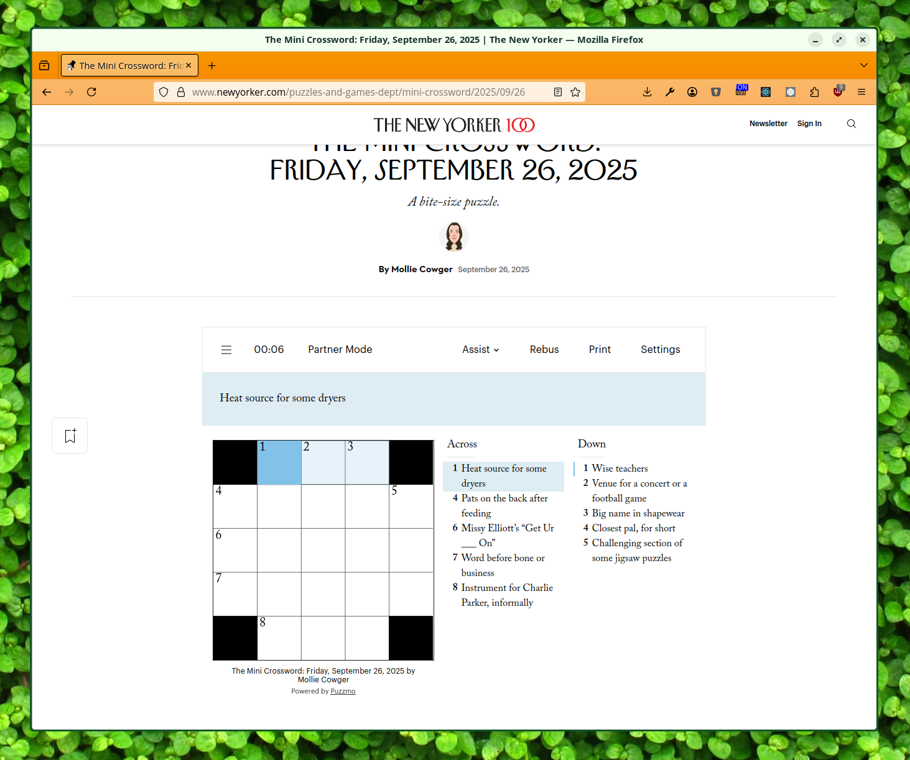
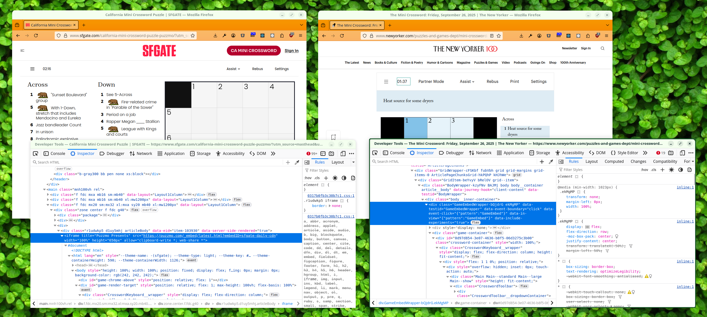

+++
title = 'Crosswords Everywhere'
date = 2025-09-26T15:06:31+01:00
authors = ["orta"]
tags = ["tech"]
theme = "outlook-hayesy-beta"
+++

The Puzzmo Cross|word has been something we've treated as a crown jewel since launch. It is the game we have put the most time into, both technically and curatorially. Our Crossword implementation has the most app-level features (e.g. the most multiplayer hooks, the ability to send clue glossaries for completion notes, hooks for reviewing / fact checking systems) and is roughly double the lines of code of the nearest game (Pile-Up Poker is ~10k LOC).

It's curated nature has meant that it is not an easy game to offer to publishing partners. Putting the Cross|word on other people's sites/apps wouldn't be an easy thing to do, and certainly would be a lot of effort on our part to get that infrastructure up and running!

Well, this month we've wrapped up that work. From April, my main project has been taking the Cross|word and making it possible to run elsewhere. We worked with two different relationships for this project who have divergent needs and I'm going to talk through what got built in order to provide a comprehensive 'Crossword on your site/app' experience.

## SF Gate

## New Yorker Crossword

It would be very easy to look at these two screenshots and assume they are basically similar, but if you look a step deeper, you'd find quite a substantial difference.

One of these is an `<iframe>` and the other is a native UI element on the page!
