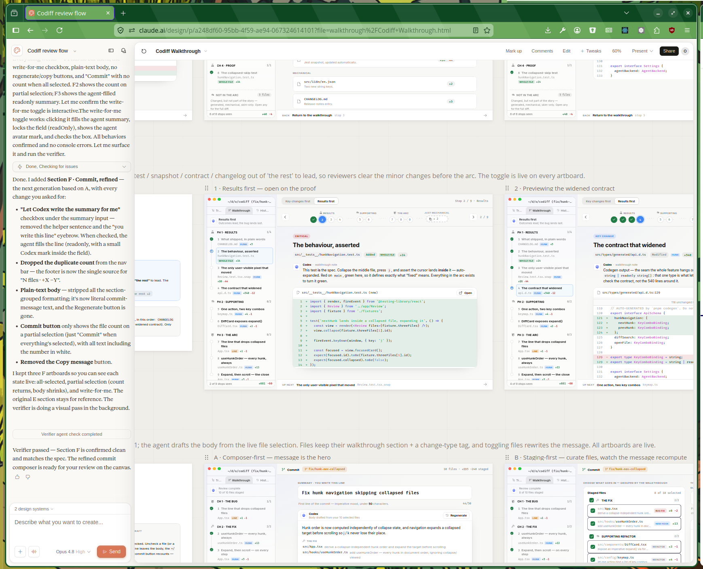

+++
title = '12 Months of Claude'
date = 2025-12-14T12:00:22Z
authors = ["orta"]
tags = ["tech"]
theme = "outlook-hayesy-beta"
+++

I try to commit to things. My relationship with the craft of programming is significantly more intense than most of people I have worked with in my career. This isn't a slight to others, a more diverse set of interests makes for more well-rounded people and there's a lot of things to do as a human in a lifetime! My commitment to the craft comes with a cost - I am extremely wary of adding dependents and taking on responsibilities which do not give me maximal time and space to further the work on my craft.

The reason for being dependant phobic is the effort takes time. Unbelievable amounts of time. Since I started to commit to programming as a craft about 13 years ago, I have programmed almost every day for somewhere between 8 to 10 hours. I have devoted tens of thousands of hours to understanding and contributing back to each ecosystem I've relied on: Ruby, iOS Native, Node, Browsers and Server Infra over that time. Those hours are based on one simple foundational concept which I grasped right at the beginning of my career: Every day I build on the work and knowledge of past me. So, any extra work I put in today gives me the chance to build upon this further tomorrow.

My last 12 months of using Claude Code has really shaken that foundations, because I think at heart, it allows for others to have access to the skills you can gain from that commitment, without putting in the time.

I find it both very exciting, and deeply epochal.

---

As this is the third in a series on using Claude Code: [first, 1 week](/posts/2025/06/07/orta-on-claude/), [second, 6 weeks](https://blog.puzzmo.com/posts/2025/07/30/six-weeks-of-claude-code/). You can opt to skip them, but I will briefly get you up to speed, feel free to jump the next few paragraphs till you hit a horizontal rule to continue.

I'm Orta, one of the co-founders of Puzzmo (where we make daily web games with interesting systems around them, think Wordle meets Fortnite.) prior to that I worked on the TypeScript compiler team at Microsoft doing an odd compiler bug/feature but mostly working on docs and web infra. I have the serious backlog of open source contributions.

I lead a team of engineers here at Puzzmo, who over time had a varied amount of willingness to use or experiment with LLMs for their daily programming. I have used GitHub Copilot since it was a wee baby only in Microsoft and have a world of respect to the team working on it - I debated working on that instead of founding Puzzmo!

I found Copilot underwhelming on the TypeScript compiler, but very effective at guessing the end of my sentence when working in the fledgling Puzzmo codebase. Then this year, I explored Cursor and found myself very impressed at Cursor's ability to [infer the rest of the paragraph](https://blog.puzzmo.com/posts/2025/06/07/orta-on-claude/#from-elegant-auto-complete-to-let-me-take-the-wheel).

Then Claude Code came out, and completely changed what it meant to be a programmer. I found myself being able to simultaneously ship features and architectural refactors at the same time by using multiple clones. Maintenance/refactors which typically took substantial amounts of time and resources became commonplace everyday PRs as I flew through ~1,100 pull requests to Puzzmo since I started using Claude.

The [list of changes](https://blog.puzzmo.com/posts/2025/07/30/six-weeks-of-claude-code/#maintenance-is-significantly-cheaper) from the first 6 weeks is formidable for an actually fully staffed team of engineers.

Interestingly, I found it [very hard to quantify](https://blog.puzzmo.com/posts/2025/07/30/six-weeks-of-claude-code/#quantifying-the-change-is-hard) the change in a concrete metric like Pull Requests, commits or lines of code changed. I will re-explore this.

One final note before I get started, these posts sometimes end up outside of the programing ecosystem - so if you are deeply pessimistic about LLMs and their consequences, [so am I](https://blog.puzzmo.com/posts/2025/06/07/orta-on-claude/#before-we-start)! I don't want to just put my head in the sand and pretend we are still in a pre-Claude Code world though. This stuff should be understood and discussed among domain experts.

---

## LLMs as the "killer app" Of This Generation

I've seen _many_ technical fads come and go: 'ChatBots', 'Metaverse', 'Edutainment', 'Crypto', 'AR/VR', 'Uber for X', 'Apps' etc. I try to understand their underlying 'why is this happening now?' and 'what tech underpins this?' but I absolutely bet against all of them.

To me, there's not been many 'Killer Apps', ones which literally change how you interact with the world. Most recent prior 'Killer App' which really impressed me is the mix of GPS, Google Maps and the smartphone. That was some transformative tech. It's not to say there aren't other great bits of technology, but the idea that would could effectively never get lost planet-wide must have been unfathomable to previous generations.

I think LLMs, Reasoning Loops and Code is the next 'Killer App' - it's not reached accessibility for everyone yet but almost everyone I've met who has genuinely engaged with it comes out changed. When I consider:

- The complexity of actually understanding how a computer works, how far away people are starting to get from some of the most primitive abstractions like files and folders due to consolidation on apps which aim to replace understanding
- The security theatre offered via app stores on Android and iOS, and the dance they force you to commit to put software on a device you own

Something derived from the lineage of Claude Code has the potential to fully undermine these systems and make computing far more accessible to individuals. I just keep seeing people making new software to solve problems that is so far out of what they previously could have done.

When it first came out, we used to need to print out instructions from Google Maps. Today to be effective with Claude Code you need the mind of a computer systems expert, but most people don't need that level of technical appreciation. I'd expect that to get simpler, with agentic loops like Claude Code found the shape of a truly epochal change to how we interface with computers.

### What do I mean by "shape"

A good example of using Claude Code's capabilities to be good with code but operate in a different space is Claude Design. It's an interesting abstraction: you start by creating a design system:


Then you work on the design system itself by iterating with the chat panel on the left while a live preview of the components builds up on the right.


Then once you're happy you can create projects with that design system:



I've found it a tool worth exploration and is excellent for getting ideas but the results are very derivative and have a pretty obvious Claude-design smell. When I first used it for [keytrace.dev](https://keytrace.dev/) on the Claude Design launch weekend it felt freeing to be able to take my existing designs and just clean it up and professionalize it.

Now, 3 months later as more people have been using the tool - it's hard to not see the AI-design-yness in the site. Hard to say if this is in the "how many fingers" period of AI design because it's just not as formally verifiable as code is.

But as a 'give me a prototype so we collectively can talk about it' tool, Claude Design is exceptional and I find myself regularly working through a redesign of a section of Puzzmo and then presenting it to others to figure if it's inspiring to put the real work in.

I'd expect there to be many many of these types of applications to explore in the future.  

## 12 Months of Claude Code

At the core, after 12 months of every day usage, thousands of conversations, I have come to view Claude Code as a tool. When I first started using it, Claude Code was truly magical, inconsistent and hard to grasp. Now I have a good mental model of when and how to use the tool in my head, and I feel like I'm pretty good at knowing when I'm over or under applying using an agent as the main way to make a change to a codebase.

The simile which might work for some folks is learning TypeScript and having a feel for when you should/shouldn't type something. It can be really tempting when you grasp the power of the type system to add type annotations everywhere, make incredibly complex generics to solve exact one-off problems and use rich but deeply nuanced typing toolkits to feel like you have an incredible coverage from TypeScript.

I'd argue that overuse in both cases is a phase you go through, and on the other side you start writing less types. (Except you "[Doom in TypeScript](https://www.tomshardware.com/video-games/porting-doom-to-typescript-types-took-3-5-trillion-lines-90gb-of-ram-and-a-full-year-of-work)" guy, never change.) You end up being more comfortable not passing in the whole type for a function but just the parts it needs, using type drilling syntax (`Type["field"]`) to avoid duplications, groking systems that affect the flow graph for a type and instead of _more_ you find that _less_ ends up being a great spot for flexibility but with enough coverage that you feel comfy.

I am at the comfy stage of Claude Code usage. I would say that I effectively don't write features by hand now, and when I don't have internet access I work in notation form on what an upcoming project should be e.g. doing spec work instead which is a far cry from the last decade of 'offline means I can concentrate on writing code.

There's no denying this is a big change, and it does come with trade-offs. Like, I loved the feeling of putting on some music and just disappearing into flow state for a few hours on a hard problem! Now I can concurrently work on a few problems at a time, at a significantly larger scale and its different (but not as flow-y)!

Want to get a general sense of how I interact with Claude Code? Here's almost everything I have said to it over the last year:

<!-- find somehwer for this -->


### On Models and Agents

I have still not tried anything other than Claude Code as an agent harness. In part, because it is an effective tool and the rate of change for just this one single application is very high. You get new features at a daily/weekly basis, and trying to keep up with the community of hackers making systems around Claude Code is pretty exhausting (even when you're IRL buddies with steipete of OpenClaw).

For most of the year, the models themselves have come and gone. I didn't really think much about them. This changed with [Fable](https://www.anthropic.com/news/claude-fable-5-mythos-5), which I think was a significant jump in capabilities. Usually for a point release I'll go back to some old projects and give them a 'examine this and offer some advice for refactors' type of prompts. With Fable I went back to some of the trickiest problems I have in the Puzzmo codebases and we made significant headway in a single weekend.

When I am asked about models and their capabilities for writing code, I describe the capabilities of the tool as being in the range of an engineer with ~5-6 years of programming experience in my domain, with a really good amount of focus oon the actual problem - with the capacity to ask insightful questions ahead of time. This alone is an incredible accomplishment for a tool, literally like science fiction. Fable certainly moves the baseline here, I have friends who have have access to Mythos + Fable and it sounds very legitimate (the Mythos addition to the equation sounds to be an unrelenting focus and capacity to dive between systems for greater understanding )

Fable aside, I know its easy to to be super excited for these updates and read a bunch of interesting graphs and comparisons but I try to ground myself with this: a year and a half ago this wasn't really possible and we are incredibly lucky to have tools of this calibre. Fretting over increments between Claude/GPT/Gemini/etc is like arguing over centimeters when we're collectively traveled meters. Fun, but pedantic.

### Ease of Change

Once I had started to settle in with Claude Code; I started to really feel like for the first few months I was just excited to be using Claude Code at all. I took almost every long running bug, architecture redesign idea and small feature and just did it on a whim in meetings.

Now the easy stuff is all done, (which was _years of backlog_ done in weeks!), I've been trying to reflect on how easy Claude Code has made systemic changes to our codebase. Changes are not as trivial as the beginning, where you could just eyeball the changes and be certain everything is correct off the ball.

What I have been thinking about is that it has moved the capacity to 'do something' to be incredibly cheap, especially on a small team with pretty established domains. When I talked this through with Brooke (our Puzzles Editor) she noted an interesting analogy:


It used to take a lot of engineer's time to make things, I used to be willing to commit unreasonable hours to make sure the things I built were systemically correct and broadly usable. I could justify that by knowing I got to build on that work in the future, so I could get work done which didn't pass other engineer's energy filter.

In a world where the implementation is cheap: the activation energy for fixing bugs, doing systemic refactors, software updates is mostly the verification phase. You're not learning the same personally, but you are building on your existing work if you're careful and deliberate in your process.

### Team "Productivity"

In a true Lord of The Rings style 'power corrupts' I think being such an active user of a tool like Claude Code starts to affect how you interact with others. Again, think of this as like when you're an adopter of any technology and you want to try persuade others of its value _'the crash which took down our site wouldn't have happened if we had TypeScript strict mode enabled'_ - except now it is literally everything in your day-to-day work: _"What did Claude say about how to do an analytics db?"_, _"Yeah, agree Prisma has a weird model for bi-directional relationships, but I just get Claude to write custom SQL when it makes sense"_, _"Just ask Claude to write the JSDocs and focus on making a good README"_, _"this is just an admin tool, a modal with more info is only a few extra minutes to add"_, _"You've never set up postgres? Claude can walk you through it"_, _"@claude handle the feedback from Y"_ etc, etc.

I found myself perceiving the folks who are not adopting these types of tools differently, but they haven't changed - I have! Wholesale adoption took a while in our team, but that's reasonable: LLMs and the people selling them suck.

After the first few months, and before other had really adopted the tools - I wondered if using Claude Code would sort of move more folks to be closer in terms of contributions to what I was like prior to adoption, but overall, I'd say its not that ground-breaking.

From operating a team which has been using Claude Code for about 6 month now I'd say that collectively we're more productive. Each individual has increased their breadth of capabilities to contribute but I've not really seen a change in the general cadence of change.

LLMs haven't really change the rate of contributions for people individually in our team, if you were shipping a chunky feature a month in the pre-claude world you are probably shipping one a month in the Claude Code days but also occasionally fixing a bug or if we're lucky two features in a month.

I think that for most engineers on our team the productivity boost for making changes to Puzzmo is by-in-large in the 1.x range of before. Which for $100 a month is substantial! It's not really what LLM boosters pitch but it's a big win for a bunch of seniors working on real-world codebases.

### Personal Productivity

I feel like I'm operating in integer multiples of productivity gains from being able to work with Claude Code.

In a blog post [about context switching, 8 years ago](https://artsy.github.io/blog/2018/08/10/On-Context-Switching), I wrote:

> In the last 2 years, most of my work at Artsy (and in the OSS world) has been less about longer-term building of hard things, but working on many smaller tasks across a lot of different areas.

> Somehow, during this period I managed to end up in the top of “most active” GitHub members, I feel like a lot of this is due to doing Open Source by Default at Artsy and second to being good at context switching.

That blog post goes through a bunch of techniques I still use today on how to be able to quickly jump through different contexts making sweeping and safe changes fast. Claude Code makes the implementation details trivial and so a lot of the work is now the parts that surround 'the work.'

Perhaps a decade of preparation for a lot of concurrent work has helped!

I have tried to figure out if there are ways to quantify, here are all of my notes:



Again, nothing which screams "multiplier" and maybe the real truth to the matter is that from an internal observation it feels like a integer multiplier but to an outside observer (slash any quantified data I've seen or made) it really is a 1.x output multiplier.

### Owning the Stack

I've never found software to be more malleable than this last year. Here's some examples of things which were just straight up not possible, but are now mundane to me:

- I have re-implemented a significant number of applications into the native UI toolkit of my (obscure Linux) OS. I use very few Electron apps now because I just start a native re-write on a weekend, then keep the clone around while I fine tune over the course of the week.

  We're talking re-implementing a SoundCloud player, the Signal Messenger client, my Gym app, and dumb desktop toys I enjoyed in my youth.

- Other peoples software which previously relied on "security by obscurity" is absolutely an open book now. I've built non-trivial decryption algorithms, extracted full API client specs from de-compiling Android apks, collected HARs from web UIs to re-implement clients against private APIs.

  Unless you are 100% server side rendering, the ability for Claude to be tasked to 'figure out how this works and make me a JavaScript implementation' is further than my own personal capabilities for focus.

- I have sent multiple pull requests in languages and ecosystems I am not familiar with. This is fraught with Danger in my opinion, but I try to be very upfront about how I have tested and verified it, but that the code itself is coming from an LLM. That said, I've definitely been in PRs where both me and the other person are just LLMing at each other until we found the right midway point.

- I have attempted re-writes in areas I would have ignored due to time constraints, I re-created Danger JS over a weekend by using the same test suite and coming in with new constraints of modernization

- I migrated Puzzmo off React Native and Redwood JS. Literally re-rooting the entire project.

There is a new breed of open open source projects like my friend Pete's OpenClaw, or Daniel Roe + Patak's npmx which really attempt a ["Yes, and ..."](https://en.wikipedia.org/wiki/Yes,_and_...) approach to open source software development with is an interesting perspective. On a personal note, I've been making open source which is less conveniently packaged in favour of having others use an LLM to fuse the code into your own codebase instead of treating it as a vendored black box.

Open source will not be the same, but it also wasn't looking too great, the generations after mine weren't as interested in contributing to the commons in the same way. That's fine, but maintainers are not going to [pivot to video](https://github.blog/open-source/maintainers/who-will-maintain-the-future-rethinking-open-source-leadership-for-a-new-generation/#h-let-s-build-a-future-together) to try find new contributors.

### Boundaries of the leash

#### Writing

I still maintain that communication between humans should always be written by hand - so commits, pull requests and lots of documentation should all be authored with the expected audience being a human. For example, none of this blog post was written by an LLM, but I am starting to be a bit more OK with READMEs being generated by Claude Code.

For commits to Puzzmo, I now use a skill based on [Saman](https://trashmoon.com/)'s work which takes my usual commit message as an argument and then appends a bunch of info based on the diff and conversation which makes commit spelunking more useful:  

```md
# Commit Workflow

The argument to `/commit` is the first line of the commit message. Use it verbatim — no reformatting, no conventional-commit prefix, no capitalization fixes. If there is no argument, stop and ask the user for one; the point of this skill is that the human writes the headline.

Write the body yourself based on the diff: what changed and why, with file/function references where useful. Skip the body only for genuinely trivial diffs (typo fixes). Don't restate the first line in technical terms — add information the user didn't already say.

## Steps

1. `git status` and `git diff --staged` (or `git diff` if nothing's staged).
2. Stage relevant files. Only commit changes from this session unless told otherwise.
3. Commit: user's argument verbatim, blank line, your body.
4. If pre-commit hooks fail, recover (below).
5. If the branch is main, switch to a branch, name it $USER/short-description, and push it. Otherwise just push to the current branch.
6. Offer a link for creating a pull request.

## Pre-commit hook failures

A failed hook means the commit did not happen. Do not use `--amend` (rewrites the _previous_ commit) or `--no-verify` (the user wants hooks to run).

Read the hook output, fix the underlying issue (don't paper over it — fix types, address lint rules rather than disabling them), re-stage if the hook auto-formatted files, and retry. If the same hook fails twice with the same error, stop and surface it — likely something you can't infer. If the failure is in code the user didn't touch, surface it immediately.

## Never

- Append a `Co-Authored-By: Claude ...` trailer. This overrides the harness default.

```

It's a great use case, I do the exact same behavior as before but now everyone gets a bit more context about the decisions involved.

#### Automation

I have Claude automatically review all Pull Requests in Puzzmo. For me, this is my main review partner on a pull request (outside of future me) - I've found it to be a good 'you missed this' sorta review, but it is sorta marking itself and so reviews have a tendency to be 'This is great.'

I've got Claude hooked up to do a few things weekly on our main monorepo:

- Look through the API's public facing aspects and investigate whether there are security issues on a per-GraphQL resolver basis (and make + assign me an issue report)
- Compare the public documentation to the implementations of certain systems (and offer a PR assigned to me if they differ)
- Look through the implementation of public facing systems and see if there are any changelog worthy notes (PR me a stubbed changelog file to fill out the messages for)
- Daily create a standup bot which gives a summary of all the merged PRs in the last 24hrs into slack (then humans reply with their plans for the day)

All of these are pretty useful assists and not really a technical overreach. I experimented with a 'if you use this issue template, Claude will try make a PR and assign it to me' feature but no-one used it, so I let it fall to the wayside. I'm still trying to find the balance between last year's engineering rigour and giving space for taking ideas from the bleeding edges of vibers.
