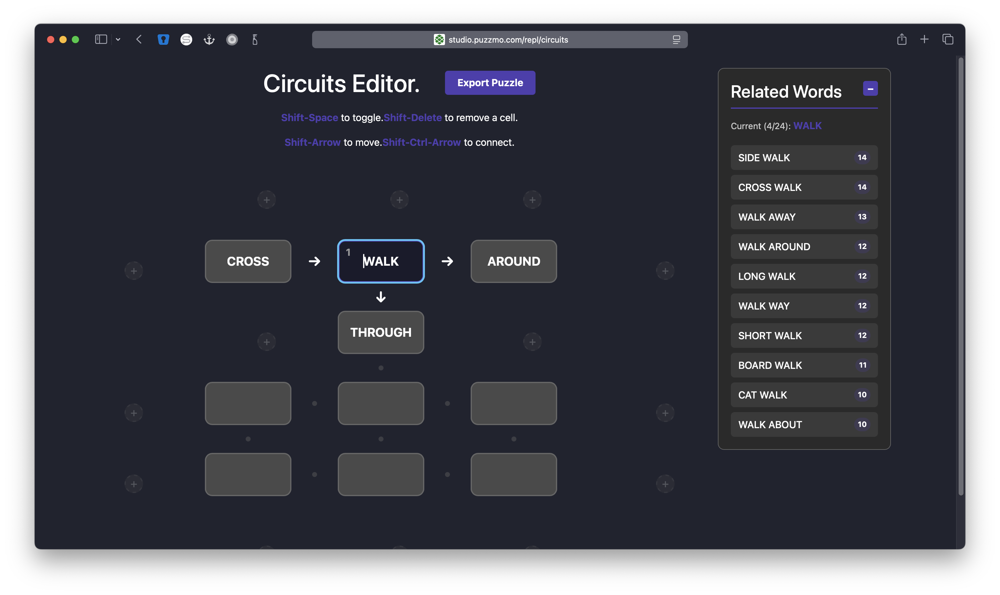

+++
title = 'Puzzmo Tech Stack: 2025'
date = 2025-12-09T00:11:39Z
authors = ["orta"]
tags = ["tech"]
theme = "outlook-hayesy-beta"
series = ["Tech Stack"]
+++

It's just over two years since Puzzmo's launch, which means its time to continue my tradition of talking through the technical changes under the hood!

I was a very early GitHub user, signing up in the first 50k users in 2009, and for the first few years the interface and platform was changing very drastically as a user. Then in 2012, GitHub [took venture capital](https://www.wired.com/2012/07/github100m/) and changes to the daily experience of being a GitHub user effectively stopped.

To some extent, I wondered if this was going to be happening with Puzzmo for the last year, and possibly for the next year. We've really started to find the spaces where we can start getting Puzzmo profitable after we had got a pretty good handle for the consumer facing side and have found a set of enterprise level features which companies are willing to pay for.

Sometimes I think to myself, _"man, we did kinda have a quiet year"_ and then I start to ask around what folks did this year and it turns out that for a few devs we really are shipping a lot of stuff, so this is going to be a pretty long!

## New Things Users Saw

- New games: Bongo, Memoku, Circuits & Missing Link.

- We shipped a native iOS app for Puzzmo. You can read about this from a [blog post in June](https://blog.puzzmo.com/posts/2025/06/01/ios-app-architecture/). To make it happen we had to add new systems for GameCenter, new subscription infrastructure and handle a lot of App Store review churn. We found lots of [perf wins](https://blog.puzzmo.com/posts/2025/02/06/digging-into-perf/) in the process of exploring offline support.

- We re-designed the two core screens for Puzzmo players, the Today page and the PlayGame page. These two screens represent the majority of the complexity density in the codebase and after 3 years the designs were starting to strain under the incremental changes.

- The markdown renderer for completion notes got very fancy

- We introduced some new easy ways to access archival games, now that we have a pretty large backlog of games.

- Games have sound! Bongo and Circuits have Buzz (realtime info from other players.) We made a credits system to attribute folks working at Puzzmo at the time of a game launching and external contributors. We added champion leaderboards.

- We made a competitive multiplayer launch game: [Circuits Royale](https://blog.puzzmo.com/posts/2025/09/08/the-making-of-circuits-royale/).

- We downplayed streaks, moving them from being something on the homepage to being information you get after completing a game only.

## New Things Users Probably Didn't See

- The capabilities to embed either Puzzmo as an app in other places. This ranges from allow/deny listing certain games, or full on offering of Puzzmo Plus to users of a [different platform](https://secure.businesswire.com/news/home/20250326593738/en/Hoopla-Digital-Launches-New-Gaming-Experience-with-Puzzmo-BingePass).

- The feature-set of the Cross|word went way beyond the list of features we use on puzzmo.com. This ranges from barred Crossword support, jpz imports, amuselabs JSON support, clue colours, tile colours, clue images, Schrondinger's squares, rich markdown processing for clues and an inline version of the Puzzmo keyboard. A significant amount of these changes exist inside our open-source project [xd-crossword-tools](https://github.com/puzzmo-com/xd-crossword-tools/blob/main/CHANGELOG.md) which at a whopping version 12!

- Our curated puzzle editing tools went from being only usable for Crosswords to being usable for many games, and in many contexts. We added both Bongo and Circuits which came with all sorts of tricky authorial problems. Our "GitHub for puzzles" system for admins certainly started to creak as we introduced Mini Cross|words, Big Crosswords and non-staff editors.

- We have built out a pretty comprehensive printing system for Crosswords, it can handle a lot of edge-case layouts and re-uses the rendering engine from our Crossword game for clues - so esoteric features like making emojis larger to fit the feel, inline images, formatting etc are all the same.

- We have had enterprises make deals for source code access to Puzzmo and/or access to games.

- The puzzle [variations](https://blog.puzzmo.com/posts/2024/07/16/augmentations/) system introduced in April Fool's 2024 got a fresh lick of paint for the Crossword Mini to allow for a variant to effectively be treated as its own game. Giving them unique stats, streaks etc. This was made feasible by offloading more stats to live in blob storage instead of in the db.

- We consolidated all game thumbnail rendering on a custom runtimeless JSX renderer

- We have extensive server monitoring tools now! Plus the number of servers needed to run Puzzmo has gone down an ordinal on average.

## Things we dropped

- Sidequests for Pile-Up Poker. (Not used very much, massive amount of data to store.)

- Initial implementations of our leaderboards, game data storage, and histograms. (All of these have had re-writes which increase their scopes)

### Where we code

At the end of the last post, I described the "repos which count" as being 3 main places:

- Monorepo ("app")
- Games
- Opengraph

Today that has been switched to:

- Monorepo ("app")
- Games
- Prototypes

The app monorepo continues to grow with new apps and packages more tech has consolidated in that repo. CI and deployment. We now use [GitHub's labeller](https://github.com/actions/labeler?tab=readme-ov-file#pull-request-labeler) ([example](./labels.png)) for PR scanability.

As the games team started to take more responsibilities for the opengraph images it started to make sense to migrate that repo into the games Monorepo. The games monorepo is now a real [Turborepo](https://github.com/vercel/turborepo?tab=readme-ov-file) codebase where each game is a unique package. This means tests, builds and type-checking can happen on a per-game basis instead of for the whole system which is a massive time-saver on git hooks like pre-commit and pre-push.

We spent considerable time on the development environment for working on games this year.



The games dev environment (we call 'The Jig') now has the ability to replicate our multiplayer environment, run fixtured puzzles/states, has interactive renderers for thumbnails, can emulate the Buzz section, store per-user puzzle/states for timelining, handle complex bootstrapping payloads and provides rich information about sounds/vibration feedback.

The prototypes repo is new, and something [I have written about](https://blog.puzzmo.com/posts/2025/07/30/six-weeks-of-claude-code/#game-design-collaboration) when talking about Claude Code. The repo acts as a place for game design experiments and still feels like a simplified version of our Puzzmo games monorepo and Jig.

We have found this repo to be a strange set of trade-offs, a lot of our shared code in the games repo lives inside some pretty complex shared redux code which handles interacting with the games runtime. We don't want to force prototypes to be using this code, which has meant there's still a lot of persnickity issues on mundane problems like pausing, timers, keyboard support, no multiplayer infra etc. So, we'll probably have to create a new abstraction for runtime integration over there.

We're still not at a point that our games folks are choosing to use the prototypes repo as their first place for explorations - more to do here.

## How Programming Changed

2025 was a epochal year for the field of programming. LLMs got good enough. I'm finding myself using Claude Code almost every time I open up my editor, and it's capabilities feels to have had quite a boost with the introduction of [Sonnet 4.5](https://www.anthropic.com/news/claude-sonnet-4-5). For the engineers who use Claude Code in our team, we're finding it can drastically speed up, or allow for parallel work. If I had to guess, I'd estimate about 70% of my lines of code is now written by Claude Code.

6 month down the line I'm still regularly impressed by Claude's ability to understand our codebase, and I can find that I can make requests which span multiple sub-projects _"add a 'display name' to this model, and make it editable in the studio"_ would make the correct changes to the db, the GraphQL SDL layer, the application API layer, the backend would get forms and fields updated. This sort of thing is the bread and butter of a well defined system, and the tooling continues to impress.

We've explored the idea of having Claude Code or Copilot running on web/hosted infrastructure, personally, I've found it uninteresting. While these tools occasionally can do a one-shot exactly what we were looking for, most of the time you need to clone the branch and make your own changes. Could have just asked locally. I think it's useful for making something for you to come to later, (e.g. you're in a lot of meetings in a row, or you're off for the day and want to have something to start with tomorrow) but to me the right abstraction is still that the tool is running locally and being supervised/guided by a developer.

Because of Claude Code, I feel like I am continually asking myself: how do I make this codebase more explicit and each abstraction boundary more obvious? We've moved the monorepos to contain all context and code about their scopes, I've worked to remove as many 'any's as possible and I test out every new feature for Claude Code.

I even started a [meetup](https://duckduckgo.com/?t=ffab&q=claude+code+anonymous&ia=web) with a friend to get the chance to talk to others who are figuring out this strange new piece of technology. I'd like to do a final introspection on using Claude Code on this blog after this one is shipped.

## How does Puzzmo run?

Today Puzzmo is a pretty complex set of systems which run together to make it all work:



Credit to [Gary](https://www.puzzmo.com/user/puz/madebygare) for the diagram.

Honestly, since last year, not much has changed. There's grafana which is mentioned below, RevenueCat is handling all our Apple subscription infra (so that we can someday support Android, and so that we're not doing BI work.) and a Bluesky Labeler which I hacked up but I can never find the time to get back to.

## Big Tech Swings

### Puzzmo.com -> RN -> Web -> SSR

This year we removed React Native from the codebase, it was a project which most engineers ended up contributing to as the re-design of today and games pages created a new design system which was web only. Longer [read here](https://blog.puzzmo.com/posts/2025/06/01/ios-app-architecture/#not-so-react-native) and it is wild that such a big task [became a single line](https://blog.puzzmo.com/posts/2025/07/30/six-weeks-of-claude-code/#maintenance-is-significantly-cheaper) in the list of Claude Code changes as I wrapped up _every other screen in the app_.

In the process we updated all of the tooling like testing, linting to be based on the [VoidZero](https://voidzero.dev/) stack. Looking forwards to seeing what [Vite+](https://voidzero.dev/posts/announcing-vite-plus) looks like in the future.

Now that it's been settled for some time, I've been progressing the tech stack for puzzmo.com and we're getting ready to support moving some pages to run as server-side rendered React. We have a work in progress library for server-side rendering React, [Tapped](https://github.com/puzzmo-com/tapped?tab=readme-ov-file#tapped), which is tightly tied to our tech stack (React/Relay/Vite/Wouter) and is currently in active use in a new project we're working on.

We took the time to migrate to [wouter](https://github.com/molefrog/wouter), [StyleX.](https://stylexjs.com/) and [Base UI](https://base-ui.com/) during this process. I've found them all to be a pleasure.

### API -> Burr

We have fully migrated from Redwood on the API side. Redwood was a great starting template for our API, and I think if they were still working on it, I would not feel the need to migrate but realistically we were using a subset of the tool and we were carrying around the dependencies for all of the opinions on which we didn't match.

My replacement is a small library called Burr which replicates only the GraphQL layers (creating the schema, setting up [Yoga](https://the-guild.dev/graphql/yoga-server), handling networking requests) and I archived the [type-system codegen](https://github.com/puzzmo-com/sdl-codegen) library I built for Redwood and migrated it into our monorepo. We run the API in Vite via [vite-plugin-node](https://github.com/axe-me/vite-plugin-node) which gives HMR on API routes and we can use vite plugins everywhere.

I sometimes muse to myself about migrating to a different technique for creating our GraphQL API. I ran a non-trivial experiment with [Postgraphile](https://www.graphile.org/postgraphile/) and found it to be a really interesting foundation, but I'm not willing to commit to moving such a big existing project to Postgraphile - but [Pothos](https://pothos-graphql.dev/)... maybe?

### iOS App

I've written pretty extensively on the [iOS app.](https://blog.puzzmo.com/posts/2025/06/01/ios-app-architecture/) It took many months of my time to get it to a place we were happy with, and even then we had to drop some pretty serious features like full offline support.

### Self-hosted Analytics

Like most startups, we use a mix of google analytics and some db queries to get some sense of puzzmo.com usage. Google analytics is easily blocked by clients, and making a query like _'on average which game was last played before subscribing'_ is very time expensive in a traditional database like Postgres.

We were looking at needing to be able to provide analytics for a lot of diverse sets of users, and for accuracy the analytics just kinda needs to be first-party. I'd heard good rumours of [Clickhouse](https://clickhouse.com/) being well suited for this type of task. I thought this [3 minute video](https://www.youtube.com/watch?v=a7rmLeGK1v8) explains the difference in architecture, so you are encouraged to make a single table with all of yor data for incredibly fast queries.

[](db.png)

## Games

### Bongo

Our first game collab! With [Seth Godin](https://en.wikipedia.org/wiki/Seth_Godin) who was a pleasure to work with.

Bongo forced us to work on a few new problems in the editing space:

- We wanted to be able to give authors a more rich profile (bios, photos, links) and so introduced a new "Publishing Profile" system.

- We were courting big names for creating puzzles and mixing in community member puzzles, and so we needed a pretty user-facing form for getting set up on a puzzle. This gave us a new set of form abstractions for Puzzmo.com (which historically didn't really any forms more complex then 3 items.)

- People weren't directly creating the puzzle. Bongo authors generate a set of seed words, and we run a generator which takes those seed words and offers a set of puzzles with different trade-offs.

  The generator itself is an arbitrary CLI program which takes the seed input, and takes about an hour to generate a single puzzle. The time it takes to generate a puzzle wasn't something we could control, so our solution was to have our API trigger 15 GitHub action workflows which gives some

We found that getting high profile folks for making Bongos wasn't really worthwhile. Perhaps it was a mix of a puzzle seed being too easy to make, Puzzmo not being established enough for others to put the time in, or not having the right team (or audience) make-up to handle that style of work. The community ones were very cool though!

Which meant going back to traditional puzzle generation for Bongo. We took some time on researching ways to generate themes for puzzles based on emoji combos and single words.

Bongo was also the first time we explored adding some sort of real-time information about other players, we called it "Circles" and it started as a quick client-side cached lookup for the most recent updates to gameplays and then we pull out their best word and score. This worked until it hit production and we instantly hit perf issues, we switched to making the call for the latest be a job which occurs every so often on a Bongo game being updated. The results are then stored in Redis. This also hit new, different scaling issues, so we started using a Redis bounded list via `lpush` and `ltrim` on gameplay updates.

### Memoku

Memoku had been hiding in our codebase for a long time, given that Weather Memoku had launched six months previously.

For the launch, we introduced an idea of obtaining a sequence based on the order of completed numbers. This was based on my wife who always completed the game 1 -> 9 during testing as an additional constraint. Roughly 20,000 games of Memoku ended up with the sequence 123456789 and 4,000 with 987654321. This was built on the [existing event](/posts/2024/09/19/plugins-are-back-in-style/#event-plugins) plugin infrastructure, then migrated into Puzzmo API core and people can still unlock sequences.

### Circuits

Our second game collab! We launched Circuits with [Circuits Royale](https://blog.puzzmo.com/posts/2025/09/08/the-making-of-circuits-royale/), where we created a real-time multiplayer version of the game at the same time.

We expanded on Circles by switching it out with a new abstraction "Buzz." With Circles, we had wondered if we could re-use the design of the player circles with scores and info across many games. It didn't really feel like we could and so Buzz introduced a new game JS bundle integration point which allows for a game to be able to control the user interface for in the sidebar.

The Buzz bundle is handed a copy of React from the application, and with a bit of Vite massaging we get small bundles and we're back to the Puzzmo app/API not having internal information about specific games.

Circuits is the first game we've had where the curation tools can't rely on a text file format which both is machine generatable and safe for humans to hand edit. For example we assume Crosswords are being made in tools like [Crossfire](https://www.beekeeperlabs.com/crossfire/) and then we support converting the output of these tools into a text-based standard [xd](https://puzzmo-com.github.io/xd-crossword-tools/) which looks like:

```
## Metadata

title: Creature Feature
author: Danger, ./orta, and brooke
editor: Brooke Husic

## Grid

HISS.NOKIA
ISNT.OWENS
PLEA.BINDI
.EAGLEEYED
..KEEL.AXE
ICY.NPR...
DOGEARED..
IMOK.IMAGE
OBOE.ZINES
MODS.EXALT

## Clues

A1. Serpentine sound ~ HISS
A5. Big name in bricks? ~ NOKIA
A10. "___ that the hull?" (what I said to my husband Orta when he suggested "Boat's bottom" as the clue for 16-Across) ~ ISNT
A11. American who won four Olympic golds in 1936 ~ OWENS
A12. "Let me keep the 'boat's bottom' clue!1!1!!", for instance ~ PLEA
A13. Symbol representing the third eye ~ BINDI
A14. Like Twitch streamers who can spot foes at incredible distances ~ EAGLE|EYED
... and more
```

There isn't a Circuits development tool like Crossfire! So, we had to build out a visual editor for creating a Circuits which generates puzzles which look like:

```
1
,NOT FOR V,GET V,LATTE V
NEPO V,*LONG >V,*LOST >V,*ART V
*BABY >V,*FACE V,AND FOUND,CRITIC
BOOMER,FACTS,,
```



To make that easier to work with, we use the gameplay data from the Circuits Royale to offer recommendations as you are building out a puzzle. This then starts out the process of

### Missing Link

I persuaded Zach to [write about Missing Link](https://blog.puzzmo.com/posts/2025/07/04/missing-link/) for the goals for that game and I wrote about the technical trade-offs we made around making it possible to ship the game in my "[6 weeks of Claude Code](https://blog.puzzmo.com/posts/2025/07/30/six-weeks-of-claude-code/#game-design-collaboration)".

### Crossword Updates

We built the infrastructure to run the Puzzmo Cross|word in another domain. We'd punted on this for a lot of reasons, but one of the big ones was that the keyboard for a game lived inside puzzmo.com's app, not inside each game individually. This meant figuring out how to share the keyboard across the games and the application.

We spent a considerable amount of time adding new features to our Crossword implementation which to get feature parity with other Crossword players which are used in embeds. I worked within The [New Yorker's games](https://www.newyorker.com/crossword-puzzles-and-games) team to help integrate our Crossword software into their site (e.g. get all our bundling patterns all in sync) as a React component (something we don't do ourselves!)

### Crossword Printing

As a part of being able to replicate a lot of existing 'Crossword in an iframe' experiences. We took on looking at handling printing a Crossword. This is one of those iceberg problems when you start to get into what printing APIs look like on the web, and the differences between what you see in previews and how the actual thing prints.

We wanted to maintain as much compatibility in terms of view-layers for our Crossword implementation as possible. So, in implementing, we knew we wanted to use the same React components used in the Cross|word game code.

My first thoughts on the project were to explore server-side rendering the whole thing as a PDF, this worked in many ways but starts to get tricky with trying to optimize the print sizing and offering any options to users on previews.

My second iteration relied on server-side rendering the React to html, and then re-creating the DOM as an evolutionary algorithm which used the amount of free space on the screen as the way to derive a layout for the Crossword. Roughly, take 4 layouts (2 column, different 2 column, 3 columns, 4 columns) then try 4 different font sizes. Take the amount of free space on the page as being X, then see how space much the grid and clues take up. With a bunch of time, and some help from Saman, we got this working pretty solidly.

### Sound

We started working with [A Shell In The Pit](https://ashellinthepit.com) who are a sound design team with a focus on indie games. We wanted to be able to give them a tool to be able to run a game and hook in their own sounds, and try out different combinations of sounds. So, we [pretty drastically over-engineered](https://www.figma.com/board/VCiWErTiE2Wz5h4iIFCQbD/Audio-system?node-id=0-1&t=JC8vJieGyMgKtCFU-1) a sound system!

In rough, there is an admin page where you can upload sound files, and then you can combine those sound files to events messages which get triggered from the game. This gave folks the ability to have a deployment of sounds and then a way for people to be able to try different versions of the sounds as a collective.


I think we had the best intentions here, but it ended up that no-one actually experimented with sounds, we didn't have A Shell In The Pit folks making changes in our backend and there was only one time that someone other than the developer of the feature used the tool. Tricky!

So, now we have a very clever sound system and we grafted the haptic interactions into that system as they nearly always correlate.

### Circuits Royale

This got a solid write-up in ["The Making of Circuits Royale"](https://blog.puzzmo.com/posts/2025/09/08/the-making-of-circuits-royale/) - so I don't have too much to add here. We kept it running for a month or so after the launch of Circuits. Then we removed it from the Puzzmo home page, and after giving it a little bit longer to see if it could run without the homepage link eventually called it. We occasionally chat about bringing it back at specific times, rather than as an always on game.

## Other Key Systems

### Face/off

Saman [wrote up the work](https://blog.puzzmo.com/posts/2025/02/06/redesign/) we did on re-designing the homepage, calendar, game page, and social page which was nicknamed "Face/off" internally.

If you're interested in the before and after, I've just taken some screenshots of the last builds of puzzmo.com running before we started the migration for the homepage and today's Crossword.





### Markdown Improvements

Because Puzzmo started off as a React Native app, I didn't really trust any of the markdown rendering engine dependencies to hit the quality bar I was looking for. So, I took an off-the-shelf [Markdown to AST](https://github.com/aleclarson/markdown-ast) library and wrote my own rendering front-end for it.

This is one of those decisions that people could very easily dismiss as "not my problem" but I'd argue that rendering text is your problem! It's one of the core user-interface primitives, and when we're rendering markdown it's always something we've thought pretty hard about because it's not just the normal user-interface React components.

By fully controlling all of the rendering paths from the markdown AST, we get all sorts of features:

- Internal links to puzzles get game icon
- User links get avatars and profile popovers
- Custom buttons, CTAs etc

This year, after talking with Brooke about how she writes constructor/editor completion messages we tied metadata from games into the Markdown renderer which we use for [highlighting clues](https://blog.puzzmo.com/posts/2025/05/24/clue-glossaries/).

To me, this is like the super polished stuff that's easy to do while a project is small but then really hard to do on a mature and calcified system.

### Archival

We were interested in making the archives for a puzzle more accessible, this both made the business folks happy (because archives was well hidden behind the calendar) but also solved one of our issues of navigating the site. Now we have a way to create a button which offers a way to go back a daily for a particular game.

### Embedding Systems

#### Game Iframe

The ability to embed Puzzmo in other people's sites and apps has grown pretty dramatically. When we launched Puzzmo, we added a way for publishing partners to embed a single game iframe. For example you might go to polygon.com and play [Really Bad Chess](https://www.polygon.com/24126394/really-bad-chess-puzzmo/).

Pretty early in the year, We had an iframe version of Flipart running on https://www.weather.com - this site had many ordinals more traffic than we were used to on puzzmo.com! This forced us to adapt and create a CDN version of our iframe game embeds. Meaning all of the traffic for running and playing an embedded game operates without touching our API. Today, this works by using a new library we have called [Belay](https://github.com/puzzmo-com/belay) which lets you use Relay Compiler compiled queries via a fetch instead of the whole Relay runtime. The API makes the same API call, and then uploads the results to our blob storage. This is on a cron job to update every CDN embed every hour.

We added all sorts of modes for game embeds: cycling through games, infinite plays on a particular game, running from a particular puzzle queue

Iframes now have an [`postMessage`](https://developer.mozilla.org/en-US/docs/Web/API/Window/postMessage) API for folks to be able to handle their own analytics tracking, or show/hiding them based on game state.

#### App Embeds

It's possible for publishing partners to be able to embed Puzzmo in their apps and sites. We have two versions of that, a simplified version of puzzmo.com with no experimental games, interactive systems and a more complete puzzmo.com experience for Puzzmo Plus users.

The first version of this came from working with [Hoopla](https://www.hoopladigital.com/) to get Puzzmo into libraries. We had to create a system for creating/logging in people who have 'checked out' Puzzmo from their hoopla account. This works by redirecting a user to a particular server API route which will either create a user or re-log them in based on their Hoopla unique ID passed to the URL.

Then we had to add a cron job for uploading usage stats back to Hoopla for two-way accounting.

These iframes have pretty extensive `postMessage` APIs for sizing. Lately I've been wondering if offering a `<script>` tag to handle the embeds is the right abstraction. We have extensive developer docs for folks integrating in our studio.

### Game Thumbnail Renderer

Previously all our game thumbnails were funky string manipulation, for example, here is Flipart's entire thumbnail renderer:

```ts
import { blendColors } from "../../lib/blendColors"
import type { ThumbnailConfig } from "../../shared/hostAPI"
import { stringToState } from "../engine/stringToState"
import { updateStateFromInputStr } from "../engine/updateStateFromInputString"
import { getAbsolutePosition, isOutOfBounds } from "../util"

export function generateThumbnail(puzzleData: string, userStateString?: string, config?: ThumbnailConfig): string {
  if (!config || !config.theme) throw new Error("Need a config + theme to render a spelltower thumbnail")

  const theme = config.theme

  const state = stringToState(puzzleData, config.theme)
  updateStateFromInputStr(state, userStateString, true)

  const bgColor = state.bgColor
  const strokeColor = blendColors(bgColor, theme.alwaysDark, 0.15)
  const piecesList = Object.entries(state.pieces)
  const allCorrect = piecesList.every(([_, piece]) => piece.absoluteRotation === 0)
  const won = config.renderContext === "timeline" ? false : config.gameplay?.completed
  const timelineWon = config.renderContext === "timeline" ? allCorrect : false

  const isOpenGraphRendered = config.renderHost === "opengraph"

  const renderTileSize = 70
  const width = renderTileSize * state.dimensions.inner[0]
  const height = renderTileSize * state.dimensions.inner[1]
  const outerStrokeWidth = won ? 4 : 2
  const buffer = won ? outerStrokeWidth * 2 : renderTileSize
  const viewbox = `0 0 ${width + buffer * 2} ${height + buffer * 2}`
  const header = `
<svg style="pointer-events:none;" preserveAspectRatio="xMidYMin meet" aria-labelledby="boardTitle" aria-describedby="boardDesc" xmlns="http://www.w3.org/2000/svg" viewBox="${viewbox}">
    <title>Flipart Thumbnail</title>
    <desc>Thumbnail for Flipart</desc>
`

  const pieces = piecesList
    .map(([_, piece]) => {
      // add handles
      let handle = ""
      if (config.renderContext === "timeline" && !timelineWon) {
        const r = renderTileSize / 12
        const offset = renderTileSize / 2
        const baseCx = piece.globalPivot[0] * renderTileSize + buffer + offset
        const baseCy = (state.dimensions.inner[1] - piece.globalPivot[1] - 1) * renderTileSize + buffer + offset

        const offsets = [
          [0, -2.5],
          [-2.5, 0],
          [0, 2.5],
          [2.5, 0],
        ]

        let dots = [] as string[]
        for (let i = 0; i < 4; i++) {
          const cx = baseCx + offsets[i][0] * r
          const cy = baseCy + offsets[i][1] * r
          dots.push(`<circle style='filter: hue-rotate(200deg) brightness(200%);' fill="${theme.fg}" cx="${cx}" cy="${cy}" r="${r}"/>`)
        }
        handle = dots.join("")
      }

      return `${won ? "" : '<g style="mix-blend-mode: hard-light;">'}${piece.tiles
        .map((tile) => {
          const absPos = getAbsolutePosition({ tile, piece })
          const oob = isOutOfBounds(absPos, state.dimensions.inner)
          if (oob && isOpenGraphRendered) return ""
          return `<rect x="${absPos[0] * renderTileSize + buffer}" y="${height - (absPos[1] + 1) * renderTileSize + buffer}"
            width="${renderTileSize}"
            height="${renderTileSize}"
            shape-rendering="crispEdges"
            fill="${oob ? theme.fg : piece.color}" /> `
        })
        .join("")}${won ? "" : "</g>"}${handle}`
    })
    .join("")

  // prettier-ignore
  const background = `<defs>
    <pattern shape-rendering="crispEdges" id="bg" patternUnits="userSpaceOnUse" width="50" height="50">
      <path fill='${strokeColor}' stroke='${strokeColor}' stroke-width='0.5' d='M99.097 100.6H96.4706L0.22998 4.16407V1.72279L99.097 100.6ZM88.9724 100.6H86.5314L0.24029 14.1147V11.6733L88.9724 100.6ZM79.0229 100.6H76.5818L0.22998 24.2403V21.6136L79.0229 100.6ZM69.0836 100.6H66.4572L0.24029 34.1806V31.5539L69.0836 100.6ZM59.1444 100.6H56.518L0.24029 44.3165V41.6898L59.1444 100.6ZM49.0095 100.6H46.5685L0.22998 54.2568V51.8155L49.0095 100.6ZM39.0703 100.6H36.6292L0.24029 64.2073V61.766L39.0703 100.6ZM29.1207 100.6H26.4943L0.22998 74.333V71.7063L29.1207 100.6ZM19.1815 100.6H16.555L0.22998 84.2733V81.6466L19.1815 100.6ZM9.05685 100.6H6.61582L0.24029 94.2238V91.7825L9.05685 100.6ZM100.22 91.7825V94.2238L6.60551 0.599976H9.04654L100.22 91.7825ZM100.22 81.6466V84.2733L16.555 0.599976H19.1815L100.22 81.6466ZM100.22 71.7063V74.333L26.4943 0.599976H29.1207L100.22 71.7063ZM100.22 61.7558V64.197L36.6292 0.599976H39.0703L100.22 61.7558ZM100.22 51.8155V54.2568L46.5685 0.599976H49.0095L100.22 51.8155ZM59.1444 0.599976L100.23 41.6898V44.3165L56.518 0.599976H59.1444V0.599976ZM69.0836 0.599976L100.22 31.5539V34.1806L66.4572 0.599976H69.0836V0.599976ZM79.0229 0.599976L100.22 21.6136V24.2403L76.5818 0.599976H79.0229V0.599976ZM88.9724 0.599976L100.23 11.6733V14.1147L86.5314 0.610286H88.9724V0.599976ZM99.097 0.599976L100.22 1.72279V4.16407L96.4706 0.599976H99.097Z' />
    </pattern>
    </defs>
    <rect shape-rendering="crispEdges" x='${buffer}' y='${buffer}' width="${width}" height="${height}" fill='transparent' stroke-width='${
    outerStrokeWidth * 2
  }px' vector-effect="non-scaling-stroke" stroke='${won || timelineWon ? theme.a_puzmo : theme.fg}' />
    <rect shape-rendering="crispEdges" x='${buffer}' y='${buffer}' width="${width}" height="${height}" fill='${bgColor}' />
    <rect shape-rendering="crispEdges" x='${buffer}' y='${buffer}' width="${width}" height="${height}" fill="url(#bg)"/>`

  return `${header}
  ${background}
  <g style='isolation: isolate;'>${pieces}</g>
</svg>`
}
```

This idea works for a while, but it is very easy to get wrong, and as the number of games and the complexity of our thumbnail renderers grows - we needed a tighter abstraction!

We all were interested in switching to use JSX, but I was not down in switching to React - we run thumbnails in all sorts of places and forcing the runtime to have React available was asking a lot of ourselves today and in the future. Our thumbnails are not interactive, so there's a lot of systems we don't need.

I started writing my own JSX renderer, but when exploring the space noted that [understated](https://github.com/callmecavs/understated) was hitting all the goals I was looking for. We took understated and gave it a fresh lick of types and started making it handle a lot more of the SVG edge cases till we ended up with

```ts
// Forked from https://github.com/callmecavs/understated/blob/751d973e31b267cc1a7ed246170beeb673ebc662/src/understated.js
// Licensed MIT: https://github.com/callmecavs/understated/blob/751d973e31b267cc1a7ed246170beeb673ebc662/package.json#L10

import { ReactElement } from "react"

// Changes:
// - Converted to TypeScript
// - Convert to ESM
// - Comments
// - Added support for null/false
// - Added support for camelCase -> kebab attributes
// - Special case for certain camel case attributes
//

/** Converts a JSX element into DOM calls, this is sorta your root entry point */
export const render = (tree: ReactElement, target?: any, ns = false) => {
  const rootElement = build(tree, ns)
  if (target && rootElement) target.appendChild(rootElement)
  return rootElement
}

/** The JSX factory fn */
export const h = (tag: string, props: any, ...children: any[]) => {
  return {
    tag,
    props: props || {},
    children: [].concat(...children),
  }
}

const createText = (str: string | number) => document.createTextNode(str.toString())

const setClassAttr = (node: HTMLElement | SVGElement, value: string) => node.setAttribute("class", value)

const setBooleanAttr = (node: HTMLElement | SVGElement, name: keyof HTMLElement | keyof SVGElement, value: any) => {
  if (value) {
    node.setAttribute(name, "")
    ;(node as any)[name as any] = true
  } else {
    ;(node as any)[name as any] = false
  }
}

const setEventAttr = (node: HTMLElement | SVGElement, name: keyof HTMLElementEventMap, value: any) =>
  node.addEventListener(name, value, false)

const setStyleAttr = (node: HTMLElement | SVGElement, value: any) => {
  if (typeof value === "string") {
    node.setAttribute("style", value)
  } else {
    if (!value) return
    Object.keys(value).forEach((key) => {
      let styleVal = value[key]
      if (typeof value[key] === "number") {
        styleVal = value[key].toString() + "px"
      }
      node.style[key as any] = styleVal
    })
  }
}

const createNode = (tag: string, props: any, children: any[], ns?: boolean) => {
  const svg = ns || tag === "svg"

  // Preserve case for SVG elements that have mixed case
  const preservedTag = svg && specialCasesForCamelCaseElements.includes(tag) ? tag : tag.toLowerCase()

  const node = svg ? document.createElementNS("http://www.w3.org/2000/svg", preservedTag) : document.createElement(preservedTag)

  if (props) {
    Object.keys(props).forEach((name) => {
      const value = props[name]

      if (name === "className") {
        setClassAttr(node, value)
      } else if (name === "style") {
        setStyleAttr(node, value)
      } else if (typeof value === "boolean") {
        setBooleanAttr(node, name as any, value)
      } else if (name.slice(0, 2) === "on") {
        const eventName = name.slice(2).toLowerCase()
        setEventAttr(node, eventName as any, value)
      } else {
        const hasCap = /[A-Z]/.test(name)
        const kebabCase =
          hasCap && !specialCasesForCamelCase.includes(name) ? name.replace(/([a-z0-9]|(?=[A-Z]))([A-Z])/g, "$1-$2").toLowerCase() : name
        if (name.toLowerCase() === "crossorigin") {
          node.setAttribute(name.toLowerCase(), value)
        } else {
          node.setAttribute(kebabCase, value)
        }
      }
    })
  }

  if (children && children.length > 0) children.forEach((child) => render(child, node, svg))

  return node
}

const createComponent = (tag: (props: any) => HTMLElement | SVGElement | Text, props: any, children: any[], ns?: boolean) => {
  props["children"] = children
  return build(tag(props), ns)
}

const build = (obj: any, ns?: any): HTMLElement | SVGElement | Text | null => {
  if (obj === null || obj === undefined || obj === false) {
    return null
  } else if (typeof obj === "string" || typeof obj === "number") {
    return createText(obj)
  } else if (typeof obj.tag === "function") {
    return createComponent(obj.tag, obj.props, obj.children, ns)
  } else {
    return createNode(obj.tag, obj.props, obj.children, ns)
  }
}

/** Known attributes which shouldn't get auto-kebab'd */
const specialCasesForCamelCase = [
  "viewBox",
  "preserveAspectRatio",
  "patternUnits",
  "tabIndex",
  "crossOrigin",
  "gradientTransform",
  "gradientUnits",
  "textLength",
  "lengthAdjust",
]

/** Known SVG elements which shouldn't get lowercased */
const specialCasesForCamelCaseElements = [
  "linearGradient",
  "radialGradient",
  "clipPath",
  "textPath",
  "animateMotion",
  "animateTransform",
  "feColorMatrix",
  "feComponentTransfer",
  "feDropShadow",
  "feFlood",
  "feGaussianBlur",
  "feOffset",
]
```

With a single JSX render pass we could now have all of the TypeScript compiler verifying our code with an extra few hundred bytes per thumbnail renderer. This is a very fine trade-off.

### Things we never got to

From last year:

> Consolidating puzzmo.com logic into Relay's [client schema extensions](https://relay.dev/docs/guides/client-schema-extensions/) and using fragment references

I explored Relay [client schema](https://relay.dev/docs/guides/client-schema-extensions/) extensions as a route to handle some of the gnarly logic around offline support. This code ended up being significantly more verbose and required a lot more wiring around the app than I had hoped. So, in the end it wasn't an answer to solving some of our gnarliest state complexity (a big `useReducer` which hosts about the application state around playing games integrations) which still remains a _'beware dragons here'_ area of the codebase that always comes with surprises on a change.

### New heuristics I have learned

1. A backtracking foreign id is probably worth adding to models which create other models. I have found myself regularly going back to the database schema to connect things like 'this object was made by this scheduler', or 'this submission created this puzzle'

2. Almost every complex db model how has a `flags` Int array in the database. Then I have a shared admin/game/app library to pull out these values and compare them at runtime. I use codegen to make the API ergonomic. Part of the goal here is systemic consistency but also ease of adding a new boolean value on a model. Previously, if you want to add a single db flag it would be: add a db column, add to the api (read/writes), add to the graphql layer, have clients add new field and potentially pass that to the games (which means editing the runtime contract.) Now, it's extend the enum definition for the bitwise flags and make sure anywhere which wants to know it exists updates the shared package.

3. Ask Claude questions. I've found myself wondering things like _"My memory is unreliable (I have [SDAM](https://www.reddit.com/r/SDAM/)) so are there things I've missed for this article"_ - so I asked Claude Code to review every PR for the last year and offer its opinions on what important foundations were added to the codebase this year.



4. It's nice to have a JSON objects in postgres when you are not sure of the design space, but that flexibility comes at the cost of an LLM (or collaborator) being able to fully grok the system without extra digging. We were pretty guilty of this because I optimized for db space instead of clarity in a bunch of places.
