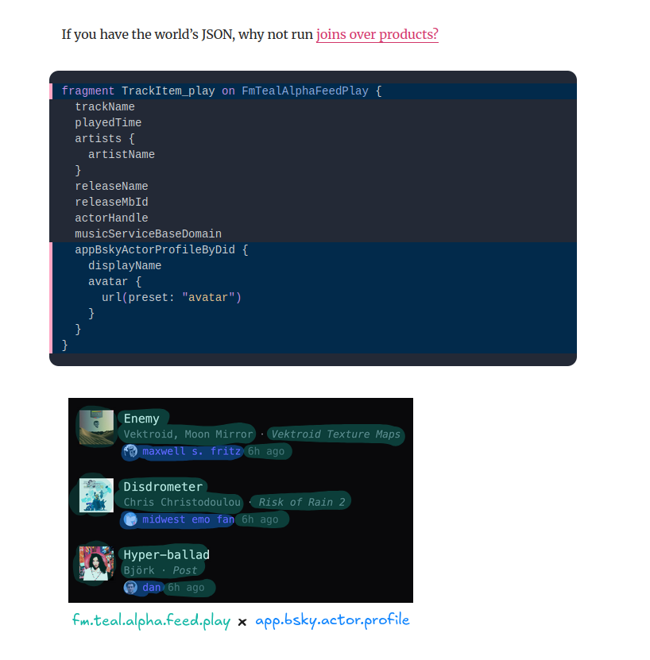

+++
title = 'Wrangling atproto + Bluesky for Puzzmo.com'
date = 2026-02-27T00:42:01Z
authors = ["orta"]
tags = ["tech", "atproto"]
theme = "puzzmo-light"
+++

## Catch-up

If you want the end-user perspective of what we have shipped read: [Bluesky on Puzzmo](../bsky). The TLDR:

- We have Bluesky follower sync
- We have a labeler which sets labels so you can see other Puzzmonauts on Bluesky
- We store your steak data in your Bluesky account
- We post the Cross|word midi dailies to our Bluesky account

But getting to this feature set was not a linear path and I think it's interesting to both cover the autobiographical reasons for why these exist, and the technical foundations so that more folks can consider what it means to interact with the Atmosphere.

## Terminology

If you are familiar with atproto development, you're welcome to skip this. I am going to give you a quick summary of what it means to work with atproto so I can stop using more ambiguous terminology and start throwing jargon around.

If you have 20m to spare, and truly want to grok it read this: [A Social Filesystem](https://overreacted.io/a-social-filesystem/) which was what fully nailed it to me. I will give a few paragraphs to explain what's necessary for this blog post.

When you sign up to Bluesky, you are creating an [atproto](https://atproto.com/) account. An atproto account is a wrapper of cryptographical identity and a collection of typed JSON blobs (records) called a registry. The 'identity' here is a [DID](https://atproto.com/specs/did) (Decentralized IDentifier) which you can think of as a network-unique ID to users/files/content/etc, mine is [`did:plc:t732otzqvkch7zz5d37537ry`](https://pdsls.dev/at://did:plc:t732otzqvkch7zz5d37537ry). It's like a URL.

In an atproto account's registry, a user has 'collections' which are JSON blobs that have the same type. So, when I post to Bluesky, it is a JSON blob in the collection [`'app.bsky.feed.post'`](https://pdsls.dev/at://did:plc:t732otzqvkch7zz5d37537ry/app.bsky.feed.post). Any client can get access to the firehose of changes (the Jetstream) to JSON blobs for every atproto account. It's also possible to backfill that data.

So, to make an app like Bluesky, you would listen for all `app.bsky.feed.post`s and then do something clever with the realtime data. A lot of bluesky labelers listen to _all likes_ to determine if the post liked was a specific post, and if so apply a label to that user.

Bluesky is effectively the reference atproto app, testing and pushing the protocol with real-world constraints while acting as a way to get people interested. If people use Bluesky, then they already have an atproto account so that the next atproto apps are easier to bootstrap and interop with.

So above, when I say _"We store your steak data in your Bluesky account,"_ I really mean: _"We post a Streak JSON blob to the com.puzzmo.streak collection on your atproto registry."_ It's an acceptable fudging we can now move past.

## 14 Months Ago

I wasn't wild on trying Bluesky.

I had been talking to Brooke, who said that the Crossword community had started to converge on Bluesky, and at the same time some of the developers who had been making the Mastodon web client [Elk](https://elk.zone/) had started to dabble in Bluesky.

I felt very culturally aligned to Mastodon, I'm a Linux guy who doesn't like algorithms influencing what I see. I enjoy not using tech and products from mega-corps. My mastodon account runs on a small server hosted by friends ([webtoo.ls](https://webtoo.ls)) and I still have a deep sense of loss from what happened to Twitter in the 2020s. Moving to a new American, VC-backed social network was really not something I had active interest in.

I spent quite a lot of time building prototypes of Puzzmo with integrations for ActivityPub (what powers Mastodon), but I just couldn't find a good place to start in terms of features that people would actually want. We could automatically post to people's feeds but that's uninteresting, we auto-post images of our dailies, which is also pretty lame. At best, all I could think of was things which I would never engage with. So they didn't even get sent to the team, let alone the public.

But, people I like moved over to Bluesky, and I didn't have to have an algorithmic feed. I could concede and give it a shot.

## 11 Months Ago

I was looking at adding my pronouns to my Bluesky account, and was reminded of how this system echo'd a Nintendo feature called [StreetPass](https://www.nintendo.com/en-gb/Hardware/Nintendo-3DS-Family/StreetPass/What-is-StreetPass-/What-is-StreetPass-827701.html) which has your Nintendo 3DS track other 3DSes which pass each other in the street.

What if we could have the serendipity of StreetPass, but while you were browsing Bluesky? I know we have quite a few micro celebrities using Puzzmo and I would be interested in seeing how they do on Puzzmo.

Having built out Twitch Oauth to Puzzmo a month or two earlier, for an unreleased feature (I think I have a technique for hooking up whether someone was streaming a game on Puzzmo) I
figured we might have an interesting prototype for a Bluesky integration.

So, where do you start with this?

I took the [Bluesky Labeler starter kit](https://github.com/aliceisjustplaying/labeler-starter-kit-bsky) for a ride and made it so you could like a post to apply a 'Puzzmonaut' label and showed it to the team with the framing of: _"What if we let people sign up to their Bluesky account and we set the label for them"_. I got an "that's interesting", but not much more interesting than some of the other ideas.

Labelers are an interesting system. You take an atproto account and you "change" it into a labeler by posting a record to a specific collection (`'app.bsky.labeler.service'`) on their registry. Here's ours: [puzzmo-labeler.bsky.social](https://pdsls.dev/at://did:plc:4p3ilpfcl77fqgoofjmghznc/app.bsky.labeler.service/self) - it is still a normal account by other means but you declare ahead of time all the possible labels.

( So, if you wanted to make an app which tracks all labelers, you'd listen to the Jetstream for all `app.bsky.labeler.service` records being created/removed. )

Interestingly, the label being applied to something is not stored in the registry. It's a stored at a Bluesky level, so no public audit trail. Sortof like your user preferences on Bluesky.

### Bluesky Oauth

Building Oauth login for Bluesky is a bit different than building a normal OAuth client because it is decentralized. Typically, you would go to the Oauth provider's site and register your application to get a secret and an ID. The Bluesky Oath system doesn't work that way, instead you have two publicly accessible endpoints:

- Oauth config: https://api.puzzmo.com/blueskyApp
- JWK public keys: https://api.puzzmo.com/atProtoJWKs

A JWK (JSON Web Key) was a new concept for me then, it's a JSON object with known keys describing a cryptographic key. So a way to describe what the key is, and also the key, but also not the key if you want only the public version.

With those two up and running, I used [@atproto/oauth-client-node](https://npmx.dev/package/@atproto/oauth-client-node) to handle the server back-and-forth, did some db work to our existing fastify setup and got to a point where we were able to log in a user and get their profile to set the avatar image and display name.

## 1 Months Ago

I was deep in a multi-month slump. I had tried a lot of different things to get over or around it, but I was just uninspired.

So, I'm very grateful Dan Abramov took a third stab at trying to find the right metaphors to describe how atproto works with this post:

<blockquote class="bluesky-embed" data-bluesky-uri="at://did:plc:fpruhuo22xkm5o7ttr2ktxdo/app.bsky.feed.post/3mcoktonamk2m" data-bluesky-cid="bafyreibsegn5z22rhxoyu2ctv6yar36lrpsuwb2lkm6sngvfgmglbtfzei" data-bluesky-embed-color-mode="system">
formats over apps  <a href="https://bsky.app/profile/did:plc:fpruhuo22xkm5o7ttr2ktxdo/post/3mcoktonamk2m?ref_src=embed">[image or embed]</a>
&mdash; dan (<a href="https://bsky.app/profile/did:plc:fpruhuo22xkm5o7ttr2ktxdo?ref_src=embed">@danabra.mov</a>) <a href="https://bsky.app/profile/did:plc:fpruhuo22xkm5o7ttr2ktxdo/post/3mcoktonamk2m?ref_src=embed">January 18, 2026 at 7:05 AM</a></blockquote>

I thought to myself, rather than mulling over something I want to avoid thinking about, maybe I should just throw myself into a completely new technical context. I wasn't interested in learning a new programming language, but trying to think in a de-centralized, file-based system? There could be something there.

Off the bat from that one article, I came out with a bunch of ideas:

- 
  If it was possible to jump across contexts like this, it would be interesting to be able to show Puzzmo user data like profile stats and streaks.

-

On the Puzzmo side, Zach had been pushing for a year or so that we switch from a Friends model to a Follow model, but that's an incredible amount of work with an ambiguous initial payoff. Building it is one thing, but so is deploying, dealing with the feedback and handling a whole new class of edge cases. That's a lot of the social work I don't really enjoy doing.

But what is switching Puzzmo to follows made it possible for us to be able to also do Bluesky follower sync?

To get follower sync working
