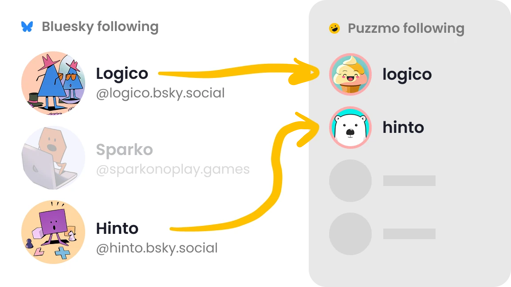
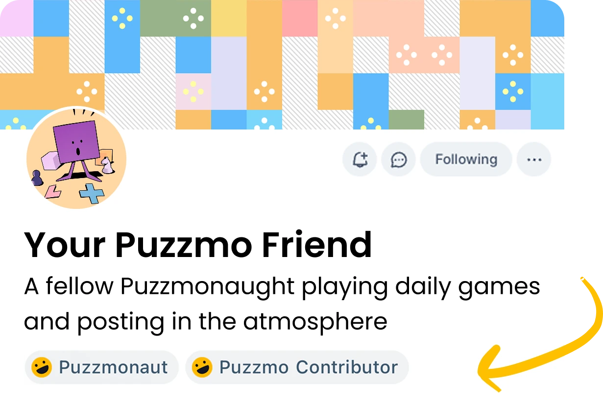

+++
title = 'Bluesky support for Puzzmo'
date = 2026-02-27T00:42:01Z
authors = ["orta"]
tags = ["feature", "bluesky"]
theme = "puzzmo-light"
+++

So, we've just shipped [Bluesky support for Puzzmo](https://www.puzzmo.com/bluesky)! There are three main components:

- Matching your Bluesky follows on Puzzmo
- Making it possible to see other Puzzmonauts on Bluesky
- Storing interesting data on your Bluesky account for you

## Follow Matching

This feature harks back to an older era of apps where you would log in with Facebook et al to sync your friends to a new account. It's the sort of system which used to be popular as a way to to let you bootstrap smaller social networks in the 2000s like Flickr, Tumblr, Meetup or last.fm, and that's kinda what we're doing here. Bluesky is a great option for this because a lot of our users use it, and we opted to adopt Bluesky once it started to look like the main text-based social network for folks dissatisfied with the decline of Twitter.

## Street pass for Bluesky

Bluesky has a concept of accounts that can add labels to people's accounts and posts, they are usually bots ran by a server and we call them "labelers". Labelers are a key part of the [moderation strategy](https://github.com/bluesky-social/proposals/blob/main/0002-labeling-and-moderation-controls/README.md) for Bluesky (e.g. not just having a centralized moderation team but allowing many folks to participate and have different focuses).

People can subscribe to a labelers and labels can be used to remove things you aren't interested in seeing, but that's not their only use! When I saw this system, I wondered if there was something interesting about trying to use this system to highlight positive traits. For example, there is a [pronoun](https://bsky.app/profile/did:plc:l3nbhdfelt5d26btksecetxu) labeler, a [game dev](https://bsky.app/profile/ozone.birb.house) labeler, why not have a "[Is on Puzzmo](https://bsky.app/profile/did:plc:4p3ilpfcl77fqgoofjmghznc)" labeler?

This is a lesser used feature of Bluesky for sure, but it's an interesting one - we have two labels, "Puzzmonaut" (all of us!) and "Puzzmo Contributor" (if you've ever had a published puzzle on the Puzzmo daily)

## Storing data in the sky

Sometimes it can be hard to predict what is going to be "big" or worth the time until much further down the line. For me, I like the idea of trying to increase the potential for serendipity around Bluesky, and so I wondered what it would mean to start syncing some of the data Puzzmo's stores to a more public space.

So, starting today:

- We are now shipping our Midi Cross|word to be available on the [puzzmo.com](https://pdsls.dev/at://did:plc:p5ode5bkf6vjtt6ahtssuxui) Bluesky's account as data each day at the same time as their release.
- You can opt-in to having your streaks be placed your own owm Bluesky account.

To the non-technical users of Bluesky, this is effectively invisible today, but it's an interesting way to encourage network effects which are hard to predict. Even from my beta versions of this upload the [Skyscraper iOS app](https://apps.apple.com/us/app/skyscraper-for-bluesky/id6754198379) for Blueksy added support for showing [Puzzmo streaks](https://bsky.app/profile/cameronbanga.com/post/3mebvo6kchb2t) on a user's profile.

## Getting Set Up

Both the labeler and the 'store my data on my Bluesky' are options you can toggle as you set up the Bluesky connection for your Puzzmo account!

If you want to give it a shot, it's available at: [puzzmo.com/bluesky](https://www.puzzmo.com/bluesky)

If you want to learn how it works, the technical write-up is [available here](../atproto).
